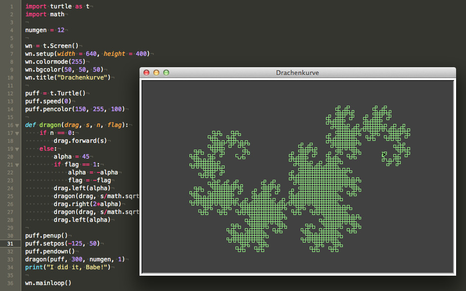
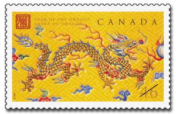

# Die Drachenkurve

Die **Drachenkurve** ist ein fraktales Objekt, das ähnlich wie die Koch-Kurve und die Hilbert-Kurve durch Ersetzung erzeugt wird. Sie wurde von den amerikanischen Mathematikern *Harter* und *Heightway* erfunden und durch eine Artikelserie im *Scientific American* vom März 1967 populär.

Eine anschauliche Methode, die Drachenkurve zu erzeugen, ist folgende:

- Man nehme einen Papierstreifen und falte ihn in der Mitte, so daß sich seine Länge halbiert.
- Dies wiederhole man beliebig oft, dabei ist darauf zu achten, daß jedes mal in dieselbe Richtung gefaltet wird.
- Zum Schluß falte man das Papier auseinander und ordne es so an, daß die Innenwinkel der Falze immer 90° betragen.

Die Drachenkurve ist strikt selbstähnlich und im Grenzfall flächenfüllend, das heißt, die fraktale Dimension ist 2.

## Quellcode

Auch für die Programmierung der Drachenkurve bietet sich das Turtle-Modul von Python geradezu an:

~~~python
import turtle as t
import math

numgen = 12

wn = t.Screen()
wn.setup(width = 640, height = 400)
wn.colormode(255)
wn.bgcolor(50, 50, 50)
wn.title("Drachenkurve")

puff = t.Turtle()
puff.speed(0)
puff.pencolor(150, 255, 100)

def dragon(drag, s, n, flag):
    if n == 0:
        drag.forward(s)
    else:
        alpha = 45
        if flag == 1:
            alpha = -alpha
            flag = -flag
        drag.left(alpha)
        dragon(drag, s/math.sqrt(2), n-1, -flag)
        drag.right(2*alpha)
        dragon(drag, s/math.sqrt(2), n-1, flag)
        drag.left(alpha)

puff.penup()
puff.setpos(-125, 50)
puff.pendown()
dragon(puff, 300, numgen, 1)
print("I did it, Babe!")

wn.mainloop()
~~~

Auch wenn ich schon mit `t.speed(0)` die höchstmögliche Geschwindigkeit eingestellt habe, dauert es eine Zeit, bis die Drachenkurve fertig gezeichnet ist. Man kann dafür aber während des Programmablaufes sehr schön die Entstehung der Kurve beobachten.

## Literatur

- Reimund Albers: *[Papierfalten](http://elib.suub.uni-bremen.de/diss/docs/00010574.pdf), Dissertation zur Erlangung des Grades eines Doktors der Naturwissenschaften*, Bremen (UB Bremen) 2006
- Eine [weitere Seite](http://www.math.uni-bremen.de/didaktik/ma/ralbers/Publikationen/Dissertation/index.html) von Reimund Albers zum Thema Papierfalten und Drachenkurve mit weiterführenden Links
- Jürgen Giese: *[Papierfalten](http://www.jgiesen.de/Divers/PapierFalten/PapierFalten.html)*, letzte Änderung am 12. März 2003
- Martin Große-Schulte: [Eine neue Kodierung für die Papierfaltungsfolge], Bremen (UB) 2010
- Dietmar Herrmann: *Algorithmen für Chaos und Fraktale*, Bonn (Addison-Wesley) 1994, S. 163-166

- [Courbe du Dragon](http://www.mathcurve.com/fractals/dragon/dragon.shtml)
- [Drachenkurve](https://de.wikipedia.org/wiki/Drachenkurve) in der Wikipedia