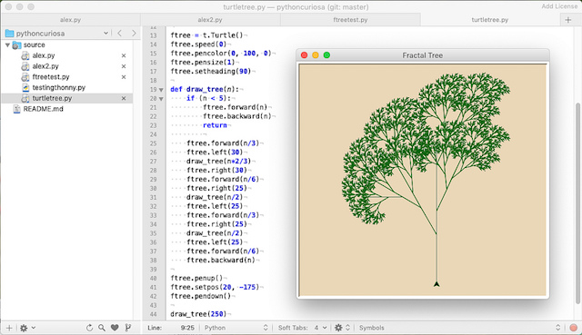

# Fraktaler Baum (1)

Ich hatte mich entschieden, nach langer Zeit mal wieder mit Pythons Schildkröte, dem [Turtle-Modul](https://docs.python.org/3/library/turtle.html), zu spielen. Denn der [Beitrag über die anfängerfreundliche Python IDE Thonny](http://blog.schockwellenreiter.de/2018/12/2018122601.html) hatte bei mir so eine Art *Back to the Roots*-Gefühl ausgelöst. Für den Anfang hatte ich mir so ein kleines fraktales Bäumchen vorgenommen:

Dafür fand ein rekursiver Algorithmus Verwendung, der immer kleiner werdende Verzweigungen im Winkel von 30° und zweimal 25° je rechts und links in immer kürzer werdenden Abständen an die vorherigen Zweige zeichnet. Die Rekursion bricht bei einer »Zweiglänge« kleiner fünf Pixel ab. Mehr ist dazu eigentlich nicht zu sagen, daher hier erst einmal der vollständige Quellcode:

~~~python
import turtle as t

WIDTH = 400
HEIGHT = 400

# Initialisierung
wn = t.Screen()
wn.colormode(255)
wn.bgcolor(235, 215, 182)
wn.setup(width = WIDTH, height = HEIGHT)
wn.title("Fractal Tree")

ftree = t.Turtle()
ftree.speed(0)
ftree.pencolor(0, 100, 0)
ftree.pensize(1)
ftree.setheading(90)

def draw_tree(n):
    if (n < 5):
        ftree.forward(n)
        ftree.backward(n)
        return
        
    ftree.forward(n/3)
    ftree.left(30)
    draw_tree(n*2/3)
    ftree.right(30)
    ftree.forward(n/6)
    ftree.right(25)
    draw_tree(n/2)
    ftree.left(25)
    ftree.forward(n/3)
    ftree.right(25)
    draw_tree(n/2)
    ftree.left(25)
    ftree.forward(n/6)
    ftree.backward(n)

ftree.penup()
ftree.setpos(20, -175)
ftree.pendown()

draw_tree(250)

wn.mainloop()
~~~

Das Programm braucht eine Weile zum Zeichnen des Baums, aber das ist gewollt und einer der Verzüge des Turtle-Moduls: Man sieht, wie der rekursive Algorithmus den Baum Zweig für Zweig abarbeitet. Und obwohl er streng deterministisch und regelmäßig formuliert ist, scheint der Baum doch so etwas wie eine natürlich Form zu besitzen.

Noch natürlicher wirkt er allerdings, wenn man -- vorsichtig! -- den Zufall ins Spiel bringt. Das versuche ich vielleicht in einem der nächsten Beiträge, denn dusselige Donnerstage gibt es sicher noch viele.