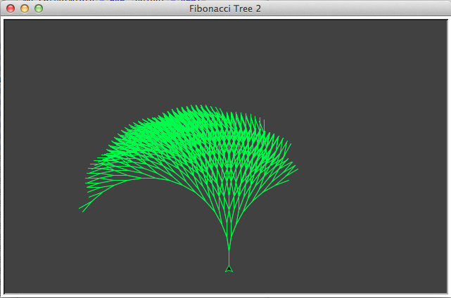
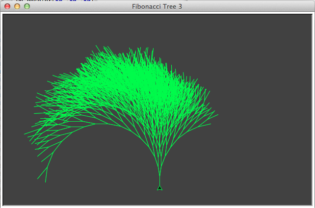

# Turtle Graphik (2): Der Fibonacci-Baum

Die [Fibonacci-Reihe](https://de.wikipedia.org/wiki/Fibonacci-Folge) ist eine Zahlenfolge, die dem italienischen Mathematiker *Leonardo von Pisa* zugeschrieben wird, der allgemein unter dem Namen *Fibonacci*, der Kurzform des italienischen *figlio di Bonacci* (Sohn des Bonacci), bekannt ist. In der zweiten Fassung seines Rechenbuchs »Liber Abacci« (Buch vom Abacus) von 1227 - die erste Version ist nicht überliefert - taucht folgende Aufgabe auf:

>Jemand setzt ein Paar Kaninchen in einen Garten, der auf allen Seiten von einer Mauer umgeben ist, um herauszufinden, wieviele Kaninchen innerhalb eines Jahre geboren werden. Wenn angenommen wird, daß jeden Monat jedes Paar ein weiteres Paar erzeugt, und daß Kaninchen zwei Monate nach ihrer Geburt geschlechtsreif sind, wie viele Paare Kaninchen werden dann jedes Jahr geboren?

Setzt man die ersten beiden Elemente der Zahlenreihe gleich (die ersten Kaninchen-Eltern) und und nimmt dann jedes weitere Element als die Summe der beiden vorherigen Elemente, so ergibt sich die Folge 1, 1, 2, 3, 5, 8, 13 …

Diese Folge, die übrigens auch schon den alten Indern und Griechen bekannt war, ist nicht nur eng mit dem Goldenen Schnitt verbunden, sondern auch ein beliebtes Beispiel, wie man eine Folge rekursiv erzeugen kann. Und genauso rekursiv kann man den mit der Fibonacci-Reihe verwandten [Fibonacci-Baum](https://de.wikipedia.org/wiki/Fibonacci-Baum) erzeugen. Dieser ist eigentlich ein Gegenstand der Graphentheorie und darüber hinaus eine Datenstruktur aus der Informatik. Aber da sich herausgestellt hat, daß man mit der Fibonacci-Folge auch zahlreiche Wachstumsvorgänge an Pflanzen beschreiben kann, wollte ich dieses mal ernst nehmen, und einen »echten« Baum mithilfe des Turtle-Moduls in Python rekursiv erzeugen. Auf die Idee dazu kam ich, weil sich das Blog *Algorithmic Shards* auch gerade mit [rekursiv erzeugten Pflanzen beschäftigt](http://blog.doxanthropos.com/). Hier erst einmal der Quellcode meiner ersten Fassung, der sich sehr stark an ein ähnliches Programm von *John B. Schneider*, *Shira Lynn Broschat* und *Jess Dahmen* anlehnt [^t2fn01]:

[^t2fn01]: John B. Schneider, Shira Lynn Broschat und Jess Dahmen: *[Algorithmic Problem Solving with Python](http://www.eecs.wsu.edu/~schneidj/swan/index.php)*, Seiten 324-328

~~~python
import turtle as t

wn = t.Screen()
wn.colormode(255)
wn.bgcolor(50, 50, 50)
wn.setup(width = 640, height = 400)
wn.title("Fibonacci Tree 2")

fib = t.Turtle()
fib.speed(0)
fib.pencolor(0, 255, 0)

def drawfib(n, len_ang):
    fib.forward(2*len_ang)
    if n == 0:
        pass
    elif n == 1:
        pass
    else:
        fib.left(len_ang)
        drawfib(n-1, len_ang)
        fib.right(2*len_ang)
        drawfib(n-2, len_ang)
        fib.left(len_ang)
    fib.backward(2*len_ang)

fib.penup()
fib.sety(-150)
fib.pensize(1)
fib.left(90)
fib.pendown()
drawfib(15, 10)

wn.mainloop()
~~~

Wichtigster Teil dieses Programmes ist die Funktion `drawFib()`, die sich zwei Mal selber rekursiv aufruft. Die Rekursionstiefe ist 15, was zur Folge hat, daß sich der entstehende Baum aus 987 Verzweigungen besteht. Wer es nicht glaubt, kann es ja in diesem Screenshot nachzählen:

Neu gegenüber der ersten Folge dieser Tutorial-Reihe sind einmal diese beiden Zeilen:

~~~python
wn.colormode(255)
wn.bgcolor(50, 50, 50)
~~~

Hier wird dem Turtle-Modul mitgeteilt, daß die Zahlen im RGB-Colormode jeweils von 0 bis 255 reichen (der Default ist 0.0 bis 1.0). Mit der nächsten Zeile habe ich dann einfach den Hintergrund des Canvas auf ein schiefertafelfarbiges Grau gesetzt. Ebenfalls neu sind diese beiden Zeilen:

~~~python
fib.speed(0)
fib.pencolor(0, 255, 0)
~~~

Mit `fib.Speed(0)` wird der Turtle befohlen, so schnell wie sie kann zu zeichnen. Es dauert -- zumindest auf meinem betagten MacBook Pro -- dennoch eine Weile, bis die Schildkröte mit der Zeichnung fertig ist [^t2fn02].

[^t2fn02]: Es gibt weitere Tricks, die Ausgabe noch mehr zu beschleunigen, aber dann findet das Zeichnen im Hintergrund statt und man kann die Bewegungen der Turtle nicht mehr verfolgen. Dazu mehr in einem späteren Tutorial.

Die zweite Zeile ist nicht wirklich neu, nur daß hier als Zeichenfarbe kein Farbname mehr angegeben wird, sondern ein RGB-Wert (sattes Grün).

Sonst besitzt das Programm betreffend dem Turtle-Modul nichts wirklich Neues mehr, außer das man mit dem Befehl `turtle.Backward()` (Zeile 25) der Schildkröte befehlen kann, rückwärts zu laufen. Überraschung! 😇

## Ein weniger regelmäßiger Baum

Nun wirkt der Baum nicht wirklich echt, er ist viel zu regelmäßig, in der Natur wachsen keine regelmäßigen Bäume. Dem kann man mit etwas nachhelfen, was in der Computerei fast immer wirkt, wenn man Regelmäßigkeiten beseitigen will: Man nimmt den Zufall zu Hilfe. Dann erhält man zum Beispiel dieses Ergebnis:

Das sieht schon bedeutend natürlicher aus. Dafür habe ich das Programm nur leicht abändern müssen:

~~~python
import turtle as t
import random as r

wn = t.Screen()
wn.colormode(255)
wn.bgcolor(50, 50, 50)
wn.setup(width = 640, height = 400)
wn.title("Fibonacci Tree 3")

fib = t.Turtle()
fib.speed(0)
fib.pencolor(0, 255, 0)

def drawfib(n, len_ang):
    ang = r.uniform(len_ang - 0.9, len_ang + 1.7)
    fib.forward(2*ang)
    if n == 0:
        pass
    elif n == 1:
        pass
    else:
        fib.left(ang)
        drawfib(n-1, ang)
        fib.right(2*ang)
        drawfib(n-2, ang)
        fib.left(ang)
    fib.backward(2*ang)

fib.penup()
fib.sety(-150)
fib.pensize(1)
fib.left(90)
fib.pendown()
drawfib(15, 10)

wn.mainloop()
~~~

Es ist eigentlich nur eine einzige Zeile, die hinzugefügt wurde

~~~python
    ang = r.uniform(len_ang - 0.9, len_ang + 1.7)
~~~

und schon wirkt das Ergebnis viel unregelmäßiger. Fragt mich nicht, wie ich auf die Konstanten `0.9` und `1.7` gekommen bin -- ich habe einfach so lange herumexperimentiert, bis ich mit dem Ergebnis einigermaßen zufrieden war.

## Caveat

Wenn man genauer hinschaut, sind immer noch zu viele Regelmäßigkeiten in dem Ergebnis. Das liegt daran, daß die Variable `ang` in jedem Durchlauf nur einmal mit dem Zufall in Berührung kommt. Wer mehr will, sollte die Variable im `else`-Zweig vor jedem Aufruf (also fünf Mal) noch einmal dem Zufall aussetzen. Doch das sei der geneigten Leserin und dem geneigten Leser als Übung überlassen.

## Literatur

- Auf den Seiten von [Michael Becker](http://www.ijon.de/index.html) gibt es einen wunderbaren, längeren Beitrag über [Fibonacci-Zahlen](http://www.ijon.de/mathe/fibonacci/node2.html) und [Fibonacci-Bäume](http://www.ijon.de/mathe/fibonacci/node6.html), bei dem ich mich gnadenlos bedient habe. Daher an dieser Stelle noch einmal ein Dank für diese schönen Seiten.