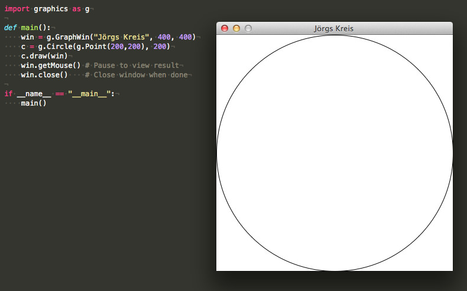

# Graphics.py

**Graphics.py** ist eine einfache, freie (GPL) und objektorientierte Graphik-Bibliothek für Python von *[John M. Zelle](http://mcsp.wartburg.edu/zelle/)*. Er hat sie für sein Buch [Python Programming -- An Introduction to Computer Science][a1] geschrieben, das mittlerweile in der dritten Auflage vorliegt. Die Bibliothek ist ein Wrapper um Tkinter und sollte daher überall funktionieren, wo auch Tkinter funktioniert. Das Paket liegt mittlerweile in der Version 5.0 vor, sollte also hinreichend getestet sein.

[a1]: https://www.amazon.de/Python-Programming-Introduction-Computer-Science/dp/1590282752/ref=as_li_ss_tl?ie=UTF8&qid=1510419559&sr=8-1&keywords=Python+Programming+Zelle&linkCode=ll1&tag=derschockwell-21&linkId=b8856ea200c3888c2ead4557ecc06168

## Installation

Das Paket ist *pure Python*, es reicht daher aus, die Datei `graphics.py` irgendwohin auf der Festplatte abzulegen, wo Python sie findet, also am sinnvollsten im Verzeichnis `site-packages`, bei meinem Anaconda-Python also unter `~/anaconda/lib/python3.5/site-packages` respektive in meiner virtuellen Python-2.7-Umgebung im Verzeichnis `~/anaconda/envs/python2/lib/python2.7/site-packages`. Das ist durchaus sinnvoll, denn die Bibliothek läuft ohne Änderungen sowohl unter Python 3 wie auch unter Python 2.7 (habe ich eigenhändig getestet).

## Getting started

Obigen Kreis habe ich mit folgendem, kleinen Programm erzeugt:

~~~python
import graphics as g

def main():
    win = g.GraphWin("Jörgs Kreis", 400, 400)
    c = g.Circle(g.Point(200,200), 200)
    c.draw(win)
    win.getMouse() # Pause to view result
    win.close()    # Close window when done

if __name__ == "__main__":
    main()
~~~

## Video-Tutorials

- [Python Graphics Programming (Graphics.py 1): The Basics](https://www.youtube.com/watch?v=R39vTAj1u_8)

- [Python Graphics Programming (Graphics.py 2): Primitive shapes](https://www.youtube.com/watch?v=nYhxBVDW7sM)

- [Python Graphics Programming (Graphics.py 3): Images and text](https://www.youtube.com/watch?v=IpiVXHcSBSw)

- [Python Graphics Programming (Graphics.py 4): Text boxes](https://www.youtube.com/watch?v=gszWqF4PKjs)

- [Python Extras: How to install Zelle's Graphical Package to Python](https://www.youtube.com/watch?v=yiUXo5yjniA)

- [graphics.py example program](https://www.youtube.com/watch?v=Rk7Q_VADBRQ)

- [graphics.py BMI Calculator program](https://www.youtube.com/watch?v=fWgy-4n293I)

## Links

- [Graphics.py Home](http://mcsp.wartburg.edu/zelle/python/), dort gibt es auch eine Kurzrefernz der Bibliothek sowohl als HTML-Seite wie auch als PDF-Dokument.