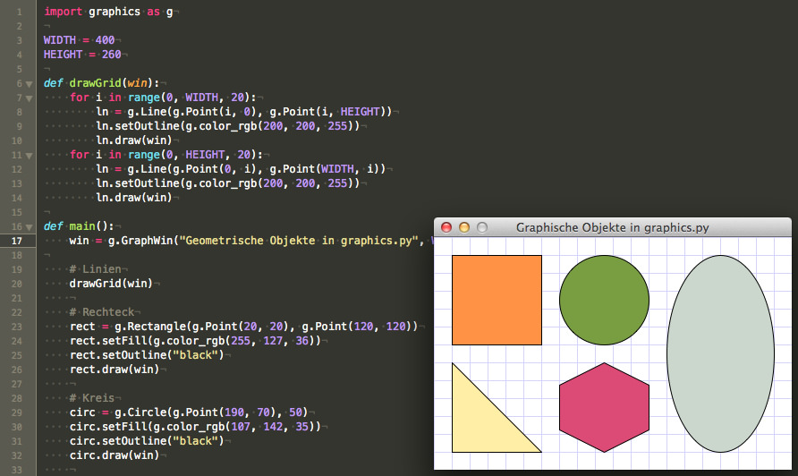

# Geometrische Grundformen in graphics.py

Das kürzlich von mir entdeckte Python-Modul `graphics.py` besitzt einige geometrische Grundformen *(shapes)*, mit denen man schon etwas anfangen kann. Es sind Linien, Rechtecke, Kreise, Ovale und Polygone. Ich habe diese in einem kleinen Programm einmal vorgestellt.

~~~python
import graphics as g

WIDTH = 400
HEIGHT = 260

def drawGrid(win):
    for i in range(0, WIDTH, 20):
        ln = g.Line(g.Point(i, 0), g.Point(i, HEIGHT))
        ln.setOutline(g.color_rgb(200, 200, 255))
        ln.draw(win)
    for i in range(0, HEIGHT, 20):
        ln = g.Line(g.Point(0, i), g.Point(WIDTH, i))
        ln.setOutline(g.color_rgb(200, 200, 255))
        ln.draw(win)

def main():
    win = g.GraphWin("Geometrische Objekte in graphics.py", WIDTH, HEIGHT)

    # Linien
    drawGrid(win)
    
    # Rechteck
    rect = g.Rectangle(g.Point(20, 20), g.Point(120, 120))
    rect.setFill(g.color_rgb(255, 127, 36))
    rect.setOutline("black")
    rect.draw(win)
    
    # Kreis
    circ = g.Circle(g.Point(190, 70), 50)
    circ.setFill(g.color_rgb(107, 142, 35))
    circ.setOutline("black")
    circ.draw(win)
    
    # Oval
    oval = g.Oval(g.Point(260, 20), g.Point(380, 240))
    oval.setFill(g.color_rgb(193, 205, 193))
    oval.setOutline("black")
    oval.draw(win)
    
    # Dreieick
    tri1 = g.Polygon(g.Point(20, 140), g.Point(120, 240), g.Point(20, 240))
    tri1.setFill(g.color_rgb(255, 236, 139))
    tri1.setOutline("black")
    tri1.draw(win)
    
    # Sechseck
    hexa = g.Polygon(g.Point(190, 140),
                     g.Point(240, 165),
                     g.Point(240, 215),
                     g.Point(190, 240),
                     g.Point(140, 215),
                     g.Point(140, 165))
    hexa.setFill(g.color_rgb(204, 53, 100))
    hexa.setOutline("black")
    hexa.draw(win)

    win.getMouse() # Pause to view result
    win.close()    # Close window when done

if __name__ == "__main__":
    main()
~~~

Rechtecke, aber auch Ovale werden durch das sie umgebene Rechteck mit zwei Punkten definiert, Kreise durch den Mittelpunkt und den Radius. Wie bei fast allen Graphikpaketen in fast allen Programmiersprachen liegt der Ursprung des Koordinatensystems (0,0) in der linken oberen Ecke und zählt von da nach rechts unten die Weite und die Höhe.

In dem Programm habe ich erst einmal mit Linien ein Karomuster gezeichent, wie man es auch aus den Rechenheften in der Schule kennt. Das diente nicht nur dazu, das Zeichnen von Linien zu demonstrieren, sondern half mir auch, die Punkte für die anderen Grundformen auszuzählen.

Da ich es nicht mag, wenn der Namensraum (m)eines Programms verschmutzt wird, habe ich nicht -- wie in den Beispielprogrammen zu `graphics.py` das Modul mit der Wildcard-Option

~~~python
from graphics import *
~~~

importiert, sondern ihm einen Kurznamen gegeben:

~~~python
import graphics as g
~~~

Das bedingt zwar ein wenig mehr Schreibarbeit beim Programmieren, aber es sorgt für Klarheit bei den Bezeichnern und ist somit eindeutig und unverwechselbar.

## Caveat

Das Modul *graphics.py* ist eigentlich nur ein Wrapper um die Graphikbefehle von *Tkinter* und dementsprechend nicht gerade schnell. Einen 3D-Egoshooter würde ich daher nicht damit programmieren wollen. Aber dafür ist es ja auch nicht gedacht.
