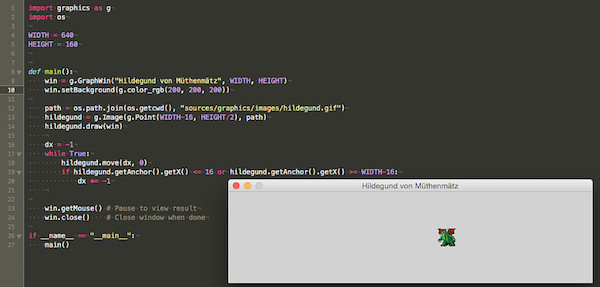

# Hildegund von Müthenmätz – ein Roguelike mit graphics.py?

Nein, ich will es nicht übertreiben, aber der [letzte Beitrag zu den Roguelikes-Tutorien](Mir ist so retro zumute: Roguelikes – 20171114) hat mich inspiriert und da sowieso das Thema »Bilder in *graphics.py*« anstand, warum dann nicht etwas in diese Richtung.

Okay, das Programm ist viel simpler gestrickt: Es holt einfach das Bild eines Drachens in das Graphikfenster und läßt diesen dort von rechts nach links und anschließend wieder zurückgleiten.

~~~python
import graphics as g
import os

WIDTH = 640
HEIGHT = 160

def main():
    win = g.GraphWin("Hildegund von Müthenmätz", WIDTH, HEIGHT)
    win.setBackground(g.color_rgb(200, 200, 200))

    path = os.path.join(os.getcwd(), "sources/graphics/images/hildegund.gif")
    hildegund = g.Image(g.Point(WIDTH-16, HEIGHT/2), path)
    hildegund.draw(win)
    
    dx = -1
    while True:
        hildegund.move(dx, 0)
        if hildegund.getAnchor().getX() <= 16 or hildegund.getAnchor().getX() >= WIDTH-16:
            dx *= -1
    # g.update(30) 

    win.getMouse() # Pause to view result
    win.close()    # Close window when done

if __name__ == "__main__":
    main()
~~~

Das Bild des Drachens habe ich aus einem der vielen freien Tilesets zu [NetHack](cp^NetHack), genauer von den [RLTiles zu Dungeon Crawl](http://rltiles.sourceforge.net/) ausgeborgt. Ihr könnt Euch ebenfalls dort bedienen oder das Bild einfach hier herunterladen:

Es ist ein GIF-Bild. Denn da *graphics.py* nur ein einfacher Wrapper zu den Graphik-Befehlen von Tkinter ist, kann die Bibliothek auch nur die Formate, die Tk und Tkinter beherrschen. Und das sind außer GIF und PPM nicht viele. [^gr3fn1]

[^gr3fn1]: [Hier hatte ich einmal beschrieben](Tutorial: Tkinter und Canvas, Teil 2 – 20170710), wie man mit PIL (oder Pillow) Tkinter auch andere Formate unterjubelt. Diese Methode funktioniert mit Sicherheit auch mit *graphics.py*, doch das wäre der Versuch, mit Kanonen auf Spatzen zu schießen.

Etwas seltsam mutet die Konstruktion des Pfades zu dem Bild mit

~~~python
    path = os.path.join(os.getcwd(), "sources/graphics/images/hildegund.gif")
~~~

an, aber leider habe ich auf meinen verschiedenen Rechnern unterschiedliche (absolute) Pfade zu meinen Arbeitsverzeichnissen und daher nutze ich `os.getcwd()` um dieses Verzeichnis zu bekommen, um dann mit `os.path.join()` den vollständigen Pfadnamen zum Bild zu erhalten.

Neu ist der Befehl `object.move()`, mit dem ein Objekt, also auch ein Bild, um `(dy, dy)` Pixel in die jeweilige Richtung versetzt werden kann. Dabei wird das Objekt an der alten Position gelöscht und dann auf der neuen Position neugezeichnet.

Tkinter ist kein Rennpferd, daher habe ich mir um die Geschwindigkeit der Animation keine Gedanken gemacht. Falls es dennoch darauf ankommt, könnte man dem Programm mit der auskommentierten Zeile `g.update(30)` befehlen, maximal 30 Frames in der Sekunde zu zeichnen, aber auf gar keinen Fall mehr. [^gr3fn2]

[^gr3fn2]: Man beschleunigt das Programm aber nicht, wenn man absurd hohe Zahlen wie zum Beispiel `g.update(240)` eingibt. Meinen Erfahrungen nach ist spätestens bei rund 60 Frames in der Sekunde das Ende der Fahnenstange erreicht.

## Könnte man tatsächlich ein Roguelike mit dieser einfachen Bibliothek programmieren?

So bleibt zum Schluß die Frage, ob man tatsächlich ein Roguelike mit solch einer einfachen Bibliothek wie *graphics.py* programmieren könnte. Sicher, warum nicht, Roguelikes verlangen keine Turbo-Graphik-Leistung. Viel spannender ist die Programmierung der Intelligenz der Spielfiguren, das Parsen der Kommandos und die Handlung.

## Nachwort

Der Name des Drachens ist eine Reminiszens an das Buch »[Die Stadt der träumenden Bücher](cp^Die Stadt der träumenden Bücher)« von *Walter Moers*. Der heldenhafte, aber etwas tollpatschige Drache heißt dort *»Hildegunst von Mythenmetz«* [^gr3fn3] und er gerät in ein Abenteuer, das mich stark an ein Roguelike erinnerte. Daher schlage ich mich auch schon lange mit den Gedanken herum, [daraus ein Spiel zu programmieren](cp^In den Labyrinthen von Buchhaim). Aber es gibt ja so viel zu spielen, und ich habe so wenig Zeit …

[^gr3fn3]: Ich habe den Namen eigentlich nur verändert, weil ich mich immer so freue, wie einfach in Python 3 die Behandlung von Umlauten geworden ist. 😏