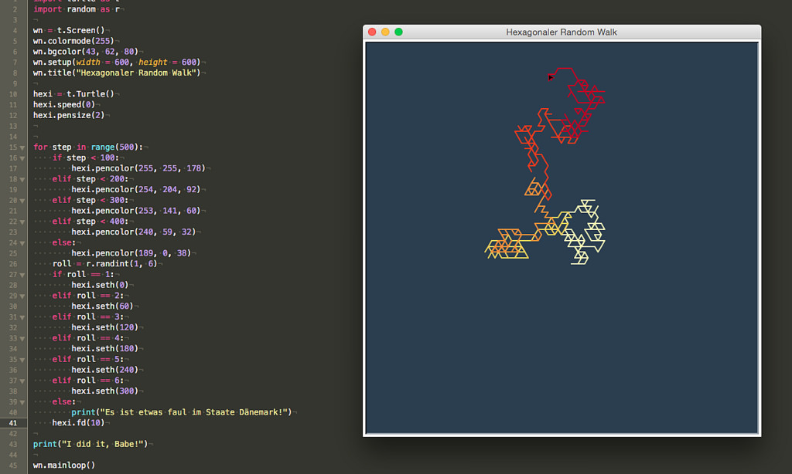
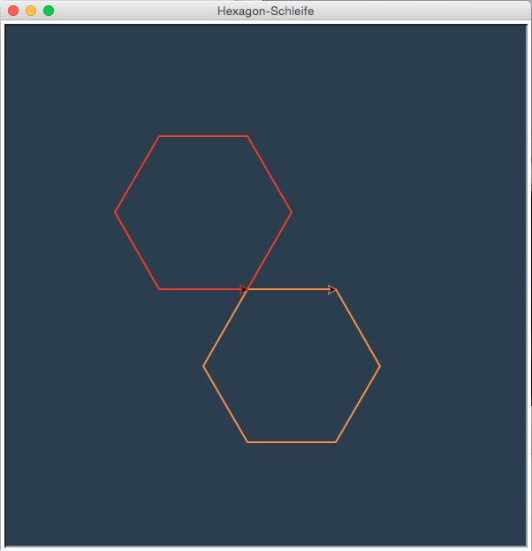

# Random Walking mit der Schildkröte

Der bei Microsoft forschende Psychologe und Informatiker *Dan Goldstein* [berichtet in seinem Blog](http://www.decisionsciencenews.com/2017/12/11/random-walking/), wie er mit seiner neunjährigen Tochter in einem Bagel-Shop warten mußte. Um sich die Langeweile zu verkürzen, kramte er ein hexagonal-kariertes Blatt Papier und einen Würfel hervor (Psychologen bei Microsoft haben immer ein hexagonal-karierten Notizblock und einen Würfel dabei). Und dann entschied er, daß, wenn eine Eins gewürfelt wurde, die Tochter auf dem Papier einen Strich nach oben (nach Norden) malen durfte, bei einer Zwei ging es nach Nordost, bei einer Drei nach Südost und so weiter in alle sechs Richtungen, die ein Hexagon erlaubt. Heraus kam ein [Random Walk](https://de.wikipedia.org/wiki/Random_Walk) in sechs Richtungen.

Als ich dies las, dachte ich, daß dies doch ein schönes Projekt für Pythons Turtle-Modul sei. Zuerst stellte ich mir die Frage, wie man denn der Schildkröte beibringt, ein Hexagon zu zeichnen. Ein [Blick in die Wikipedia](https://de.wikipedia.org/wiki/Sechseck) half mir weiter, denn dort konnte ich entnehmen, daß die Schildkröte an jedem der sechs Endpunkt einen Winkel von 60° einschlagen mußte, entweder konsequent nach rechts oder konsequent nach links. Die sechs Winkel für die sechs möglichen Richtungen sind also 0°, 60°, 120°, 180°, 240° und 300°. *Brute Force* zeichnet sich ein Hexagon also so:

~~~python
import turtle as t

wn = t.Screen()
wn.colormode(255)
wn.bgcolor(43, 62, 80)
wn.setup(width = 600, height = 600)
wn.title("Ein Hexagon mit der Schildkröte")

hexi = t.Turtle()
hexi.pensize(2)
hexi.pencolor(253, 141, 60)

hexi.penup()
hexi.goto(-62, -87)  # Hexagon im Fenster »einmitten«
hexi.pendown()

hexi.seth(0)
hexi.fd(100)
hexi.seth(60)
hexi.fd(100)
hexi.seth(120)
hexi.fd(100)
hexi.seth(180)
hexi.fd(100)
hexi.seth(240)
hexi.fd(100)
hexi.seth(300)
hexi.fd(100)

wn.mainloop()
~~~

Natürlich geht das auch viel kürzer in einer Schleife, aber da ich für den hexagonalen Random Walk sowieso die einzelnen Winkel bräuchte, habe ich es erst einmal so gelassen.

Ein eleganterer Weg könnte so aussehen: Hier habe ich in einer Schleife zwei Hexagons zeichnen lassen, eines nur mit Rechts- und ein zweites nur mit Linkswinkeln:

~~~python
import turtle as t

wn = t.Screen()
wn.colormode(255)
wn.bgcolor(43, 62, 80)
wn.setup(width = 600, height = 600)
wn.title("Hexagon-Schleife")

hexi = t.Turtle()
hexi.pensize(2)
hexi.pencolor(253, 141, 60)
hexa = t.Turtle()
hexa.pensize(2)
hexa.pencolor(240, 59, 32)

hexi.penup()
hexi.goto(75, 0)
hexi.pendown()

hexa.penup()
hexa.goto(-25, 0)
hexa.pendown()

for i in range(6):
    hexi.rt(60)
    hexi.fd(100)
    hexa.lt(60)
    hexa.fd(100)

wn.mainloop()
~~~

Das Ergebnis sieht dann aus wie dieser Screenshot:

Nach diesen Vorarbeiten war das Programm zum hexagonalen Zufallsmarsch ein Kinderspiel. Zumal das Pythonmodul `random` mit der Methode `randint()` die Simulation eines sechseitigen Würfels extrem einfach macht. Dazu habe ich mir noch von [dieser Seite](http://colorbrewer2.org/#type=sequential&scheme=YlOrRd&n=6) eine schöne Farbpalette aus sechs Farben herausgesucht, die von hellorange bis dunkelrot reicht und die zeigt, wie weit die Schildkröte auf ihrer Reise schon gekommen ist. Hier das komplette Programm:

~~~python
import turtle as t
import random as r

wn = t.Screen()
wn.colormode(255)
wn.bgcolor(43, 62, 80)
wn.setup(width = 600, height = 600)
wn.title("Hexagonaler Random Walk")

hexi = t.Turtle()
hexi.speed(0)
hexi.pensize(2)

for step in range(500):
    if step < 100:
        hexi.pencolor(255, 255, 178)
    elif step < 200:
        hexi.pencolor(254, 204, 92)
    elif step < 300:
        hexi.pencolor(253, 141, 60)
    elif step < 400:
        hexi.pencolor(240, 59, 32)
    else:
        hexi.pencolor(189, 0, 38)
    roll = r.randint(1, 6)
    if roll == 1:
        hexi.seth(0)
    elif roll == 2:
        hexi.seth(60)
    elif roll == 3:
        hexi.seth(120)
    elif roll == 4:
        hexi.seth(180)
    elif roll == 5:
        hexi.seth(240)
    elif roll == 6:
        hexi.seth(300)
    else:
        print("Es ist etwas faul im Staate Dänemark!")
    hexi.fd(10)

print("I did it, Babe!")

wn.mainloop()
~~~

Natürlich kann es passieren, daß die Turtle auf ihrem Zufallsweg das Bildschirmfenster auch einmal verläßt, aber das Turtle-Modul ist da stabil. Es läßt die Schildkröte einfach ziehen und wenn sie wiederkommen will, darf sie auch wiederkommen.

Ich habe die Iteration testweise auch mit 1.000 Schritten durchgeführt, in den meisten Fällen verläßt die Schildkröte das Bildschirmfenster nicht.

## Literatur

Random-Walk-Modelle finden einige interessanten Anwendungen von der Biologie bis zur Finanzwirtschaft. Wer sich da hineinlesen will, findet hier ein paar interessante Beiträge:

- Jake Hofman: *[Simple math for a complex world: Random walks in biology and finance](http://jakehofman.com/talks/dalton_hunter_20071031.pdf)* (Vortragsfolien), 31. Oktober 2007
- William F. Sharpe, Daniel G. Goldstein und Philip W. Blythe: *[The Distribution Builder: A Tool for Inferring Investor Preferences](https://web.stanford.edu/~wfsharpe/art/qpaper/qpaper.pdf)*, 10. Oktober 2000
- [Random Walks](http://www.science.oregonstate.edu/~landaur/INSTANCES/WebModules/5_RandomWalk/RandomWalkFiles/Pdfs/RandomWalk.pdf)

Und auch im schon einmal verlinkten [Original-Blog-Post](http://www.decisionsciencenews.com/2017/12/11/random-walking/), der mich zu diesem Beitrag inspirierte, hat *Dan Goldstein* ein paar überraschende Überlegungen zum Zufallsspaziergang der Schildkröte angestellt.
> 