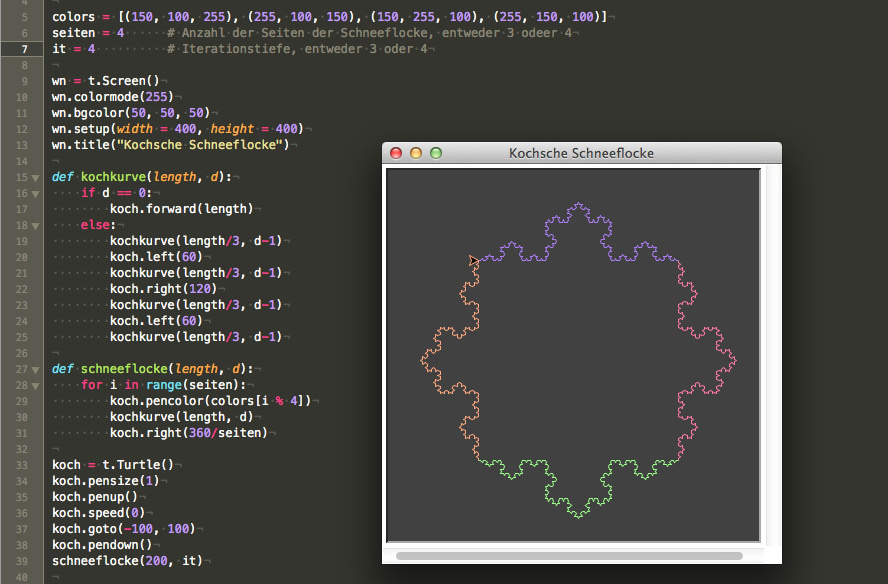

# Turtle-Graphik (4): Die Kochsche Schneeflocke

Die [Koch-Kurve](https://de.wikipedia.org/wiki/Koch-Kurve) oder Kochsche Kurve ist ein von dem schwedischen Mathematiker [Helge von Koch](https://de.wikipedia.org/wiki/Helge_von_Koch) 1904 vorgestelltes Beispiel für eine überall stetige, aber nirgends differenzierbare Kurve. Es handelt sich bei ihr ferner um eines der ersten formal beschriebenen fraktalen Objekte. Die Koch-Kurve ist eines der am häufigsten zitierten Beispiele für ein Fraktal und wurde bei der Entdeckung als Monsterkurve bezeichnet. Die Koch-Kurve ist auch in Form der **kochschen Schneeflocke** bekannt, die durch geeignete Kombination dreier oder vierer Koch-Kurven entsteht.

Man kann die Kurve anschaulich mittels eines iterativen Prozesses konstruieren Zu Beginn besteht die Kurve aus einem einzigen Streckenstück. Die Iteration besteht nun darin, daß dieser Streckenabschnitt durch einen anderen, aus vier gleich langen Strecken bestehenden Streckenabschnitt ersetzt wird, der wie folgt aufgebaut ist: Strecke -- 60° Winkel -- Strecke -- 120° Winkel (in der Gegenrichtung) -- Strecke – 60° Winkel -- Strecke. Jeder der vier neuen Streckenabschnitte hat 1/3 der Länge des ursprünglichen Streckenabschnitts. Im nächsten Schritt wird jeder der vier Streckenabschnitte durch einen Streckenabschnitt der oberen Art ersetzt. Diese Iteration wird nun beliebig oft wiederholt, wobei die Dreiecke stets zur selben Seite der Kurve hin zu errichten sind. Auf diese Weise ergibt sich eine Folge von Streckenzügen, die gegen die Koch-Kurve strebt. Im Grenzfall (nach unendlich vielen Iterationen) ist die Kochkurve unendlich lang, da der Streckenzug bei jeder Iteration um den Faktor $$4/3$$ länger wird.

## Quellcode

Man kann eine näherungsweise Abbildung sowohl der Kochkurve wie auch der Schneeflocke sehr schön mit Pythons Turtle-Modul visualisieren (siehe obigen Screenshot):

~~~python
import turtle as t

colors = [(150, 100, 255), (255, 100, 150), (150, 255, 100), (255, 150, 100)]
seiten = 4      # Anzahl der Seiten der Schneeflocke,
                # entweder 3 oder 4
it = 4          # Iterationstiefe, entweder 3 oder 4

wn = t.Screen()
wn.colormode(255)
wn.bgcolor(50, 50, 50)
wn.setup(width = 400, height = 400)
wn.title("Kochsche Schneeflocke")

def kochkurve(length, d):
    if d == 0:
        koch.forward(length)
    else:
        kochkurve(length/3, d-1)
        koch.left(60)
        kochkurve(length/3, d-1)
        koch.right(120)
        kochkurve(length/3, d-1)
        koch.left(60)
        kochkurve(length/3, d-1)

def schneeflocke(length, d):
    for i in range(seiten):
        koch.pencolor(colors[i % 4])
        kochkurve(length, d)
        koch.right(360/seiten)

koch = t.Turtle()
koch.pensize(1)
koch.penup()
koch.speed(0)
koch.goto(-100, 100)
koch.pendown()
schneeflocke(200, it)

wn.mainloop()
~~~

Die Kochkurve wird spätestems seit Mandelbrot zur Simulation von Küstenlinien herangezogen. Und so ist die Kochsche Schneeflocke oder Insel auch ein Beispiel für ein Fläche mit einem endlichen Flächeninhalt aber einer unendlich langen Begrenzug.

Die Kochsche Insel oder Schneeflocke ist im Gegensatz zur Kochkurve **nicht** selbstähnlich.

## Literatur

- Adrian Jablonski: *[Einführung in die fraktale Geometrie](http://quadsoft.org/fraktale/)*, korrigierte und überarbeitete Fassung vom 15. Juli 2017

- Benoit B. Mandelbrot; *[Die fraktale Geometrie der Natur][a1]*, Basel (Birkhäuser) 1987, Seite 46-69

- Ian Stewart: *[Das Rätsel der Schneeflocke -- Die Mathematik der Natur][a2]*, München (Spektrum) 2007

[a1]: https://www.amazon.de/Die-fraktale-Geometrie-Natur-Mandelbrot/dp/303485028X/ref=as_li_ss_tl?ie=UTF8&qid=1510140874&sr=8-1&keywords=die+fraktale+geometrie+der+natur&dpID=415LbTNsq2L&preST=_SX198_BO1,204,203,200_QL40_&dpSrc=srch&linkCode=ll1&tag=derschockwell-21&linkId=b3ecdbcc3378c34db3cf7b84a175fbb4
[a2]: https://www.amazon.de/Das-R%C3%A4tsel-Schneeflocke-Mathematik-Natur/dp/3827419344/ref=as_li_ss_tl?ie=UTF8&qid=1510345373&sr=8-1&keywords=das+r%C3%A4tsel+der+schneeflocke&dpID=51KRAkxPc%252BL&preST=_SX198_BO1,204,203,200_QL40_&dpSrc=srch&linkCode=ll1&tag=derschockwell-21&linkId=34ff8101966927dd043319d336e49da2