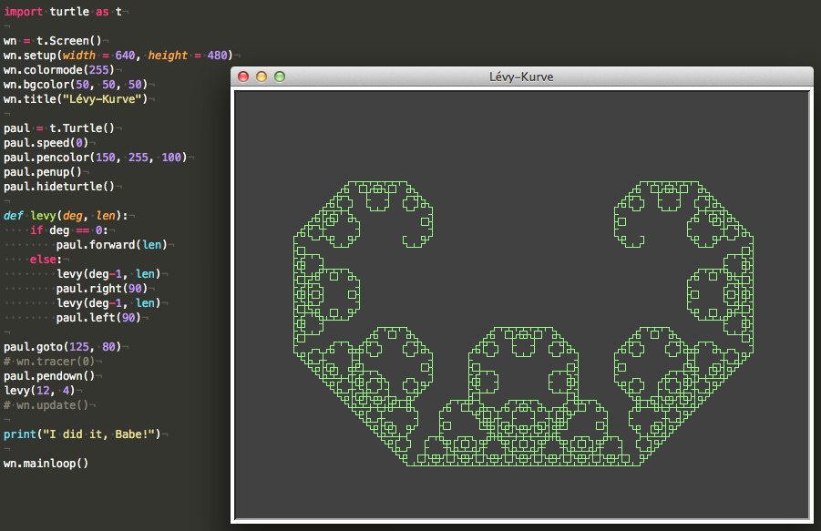
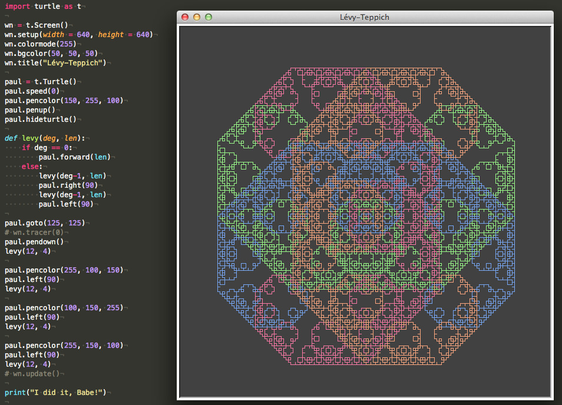

# Die Lévy-Kurve

Die Lévy-Kurve ist ein selbstähnliches Fraktal, das schon früh von *Ernesto Cesàro* (1906) und *Georg Faber* (1910) beschrieben wurde. Benannt ist sie aber nach dem französischen Mathematiker Paul Lévy, der 1938 ihre Selbstähnlichkeit beschrieb und auch eine Konstruktionsvorschrift vorstellte, die die Verwandschaft der Monsterkurve mit der Koch-Kurve zeigte. Wegen ihrer Form, die an ein (liegendes) »C« erinnert, wird sie im angelsächsischen Sprachraum auch als (Lévy-) C-Kurve bezeichnet. Sie ist eng mit der Drachenkurve verwandt.

Die Levy-Kurve kann mit diesem Python-Turtle-Programm gezeichnet werden. Paul Lévy zu ehren habe ich die ausführende Schildkröte ebenfalls »Paul« genannt:

~~~python
import turtle as t

wn = t.Screen()
wn.setup(width = 640, height = 480)
wn.colormode(255)
wn.bgcolor(50, 50, 50)
wn.title("Lévy-Kurve")

paul = t.Turtle()
paul.speed(0)
paul.pencolor(150, 255, 100)
paul.penup()
paul.hideturtle()

def levy(deg, len):
    if deg == 0:
        paul.forward(len)
    else:
        levy(deg-1, len)
        paul.right(90)
        levy(deg-1, len)
        paul.left(90)

paul.goto(125, 80)
# wn.tracer(0)
paul.pendown()
levy(12, 4)
# wn.update()

print("I did it, Babe!")

wn.mainloop()
~~~

Es ist eine recht einfache Kurve, daher ist die (rekursive) Funktion `levy()` sehr kurz. Trotzdem ist die fraktale Dimension der Kurve schwer zu ermitteln, da es hier zu Selbstberührungen kommt. *Duvall* und *Keesling* haben dies erst 1999 untersucht und die Hausdorff-Dimension auf $1.934007183$ geschätzt.

## Der Lévy-Teppich

Kombiniert man vier Lévy-Kurven miteinander, die jeweils um 90 Grad gedreht werden, so erhält man den Lévy-Teppich:

~~~python
import turtle as t

wn = t.Screen()
wn.setup(width = 640, height = 640)
wn.colormode(255)
wn.bgcolor(50, 50, 50)
wn.title("Lévy-Teppich")

paul = t.Turtle()
paul.speed(0)
paul.pencolor(150, 255, 100)
paul.penup()
paul.hideturtle()

def levy(deg, len):
    if deg == 0:
        paul.forward(len)
    else:
        levy(deg-1, len)
        paul.right(90)
        levy(deg-1, len)
        paul.left(90)

paul.goto(125, 125)
# wn.tracer(0)
paul.pendown()
levy(12, 4)

paul.pencolor(255, 100, 150)
paul.left(90)
levy(12, 4)

paul.pencolor(100, 150, 255)
paul.left(90)
levy(12, 4)

paul.pencolor(255, 150, 100)
paul.left(90)
levy(12, 4)
# wn.update()

print("I did it, Babe!")

wn.mainloop()
~~~

Das Programmieren mit der Turtle in Python ist schon ein wenig *Retro-Computing*, in ähnlicher Geschwindigkeit habe ich solche Monsterkurven auch schon vor Jahrzehnten auf meinem Atari-ST gezeichnet bekommen (allerdings nicht so schön bunt). Wenn man allerdings die auskommentierten Befehlszeilen `wn.tracer(0)` und `wn.update()` aktiviert, dann sind die Kurven in Bruchteilen einer Sekunde vollständig auf dem Bildschirm zu sehen. Allerdings bringt man sich dann um das Vergnügen, die Kurven wachsen zu sehen und ihre Entstehung zu begreifen. Also mindestens einmal sollte man nicht so ungeduldig sein und die Zeilen auskommentiert lassen.

## Literatur

- P. Duvall, J. Keesling: *[The Hausdorff dimension of the boundary of the Lévy dragon](https://arxiv.org/abs/math/9907145)*, 1999
- Dietmar Hermann: *Algorithmen für Chaos und Fraktale*, Bonn (Addison-Wesley) 1994, Seiten 161ff.
- Paul Lévy: *Plane or Space Curves and Surfaces Consisting of Parts Similar to the Whole (1938)*, neu abgedruckt in Gerald A. Edgar (ed.): *Classics on Fractals*, Reading (MA) (Addison-Wesley) 1993
- Eric W. Weisstein: *[Lévy Fractal](http://mathworld.wolfram.com/LevyFractal.html)* auf WolframMathWorld
- Die [Lévy C Curve](https://en.wikipedia.org/wiki/L%C3%A9vy_C_curve) in der Wikipedia
