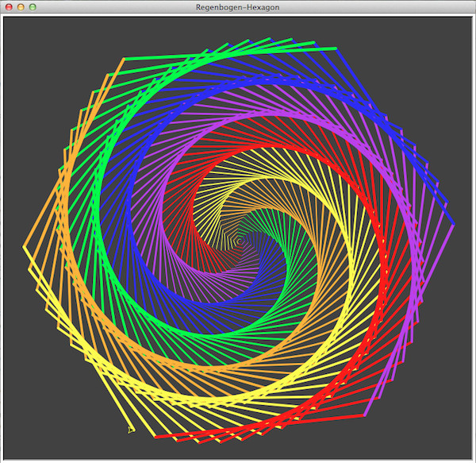

# Tutorial: Regenbogen-Hexagon mit Pythons-Turtle

Man kann es drehen und wenden wie man will: Hauptaufgabe des Turtle-Moduls ist es doch, dekorative Graphiken zu erstellen, denn das macht Spaß. Und da ich vor einer Woche sowieso schon mit einem [Sechseck (Hexagon) herumgespielt hatte](Spaß mit der Turtle: Random Walk – 20171213), möchte ich heute zeigen, wie man aus einem Hexagon eine regenbogenbunte Spirale konstruiert:

Das Programm ist eigentlich relativ einfach und sieht nicht viel anders aus, als die vorangegangenen Programme mit der Schildkröte:

~~~python
import turtle as t

wn = t.Screen()
wn.setup(width = 800, height = 800)
wn.colormode(255)
wn.bgcolor(50, 50, 50)
wn.title("Regenbogen-Hexagon")

colors = ["red", "purple", "blue", "green", "orange", "yellow"]

alex = t.Turtle()
alex.speed(0)
for i in range(360):
    alex.pencolor(colors[i%6])
    alex.width(i/100 + 1)
    alex.forward(i)
    alex.left(59)

print("I did it, Babe!")

wn.mainloop()
~~~

Zu beachten ist lediglich, daß jeder neue Winkel im Hexagon statt um 60° nur um 59° gekippt wird, so entsteht die Spirale. Und damit die Sechsecke (und damit auch die Spirale) immer größer wird, muß die Schildkröte in Abhängigkeit von der Laufvariablen `i` immer ein wenig weiter laufen. Außerdem wurde -- ebenfalls in Abhängigkeit von `i` -- die Stiftstärke verdickt, von ganz dünnen Strichen am Anfang zu doch schon recht fetten Strichen am Ende der Zeichnung.

Sagte ich eigentlich schon, daß Alex meine Lieblingsschildkröte ist? 😛

Die Idee zu diesem Programm hatte ich auf [dieser Seite](http://www.geeksforgeeks.org/turtle-programming-python/) <del>geklaut</del> gefunden. Dort sind noch viele weitere Anregungen. Schaun wir mal …