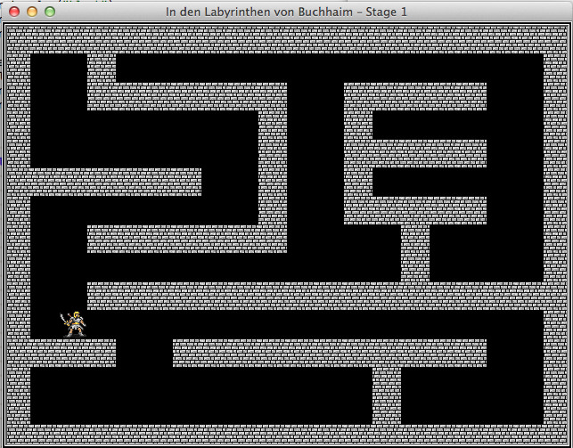
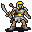
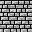

# Ein Rogue-like mit Python und der Turtle -- Stage&nbsp;1

Die Video-Tutorial-Reihe »[Python Maze Game Tutorial](https://www.youtube.com/watch?v=inocKE13DEA&list=PLlEgNdBJEO-lNDJgg90fmfAq9RzORkQWP)« von *Christian Thompson* inspirierte mich, auch mal ein [Rogue-like](http://cognitiones.kantel-chaos-team.de/medien/retrogames/rogue.html) mit dem Turtle-Graphik-Modul von Python zu programmieren. Man sollte eigentlich denken, daß die Turtle-Graphik dafür nicht geeignet sei, aber das Modul ist so genial ausgelegt, daß das Gegenteil der Fall ist.

Das Schwierigste war, passende Bildchen für den Helden, die Monster und die Gegenstände zu finden. Fündig wurde ich bei der [TomeTik Tiles Library](http://pousse.rapiere.free.fr/tome/), bei der es massenhaft Tiles -- vornehmlich aus der [Angband](http://cognitiones.kantel-chaos-team.de/medien/retrogames/angband.html)-Reihe -- gibt, die von *David E. Gervais* gezeichnet wurde und die er unter einer [Creative-Commons-Lizenz](http://creativecommons.org/licenses/by/3.0/) auch für eine kommerzielle Nutzung freigegebn hat. Einzige Bedingung ist die, daß der Schöpfer genannt werden will, was ich hiermit erledigt habe.

In dieser Folge werden nur zwei Tiles aus der Sammlugn genutzt, nämlich den Spieler und die Mauern, in den weiteren Folgen kommen noch einige Bildchen hinzu. Diese werden mit folgenden Zeilen geladen und der Turtle-Bibliothek bekannt gemacht:

~~~python
wall_shape = os.path.join(os.getcwd(), "sources/turtle/roguelike/images/wall.gif")
player_shape = os.path.join(os.getcwd(), "sources/turtle/roguelike/images/player.gif")
wn.register_shape(wall_shape)
wn.register_shape(player_shape)
~~~

Die Pfadangaben sind bei mir so kompliziert, weil TextMate, der Editor, in dem ich **alle** meine Programmierprojekte erledige, als *Current Working Directory* das Wurzelverzeichnis des Projektes in meinem Git-Repositoriums setzt und ich diese und die kommenden Programme in einem viel tiefer gelegenen Unterverzeichnis liegen habe. Ihr müßt das Verzeichnis natürlich Euren Gegebenheiten anpassen, in den meisten Fällen dürfte

~~~python
my_shape = os.path.join(os.getcwd(), "images/my_shape.gif")
~~~

oder sogar noch einfacher

~~~python
my_shape = "images/my_shape.gif")
~~~

ausreichen. Probiert das einfach mal aus. Und da das Turtle-Moduls auf `Tkinter` aufsetzt und diese Bibliothek ohne große Verrenkungen nur mit GIF- oder PPM-Bilddateien umgehen kann, müßt Ihr gegebenenfalls mit einem Bildverarbeitungsprogramm die Bilddateien nach GIF umwandeln.

Hier sind die beiden GIFs für den Rogue und die Mauern:

 

Das nächste »Problem« ist es, ein *Dungeon* zu entwerfen. Auch wenn ich sehr häufig für solche Aufgaben das freie (GPL) und plattformübergreifende Programm [Tiled](http://cognitiones.kantel-chaos-team.de/multimedia/spieleprogrammierung/tiled.html) verwende, hielt ich das in diesem einfachen Fall für einen Overkill und habe es schnell mit Bleistift, Radiergummi und kariertem Papier in meinem Notizblock entworfen. Heraus kam folgendes Labyrinth:

~~~python
level_1 = [
    "####################",
    "# @#               #",
    "#  #######  #####  #",
    "#        #  #      #",
    "#        #  #####  #",
    "#######  #  #      #",
    "#        #  #####  #",
    "#  #######    #    #",
    "#             #    #",
    "#  #################",
    "#                  #",
    "####  ###########  #",
    "#            #     #",
    "#            #     #",
    "####################"
]
~~~

Die Doppelkreuze (`#`) stellen die Mauern dar und der Klammeraffe (`@`) ist in alter Tradition der *Rogue*, der Held des Spiels. Das Fenster des Spiels ist 640 x 480 Pixel groß, das entspricht der Standard-Auflösung der damaligen VGA-Monitore und da die Tiles jeweils 32 x 32 Pixel messen, hat das *Dungeon* ein Ausmaß von 20 x 15 Tiles. Auch wenn es im obigen Quellcode nicht so aussieht, da die Buchstaben höher als breiter und eben nicht quadratisch sind, ist das Verließ, durch das sich der Spieler bewegen soll, breiter als höher. Der obige Screenshot beweist es.

Dann habe ich eine Klasse `Sprite` entworfen, die die Grundlage für alle Spielfiguren ist. Sie werden entweder direkt von ihr abgeleitet (wie die Mauern) oder sie sind Subklassen von `Sprite`.

~~~python
class Sprite(t.Turtle):
    
    def __init__(self, shape):
        t.Turtle.__init__(self)
        self.shape(shape)
        self.penup()
        self.speed(0)      
~~~

Die Klasse `Sprite` ist ihrerseits schon eine Subklasse von `turtle.Turtle` und erbt somit alle Turtle-Methoden. Sie ist so elementar, daß das Objekt `wall` direkt von ihr abgeleitet werden kann:

~~~python
wall = Sprite(wall_shape)
~~~

Ein Kind von `Sprite` ist die Klasse `Player`, die schon etwas komplexer ist:

~~~python
class Player(Sprite):
    
    def __init__(self, shape):
        Sprite.__init__(self, shape)

    def go_left(self):
        go_to_x = self.xcor() - 32
        go_to_y = self.ycor()
        if (go_to_x, go_to_y) not in walls:
            self.goto(go_to_x, go_to_y)
        
    def go_right(self):
        go_to_x = self.xcor() + 32
        go_to_y = self.ycor()
        if (go_to_x, go_to_y) not in walls:
            self.goto(go_to_x, go_to_y)

    def go_up(self):
        go_to_x = self.xcor()
        go_to_y = self.ycor() + 32
        if (go_to_x, go_to_y) not in walls:
            self.goto(go_to_x, go_to_y)
        
    def go_down(self):
        go_to_x = self.xcor()
        go_to_y = self.ycor() - 32
        if (go_to_x, go_to_y) not in walls:
            self.goto(go_to_x, go_to_y)
~~~

Sie sorgt dafür, daß der Spieler, wenn er sich bewegt, nicht durh die Wände gehen kann. Dafür habe ich mit

~~~python
walls = []
~~~

erst einmal eine Liste angelegt, die alle Positionen der Mauer-Tiles aufnehmen soll. Und der Spieler legt in `go_to_x` und `go_to_y` erst einmal fest, wohin er gehen möchte. Dann prüft er aber, ob `(go_to_x, go_to_y)` nicht in der Liste der Mauerteile liegen und nur wenn diese Frage mit »Nein« beantwortet wird, geht der Spieler auch wirklich dorthin.

~~~python
        if (go_to_x, go_to_y) not in walls:
            self.goto(go_to_x, go_to_y)
~~~

Ist das nicht der Fall, bleibt er stur stehen, bis der Nutzer eine andere Pfeiltaste drückt und ihm ein neues Ziel gibt.

Das ganze Dungeon wird mit folgenden Zeilen Python-Code erzeugt:

~~~python
def setup_maze(level):
    for y in range(len(level)):
        for x in range(len(level[y])):
            sprite= level[y][x]
            screen_x = -308 + (x*32)
            screen_y =  224 - (y*32)
            
            if sprite == "#":
                wall.goto(screen_x, screen_y)
                walls.append((screen_x, screen_y))
                wall.stamp()
            elif sprite == "@":
                rogue.goto(screen_x, screen_y)
                rogue.stamp
~~~

Die `-308` für die Ecke links oben habe ich durch Herumprobieren gefunden. Eigentlich müßte dort meiner Meinung nach `-304` stehen, denn die Koordinaten `(0, 0)` liegen im Mittelpunkt des Bildschirms, daher müßte meiner Meinung nach die x-Koordinate der linken oberen Ecke mit der Formel

$$
(-10*32) + 16
$$

berechnet werden, also negative zehn mal die Breite der Tiles zuzüglich der Hälfte des letzten Tiles, da im Turtle-Modul die Tile-Koordinaten ebenfalls im Mittelpunkt und nicht, wie von anderen Graphik-Systemen her gewohnt, in der linken oberen Ecke des Tiles liegen.

Wie dem auch sei, bei `-304` lag ein Teil der Mauern außerhalb des Bildschirmfensters, `-308` brachte ein ordentlicher aussehendes Ergebnis. Falls irgendeiner meiner Leser weiß, wo der Fehler in meinen Überlegungen liegt, bitte ich um einen Hinweis in meinen Email-Kommentaren. Ich bin mir nämlich sicher, daß das irgendwo ein ganz dummer Denkfehler von mir liegt, nur scheie ich da so betriebsblind zu sein, daß ich nicht darauf komme.

Das ist eigentlich schon alles, jetzt muß man nur noch auf die Tastaturereignisse lauschen und die Hauptschleife für das Spiel einsetzen:

~~~python
t.listen()
t.onkey(rogue.go_left, "Left")
t.onkey(rogue.go_right, "Right")
t.onkey(rogue.go_up, "Up")
t.onkey(rogue.go_down, "Down")
t.onkey(exitGame, "Escape") # Escape beendet das Spiel

wn.tracer(0)
setup_maze(levels[0])

keepGoing = True
while keepGoing:
    wn.update()
~~~

Mit `tracer(0)` wird verhindert, daß der Graphikbuffer bei jeder Änderung seinen Inhalt in den Monitor kippt und so die Graphikausgabe verlangsamt. Das Modul wartet nur auf das `update()`-Kommando -- erst dann erfolgt ein *Refresh* des Monitors. Damit wird das Spiel ernorm beschleunigt. Wer es mal verifizieren möchte, ann diese beiden Zeilen ja einfach mal auskommentieren (in der Endlosschleife muß dann allerdings stattdessen noch ein `pass` gesetzt werden). Und natürlich darf die Funktion `exitGame()` nicht fehlen, die `keepGoing` auf `False` setzt und somit die Endlosschleife beendet:

~~~python
def exitGame():
    global keepGoing
    keepGoing = False
~~~

So, und nun für diejenigen unter Euch, die das nachprogrammieren wollen, hier der komplette Quelltext zum Abtippen:

~~~python
import turtle as t
import os

wn = t.Screen()
wn.bgcolor("black")
wn.title("In den Labyrinthen von Buchhaim – Stage 1")
wn.setup(640, 480)

wall_shape = os.path.join(os.getcwd(), "sources/turtle/roguelike/images/wall.gif")
player_shape = os.path.join(os.getcwd(), "sources/turtle/roguelike/images/player.gif")
wn.register_shape(wall_shape)
wn.register_shape(player_shape)

# Die Mauern des Labyrinths
class Sprite(t.Turtle):
    
    def __init__(self, shape):
        t.Turtle.__init__(self)
        self.shape(shape)
        self.penup()
        self.speed(0)
    
class Player(Sprite):
    
    def __init__(self, shape):
        Sprite.__init__(self, shape)

    def go_left(self):
        go_to_x = self.xcor() - 32
        go_to_y = self.ycor()
        if (go_to_x, go_to_y) not in walls:
            self.goto(go_to_x, go_to_y)
        
    def go_right(self):
        go_to_x = self.xcor() + 32
        go_to_y = self.ycor()
        if (go_to_x, go_to_y) not in walls:
            self.goto(go_to_x, go_to_y)

    def go_up(self):
        go_to_x = self.xcor()
        go_to_y = self.ycor() + 32
        if (go_to_x, go_to_y) not in walls:
            self.goto(go_to_x, go_to_y)
        
    def go_down(self):
        go_to_x = self.xcor()
        go_to_y = self.ycor() - 32
        if (go_to_x, go_to_y) not in walls:
            self.goto(go_to_x, go_to_y)

# Liste der Labyrinthe
levels = []

level_1 = [
    "####################",
    "# @#               #",
    "#  #######  #####  #",
    "#        #  #      #",
    "#        #  #####  #",
    "#######  #  #      #",
    "#        #  #####  #",
    "#  #######    #    #",
    "#             #    #",
    "#  #################",
    "#                  #",
    "####  ###########  #",
    "#            #     #",
    "#            #     #",
    "####################"
]

levels.append(level_1)

# Level Setup
def setup_maze(level):
    for y in range(len(level)):
        for x in range(len(level[y])):
            sprite= level[y][x]
            screen_x = -308 + (x*32)
            screen_y =  224 - (y*32)
            
            if sprite == "#":
                wall.goto(screen_x, screen_y)
                walls.append((screen_x, screen_y))
                wall.stamp()
            elif sprite == "@":
                rogue.goto(screen_x, screen_y)
                rogue.stamp

def exitGame():
    global keepGoing
    keepGoing = False

walls = []
wall = Sprite(wall_shape)
rogue = Player(player_shape)

# Auf Tastaturereignisse lauschen
t.listen()
t.onkey(rogue.go_left, "Left")
t.onkey(rogue.go_right, "Right")
t.onkey(rogue.go_up, "Up")
t.onkey(rogue.go_down, "Down")
t.onkey(exitGame, "Escape") # Escape beendet das Spiel

wn.tracer(0)
setup_maze(levels[0])
# print(walls)

keepGoing = True
while keepGoing:
    wn.update()
~~~

In der nächsten Folge werde ich dem Spieler ein paar Goldmünzen als lohnende Ziele spendieren und in einer weiteren Folge wird er ein paar Monster als Gegner zur Seite gestellt bekommen. *Still digging!*
