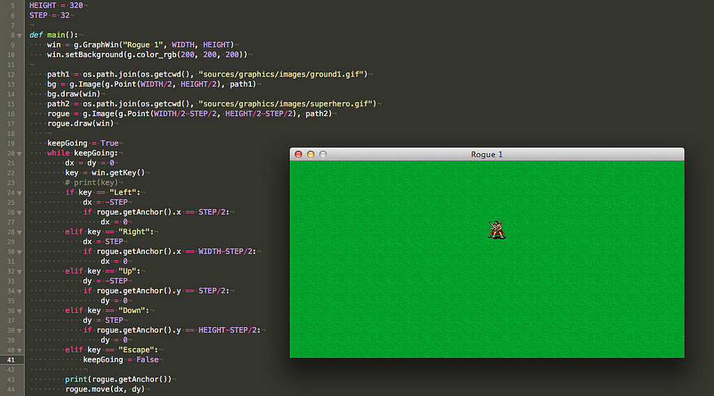
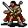

# Tastaturabfrage in graphics.py: Noch mehr Roguelike

Zwar hatte ich schon bei der ersten Vorstellung von *graphics.py* ein Beispiel, wie die Abfrage eines Mausklicks in diesem kleinen Python-Paket funktionert, aber nun möchte ich zeigen, wie man auch die Tastatur abfragen kann. Und ich konnte es nicht lassen, wieder mußte und wollte ich dies am Beispiel eines Roguelikes zeigen.

Dabei wollte ich zweierlei erreichen: Die Spielfigur sollte sich nicht mehr kontinuierlich bewegen, sondern sie sollte auf Tastendruck wie auf einem Schachbrett je ein Feld weiterspringen, und zwar nach oben, unten, rechts oder links. Die Felder sind, genau wie die Spielfigur, jeweils 32x32 Pixel groß. Und die Spielfigur sollte am Verlassen des Spielfeldes gehindert werden, also an den Rändern einfach stehen bleiben, egal welche Taste der Spieler drückt [^fn00].

[^fn00]: Das ist eine Vorübung, da in ähnlicher Form auch in einem »echten« Roguelike die Kollisionsabfragen erfolgen können, egal ob mit Hindernissen, aufzusammelnden Gegenständen oder mit Monstern und sonstigen Gegnern.

Als Tasten sollten die Pfeiltasten zum Einsatz kommen. Aber dafür muß man erst einmal herausbekommen, wie sie heißen. Die Tastaturabfrage wird in *graphics.py* mit `graphics.getKey()` durchgeführt, die Zeile

~~~python
print(win.getKey())
~~~

in meinem Testprogramm lieferte mir also die Namen `left`, `right`, `up` und `down` für die Pfeiltasten und `escape`für die Escape-Taste, mit der ich das Spiel beenden wollte. Die Größe des Fensters habe ich dieses Mal auf 640x320 Pixel gesetzt und es sollte mit einem satten, grünen Rasen als Hintergrund ausgestattet werden (das Bild des Rasens hatte ich mit Tiled erstellt und dann im GIMP von PNG nach GIF konvertiert [^fn01]). Obwohl *graphics.py* keinen expliziten Befehl für Hintergrundbilder besitzt, reichten diese Zeilen aus, um das Gewünschte zu erreichen:

[^fn01]: Wer kein Rasenbild hat, kann auch einfach mit `win.setBackground(g.color_rgb(0, 200, 0))` oder ähnlichen Werten eine grüne Hintergrundfarbe verwenden.

~~~python
    path1 = os.path.join(os.getcwd(), "sources/graphics/images/ground1.gif")
    bg = g.Image(g.Point(WIDTH/2, HEIGHT/2), path1)
    bg.draw(win)
    path2 = os.path.join(os.getcwd(), "sources/graphics/images/superhero.gif")
    rogue = g.Image(g.Point(WIDTH/2-STEP/2, HEIGHT/2-STEP/2), path2)
    rogue.draw(win)
~~~

In den ersten drei Zeilen wird das Hintergrundbild geladen und im Fenster angezeigt. Dabei ist zu beachten, daß der Ankerpunkt eines Bildes in *graphics.py* nicht -- wie in vielen anderen Paketen -- die linke, obere Ecke des Bildes ist, sondern die Mitte des Bildes.

Die folgenden Zeilen laden dann das Bild meines Superhelden und zeigen es an. Es zeigte sich, daß dies funktioniert und der Held bewegt werden kann, ohne häßliche Löcher in den Rasen zu reißen.

Nun folgt die eigentliche Spiellogik mit der Tastaturabfrage:

~~~python
    keepGoing = True
    while keepGoing:
        dx = dy = 0
        key = win.getKey()
        # print(key)
        if key == "Left":
            dx = -STEP
            if rogue.getAnchor().x == STEP/2:
                dx = 0
        elif key == "Right":
            dx = STEP
            if rogue.getAnchor().x == WIDTH-STEP/2:
                dx = 0
        elif key == "Up":
            dy = -STEP
            if rogue.getAnchor().y == STEP/2:
                dy = 0
        elif key == "Down":
            dy = STEP
            if rogue.getAnchor().y == HEIGHT-STEP/2:
                dy = 0
        elif key == "Escape":
            keepGoing = False
            
        print(rogue.getAnchor())
        rogue.move(dx, dy)
~~~

Zuerst habe ich die Variable `keepGoing` auf `True` gesetzt und dann das Programm in eine faktische Endlosschleife geschickt. In dieser wird die Tastatur abgefragt und auf die Pfeiltasten reagiert. Je nach gedrückter Pfeiltaste wird der Held um einen `STEP` (das sind 32 Pixel) nach rechts, links, oben oder unten geschickt. Nur in den Fällen, in denen er den Rand des Fensters erreicht hat, wird die Schrittlänge auf 0 Pixel gesetzt und unser Held kann somit nicht weiterlaufen, egal wie oft die Pfeiltaste noch gedrückt wird.

Bei der Abfrage zu den Rändern taucht immer wieder der Wert `STEP/2`, also 16 Pixel auf, weil natürlich auch der Mittelpunkt unseres 32x32 Pixel großen Helden der Ankerpunkt seines Bildes ist. Es war zuerst nicht einfach für mich, das konsequent durchzuhalten, immer wieder ging ich rein gewohnheitmäßig von der linken oberen Ecke des Bildes aus.

Das macht sich besonders auch dann bemerkbar, wenn die Anzahl der Kacheln unseres Spielfeldes in einer oder beiden Richtungen nicht gerade ist: Will man dann die Startposition des Helden in eine Kachel in der Mitte des Bildes setzen, muß man wieder mit `STEP/2` hantieren. Aber egal, ich habe es jetzt hoffentlich gefressen und werde es mir mindestens so lange merken, wie ich mit dem Paket `graphics.py` programmiere.

Eine Besonderheit sind die letzten beiden Zeilen in der `if`-Abfrage: Wird die Escape-Taste gedrückt, ist das Spiel beendet, denn `keepGoing` wird auf `False` gesetzt und damit die `while`-Schleife verlassen. Und weil danach kein weiterer Befehl folgt, endet auch das Programm.

Die Zeile

~~~python
print(rogue.getAnchor())
~~~

ist nur meiner Unsicherheit mit dem Mittelpunkt des Superhero-Bildes geschuldet und kann natürlich auskommentiert werden. Aber ich wollte einfach immer wissen, auf welchen Koordinatenpaaren sich der Held befindet.

Und der `move(dx, dy)`-Befehl schob tatsächlich den Helden brav über das Hintergrundbild, ohne daß die Kachel seines vorherigen Bleibens neugezeichnet werden mußte. Das erledigt das `graphics.py`-Paket brav für uns. [^fn02]

[^fn02]: Das mag heute trivial erscheinen. Aber wer -- wie ich -- in den frühen 1980er Jahren auf einem Atari oder Macintosh programmiert hatte, der weiß noch, das das Neuzeichnen des Hintergrundes immer dem Programmierer überlassen blieb. Und das hat bei mir tiefe Spuren hinterlassen.

## Der Qeullcode

Nun für diejenigen, die das nachprogrammieren wollen, der komplette Quellcode des Progrämmchens:

~~~python
import graphics as g
import os

WIDTH = 640
HEIGHT = 320
STEP = 32

def main():
    win = g.GraphWin("Rogue 1", WIDTH, HEIGHT)
    win.setBackground(g.color_rgb(200, 200, 200))

    path1 = os.path.join(os.getcwd(), "sources/graphics/images/ground1.gif")
    bg = g.Image(g.Point(WIDTH/2, HEIGHT/2), path1)
    bg.draw(win)
    path2 = os.path.join(os.getcwd(), "sources/graphics/images/superhero.gif")
    rogue = g.Image(g.Point(WIDTH/2-STEP/2, HEIGHT/2-STEP/2), path2)
    rogue.draw(win)
    
    keepGoing = True
    while keepGoing:
        dx = dy = 0
        key = win.getKey()
        # print(key)
        if key == "Left":
            dx = -STEP
            if rogue.getAnchor().x == STEP/2:
                dx = 0
        elif key == "Right":
            dx = STEP
            if rogue.getAnchor().x == WIDTH-STEP/2:
                dx = 0
        elif key == "Up":
            dy = -STEP
            if rogue.getAnchor().y == STEP/2:
                dy = 0
        elif key == "Down":
            dy = STEP
            if rogue.getAnchor().y == HEIGHT-STEP/2:
                dy = 0
        elif key == "Escape":
            keepGoing = False
            
        print(rogue.getAnchor())
        rogue.move(dx, dy)

        

if __name__ == "__main__":
    main()
~~~

Natürlich darf auch das Bild des Superhelden nicht fehlen:

Ich habe es aus der freien [Sprite-Sammlung von TomeTik](http://pousse.rapiere.free.fr/tome/) entnommen, die *David Gervais* gezeichnet hat. Es ist eine alte Website, die noch Frames verwendet. Daher dort unter `Silmar Tiles` auf `Player` klicken. Ihr findet dort noch weitere Bildchen, die Ihr alternativ für Euere Projekte verwenden könnt. Vergeßt aber bitte nicht, den Urheber zu erwähnen. Das schreibt nicht nur der Anstand, sondern auch die verwendete [Creative Commons Licence](http://creativecommons.org/licenses/by/3.0/) vor.

Je tiefer ich einsteige, desto mehr macht mir die Beschäftigung mit dem *graphics.py*-Paket Spaß. Ich werde daher noch mindestens ein Tutorial dranhängen, daß zeigt, wie *graphics.py* mit Texten umgeht. *Still digging!*