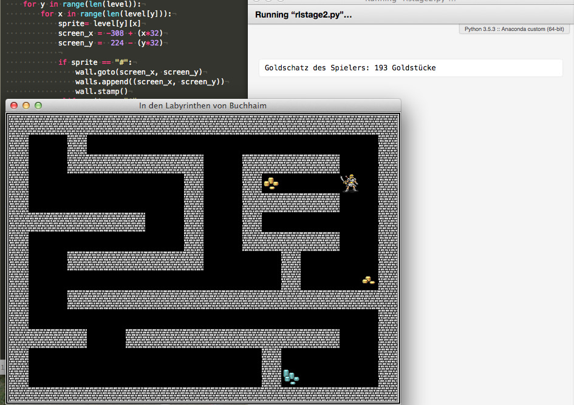
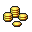
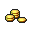
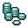
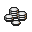
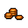

# Ein Rogue-like mit Python und der Turtle (Stage 2)

Im ersten Teil meiner kleinen Tutorial-Reihe, wie man ein [Rogue-like](http://cognitiones.kantel-chaos-team.de/medien/retrogames/rogue.html) mit dem Turtle-Modul von Python programmiert, habe ich das Labyrinth geschaffen und unseren Helden, den *Rogue* darin zum Leben erweckt, denn der Spieler kann ihn mit den Pfeiltasten der Tastatur durch dieses Labyrinth steuern. Im zweiten Teil möchte ich nun ein paar Goldstücke im Labyrinth verteilen und dafür sorgen, daß der *Rogue* sie auch finden und seinen Goldschatz vermehren kann.

Dafür brauchte ich zuerst einmal ein paar Bilder der Goldstückchen, die ich ebenfalls wieder bei der freien ([CC BY 3.0](https://creativecommons.org/licenses/by/3.0/)) [TomeTik Tiles Library](http://pousse.rapiere.free.fr/tome/) ausgeliehen habe. Der Schöpfer der Bilder ist immer noch *David E. Gervais* und ich habe ihn hiermit lizenzgemäß genannt.

     

Das Laden und Registrieren der Bilder bläht den Quellcode schon ganz gewaltig auf:

~~~python
wall_shape = os.path.join(os.getcwd(), "sources/turtle/roguelike/images/wall.gif")
player_shape = os.path.join(os.getcwd(), "sources/turtle/roguelike/images/player.gif")
gold1_shape = os.path.join(os.getcwd(), "sources/turtle/roguelike/images/gold1.gif")
gold2_shape = os.path.join(os.getcwd(), "sources/turtle/roguelike/images/gold2.gif")
gold3_shape = os.path.join(os.getcwd(), "sources/turtle/roguelike/images/gold3.gif")
gold4_shape = os.path.join(os.getcwd(), "sources/turtle/roguelike/images/gold4.gif")
gold5_shape = os.path.join(os.getcwd(), "sources/turtle/roguelike/images/gold5.gif")
gold6_shape = os.path.join(os.getcwd(), "sources/turtle/roguelike/images/gold6.gif")
wn.register_shape(wall_shape)
wn.register_shape(player_shape)
wn.register_shape(gold1_shape)
wn.register_shape(gold2_shape)
wn.register_shape(gold3_shape)
wn.register_shape(gold4_shape)
wn.register_shape(gold5_shape)
wn.register_shape(gold6_shape)
~~~

Man kann das natürlich auch intelligenter anstellen und die Goldstücke in einer Schleife laden und registrieren, aber das überlasse ich zur Übung der geneigten Leserin oder dem geneigten Leser.

Die Oberklasse `Sprite` wurde mit zwei weiteren Funktionen versehen, einmal mit der Methode `collides_with()`,

~~~python
    def collides_with(self, other):
        a = self.xcor() - other.xcor()
        b = self.ycor() - other.ycor()
        distance = math.sqrt(a**2 + b**2)
        if distance < 5:
            return True
        else:
            return False
~~~

die feststellt, ob ein Sprite mit einem anderen Sprite kollidiert. Die Bedingung `if distance < 5` habe ich recht willkürlich gewählt, ein `if distance == 0` hätte auch gereicht, da sich alle Sprites auf einem festen Raster bewegen, aber ich wollte die Methode so allgemein wie möglich halten -- vielleicht gebe ich ja irgendwann auch das feste Raster auf. Für die Berechnung der Distanz mußte übrigens zu Beginn des Programmes das Mathematik-Paket aus der Python-Standard-Bibliothek impoertiert werden:

~~~python
import math
import random as r
~~~

Und die Zufallszahlen-Bibliothek habe ich gleich mit importiert, die wird später noch gebraucht.

Dann gibt es die Methode `destroy()`,

~~~python
    def destroy(self):
        self.goto(5000, 5000)
        self.hideturtle()
~~~

die das Objekt nicht wirklich zerstört, sondern es nur außerhalb des Fensters und damit außerhalb der Sichtbarkeit des Spielers versteckt.

Die Klasse des Spielers ist nahezu unverändert geblieben, er hat nur die Eigenschaft

~~~python
        self.gold = 0
~~~
zusätzlich bekommen. Dieses leere Portemonnaie soll er während des Spieles auffüllen können.

Neu ist die Klasse `Treasure`, die die Goldobjekte erzeugen soll:

~~~python
class Treasure(Sprite):
    
    def __init__(self, shape, x, y, amount):
        Sprite.__init__(self, shape)
        self.x = x
        self.y = y
        self.gold = amount
        self.goto(self.x, self.y)
~~~

Außerdem sind noch zwei weitere Listen hinzugekommen:

~~~python
treasures = []
treasure_shapes = [gold1_shape, gold2_shape, gold3_shape,
                   gold4_shape, gold5_shape, gold6_shape]
~~~

`treasures` soll die Koordinaten der einzelnen Goldschätze aufnehmen und `treasure_shapes` ist eine Liste der Bilder der einzelnen Goldschätze.

Im Level habe ich dann ein einigen Stellen die Goldschätze mit Hilfe des Buchstabens `g` versteckt:

~~~python
level_1 = [
    "####################",
    "# @#               #",
    "#  #######  #####  #",
    "#        #  #g     #",
    "#        #  #####  #",
    "#######  #  #      #",
    "#        #  #####  #",
    "#  #######    #    #",
    "#             #   g#",
    "#  #################",
    "#                  #",
    "####  ###########  #",
    "#           g#     #",
    "#            #g    #",
    "####################"
]
~~~

Die Beschränkung auf ASCII-Zeichen im Level-Entwurf führte bei den frühen Rogue-likes dazu, daß maximal 256 verschiedene *Items* das Spielfeld bevölkern konnten, nutzte man einen erweiterten ASCII-Satz waren es schon deutlich mehr. Dennoch hatte ich früher beim Level-Entwurf immer dreistellige numerische Werte bevorzugt, denn dies lies immerhin 1.000 verschiedene *Items* zu, aber es machte zugegebenermaßen die Leveldarstellung unübersichtlicher. In Zeiten von UTF-8 und Python 3 kann man gefahrlos die Glyphen-Darstellung wählen, es stehen einem ja nun Millionen von Zeichen -- bis hin zu Emojis -- offen. (Ein Level-Entwurf, der komplett mit Emojis gezeichnet wurde, das wäre doch mal was.)

Das Level-Setup mußte natürlich um eine weitere `elif`-Bedingung erweitert werden:

~~~python
elif sprite == "g":
    treasures.append(Treasure(r.choice(treasure_shapes), screen_x, screen_y,
    r.randint(25, 250)))
    num_treasures += 1
~~~

Hier erkennt man, warum ich `random`importieren mußte. Einmal wähle ich mit der Funktion `choice()`aus der Shape-Liste einen Tile für die Goldstücke aus und zum anderen weise ich jedem Goldschatz mit der Funktion `randint()` einen zufälligen Wert zwischen 25 und 250 zu.

Jetzt bleibt nur noch die eigentliche Hauptschleife des Spiels. Sie ist nun immerhin so groß geworden, daß sie diesen Namen auch verdient:

~~~python
keepGoing = True
while keepGoing:
    for treasure in treasures:
        if rogue.collides_with(treasure):
            rogue.gold += treasure.gold
            print("Goldschatz des Spielers: {} Goldstücke".format(rogue.gold))
            treasure.destroy()
            num_treasures -= 1
            if num_treasures == 0:
                print("Glückwunsch, Du hast diesen Level überlebt!")
    wn.update()
~~~

Jedes Mal, wenn der Rogue einen Goldschatz einsackt, wird die Anzahl der Goldschätze um einen erniedrigt. Gibt es keine Goldschätze im Level mehr, wird der Rogue für seine Leistung beglückwünscht.

Nun aber wieder den kompletten Quellcode zur Kontrolle und für diejenigen, die das Spiel in diesem Status nachprogrammieren wollen:

~~~python
import turtle as t
import random as r
import os
import math

wn = t.Screen()
wn.bgcolor("black")
wn.title("In den Labyrinthen von Buchhaim – Stage 2")
wn.setup(640, 480)

wall_shape = os.path.join(os.getcwd(), "sources/turtle/roguelike/images/wall.gif")
player_shape = os.path.join(os.getcwd(), "sources/turtle/roguelike/images/player.gif")
gold1_shape = os.path.join(os.getcwd(), "sources/turtle/roguelike/images/gold1.gif")
gold2_shape = os.path.join(os.getcwd(), "sources/turtle/roguelike/images/gold2.gif")
gold3_shape = os.path.join(os.getcwd(), "sources/turtle/roguelike/images/gold3.gif")
gold4_shape = os.path.join(os.getcwd(), "sources/turtle/roguelike/images/gold4.gif")
gold5_shape = os.path.join(os.getcwd(), "sources/turtle/roguelike/images/gold5.gif")
gold6_shape = os.path.join(os.getcwd(), "sources/turtle/roguelike/images/gold6.gif")
wn.register_shape(wall_shape)
wn.register_shape(player_shape)
wn.register_shape(gold1_shape)
wn.register_shape(gold2_shape)
wn.register_shape(gold3_shape)
wn.register_shape(gold4_shape)
wn.register_shape(gold5_shape)
wn.register_shape(gold6_shape)

# Die Oberklasse Sprite, zugleich die Klasse für die Mauern des Labyrinths
class Sprite(t.Turtle):
    
    def __init__(self, shape):
        t.Turtle.__init__(self)
        self.shape(shape)
        self.penup()
        self.speed(0)
    
    def collides_with(self, other):
        a = self.xcor() - other.xcor()
        b = self.ycor() - other.ycor()
        distance = math.sqrt(a**2 + b**2)
        if distance < 5:
            return True
        else:
            return False
    
    def destroy(self):
        self.goto(5000, 5000)
        self.hideturtle()

# Der Spieler
class Player(Sprite):
    
    def __init__(self, shape):
        Sprite.__init__(self, shape)
        self.gold = 0
    
    def go_left(self):
        go_to_x = self.xcor() - 32
        go_to_y = self.ycor()
        if (go_to_x, go_to_y) not in walls:
            self.goto(go_to_x, go_to_y)
        
    def go_right(self):
        go_to_x = self.xcor() + 32
        go_to_y = self.ycor()
        if (go_to_x, go_to_y) not in walls:
            self.goto(go_to_x, go_to_y)

    def go_up(self):
        go_to_x = self.xcor()
        go_to_y = self.ycor() + 32
        if (go_to_x, go_to_y) not in walls:
            self.goto(go_to_x, go_to_y)
        
    def go_down(self):
        go_to_x = self.xcor()
        go_to_y = self.ycor() - 32
        if (go_to_x, go_to_y) not in walls:
            self.goto(go_to_x, go_to_y)

# Die Schätze
class Treasure(Sprite):
    
    def __init__(self, shape, x, y, amount):
        Sprite.__init__(self, shape)
        self.x = x
        self.y = y
        self.gold = amount
        self.goto(self.x, self.y)

# Listen der Labyrinthe, der Mauern und der Schätze
levels = []
walls = []
treasures = []
treasure_shapes = [gold1_shape, gold2_shape, gold3_shape,
                   gold4_shape, gold5_shape, gold6_shape]

level_1 = [
    "####################",
    "# @#               #",
    "#  #######  #####  #",
    "#        #  #g     #",
    "#        #  #####  #",
    "#######  #  #      #",
    "#        #  #####  #",
    "#  #######    #    #",
    "#             #   g#",
    "#  #################",
    "#                  #",
    "####  ###########  #",
    "#           g#     #",
    "#            #g    #",
    "####################"
]

levels.append(level_1)

# Level Setup
def setup_maze(level):
    global num_treasures
    for y in range(len(level)):
        for x in range(len(level[y])):
            sprite= level[y][x]
            screen_x = -308 + (x*32)
            screen_y =  224 - (y*32)
            
            if sprite == "#":
                wall.goto(screen_x, screen_y)
                walls.append((screen_x, screen_y))
                wall.stamp()
            elif sprite == "@":
                rogue.goto(screen_x, screen_y)
                rogue.stamp
            elif sprite == "g":
                treasures.append(Treasure(r.choice(treasure_shapes), screen_x, screen_y, r.randint(25, 250)))
                num_treasures += 1

def exitGame():
    global keepGoing
    keepGoing = False

wall = Sprite(wall_shape)
rogue = Player(player_shape)

# Auf Tastaturereignisse lauschen
t.listen()
t.onkey(rogue.go_left, "Left")
t.onkey(rogue.go_right, "Right")
t.onkey(rogue.go_up, "Up")
t.onkey(rogue.go_down, "Down")
t.onkey(exitGame, "Escape") # Escape beendet das Spiel

wn.tracer(0)
num_treasures = 0
setup_maze(levels[0])
# print(walls)

keepGoing = True
while keepGoing:
    for treasure in treasures:
        if rogue.collides_with(treasure):
            rogue.gold += treasure.gold
            print("Goldschatz des Spielers: {} Goldstücke".format(rogue.gold))
            treasure.destroy()
            num_treasures -= 1
            if num_treasures == 0:
                print("Glückwunsch, Du hast diesen Level überlebt!")
    wn.update()
~~~

Das Spiel ist so noch keine echte Herausforderung für den Spieler, sondern nur ein Versuch, herauszufinden, was man mit dem Turtle-Modul so alles anstellen kann. Im nächsten Teil dieser kleinen Reihe möchte ich den *Rogue* mit einer Reihe von Monstern konfrontieren, die ihm dann gefährlich werden können. *Still digging!*