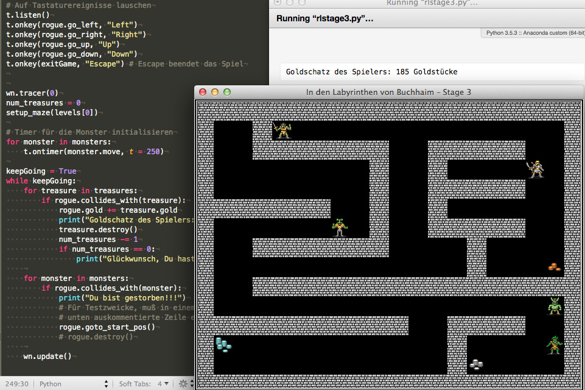
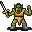
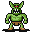
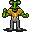
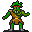

# Ein Rogue-like mit Python und der Turtle (Stage 3)

Nachdem ich im ersten Teil dieser kleinen Tutorialreihe die Grundlagen gelegt und ein Labyrinth erschaffen hatte, in dem sich unser Held, der *Rogue*, bewegen konnte und im zweiten Teil Schätze im Labyrinth hinterlegt hatte, damit der *Rogue* ein Ziel hat und sein Portemonnaie auffüllen kann, möchte ich nun im dritten Teil das Labyrinth mit Monstern bevölkern, die dem Spieler das Leben schwer machen sollen:

Die Monster habe ich mir ebenfalls wieder bei der freien ([CC BY 3.0](https://creativecommons.org/licenses/by/3.0/)) [TomeTik Tiles Library](http://pousse.rapiere.free.fr/tome/) ausgeliehen. Die Lizenz schreibt vor, daß der Schöpfer der Bilder genannt wird -- es ist *David E. Gervais*. Einwohner des Labyrinths sollen ein Ork, ein Schmerzkiller, ein Reptilien-Mann und ein Troll sein. Hier sind die entsprechenden Bildchen:

   

Die Bilder mußte ich mit der [Bildverarbeitung meines Vertrauens](http://cognitiones.kantel-chaos-team.de/multimedia/computergraphik/gimp.html) nachbearbeiten, da nicht alle exakt 32 x 32 Pixel groß waren. Nachdem dies erledigt war, konnte ich sie nun für die Turtlegraphik laden und registrieren:

~~~python
orc_shape = os.path.join(os.getcwd(), "sources/turtle/roguelike/images/orc.gif")
painkiller_shape = os.path.join(os.getcwd(), "sources/turtle/roguelike/images/painkiller.gif")
reptileman_shape = os.path.join(os.getcwd(), "sources/turtle/roguelike/images/reptileman.gif")
troll_shape = os.path.join(os.getcwd(), "sources/turtle/roguelike/images/troll.gif")

shapes = [wall_shape, player_shape, gold1_shape, gold2_shape, gold3_shape,
          gold4_shape, gold5_shape, gold6_shape,
          orc_shape, painkiller_shape, reptileman_shape, troll_shape]

for shape in shapes:
    wn.register_shape(shape)
~~~

Damit ich die Shapes nicht alle einzeln registrieren muß, habe ich alle Shapes in eine Liste gepackt und diese dann in einer `for`-Schleife registriert.

Die Klasse `Monster` ist komplett neu hinzugekommen. Auch sie erbt natürlich von `Sprite`, hat aber eine eigene `move()`-Methode, da die Monster ja im Gegensatz zum *Rogue* nicht vom Spieler gesteuert werden, sondern autonom agieren.

~~~python
class Monster(Sprite):

    def __init__(self, shape, x, y):
        Sprite.__init__(self, shape)
        self.x = x
        self.y = y
        self.goto(self.x, self.y)
        self.dir = r.choice(["up", "down", "left", "right"])
    
    def move(self):
        if self.dir == "up":
            dx = 0
            dy = 32
        elif self.dir == "down":
            dx = 0
            dy = -32
        elif self.dir == "left":
            dx = -32
            dy = 0
        elif self.dir == "right":
            dx = 32
            dy = 0
        else:
            dx = 0
            dy = 0
        
        move_to_x = self.xcor() + dx
        move_to_y = self.ycor() + dy
        
        if (move_to_x, move_to_y) not in walls:
            self.goto(move_to_x, move_to_y)
        else:
            self.dir = r.choice(["up", "down", "left", "right"])
            
        # Set Timer
        t.ontimer(self.move, r.randint(100, 300))
~~~

Die »autonome« Bewegung der Monster ist noch recht einfach gehalten. Zu Beginn wird mit `choice()` zufällig eine der vier Himmelsrichtungen ausgesucht. In diese Richtung läuft das Monster solange weiter, bis es an ein Hindernis stößt. Dann sucht es wieder zufällig eine neue Himmelsrichtung aus und wenn diese frei ist, läuft es in diese Richtung solange weiter, bis es erneut auf ein Hindernis trifft. Dieses doch recht einfache Bewegungsmuster bedeutet aber auch, daß die Monster nicht überall hinkommen. Insbesondere mußte ich den Eingang zur Kammer unten links verlegen (siehe Screenshot oben), weil ein Monster sonst darin auf ewig gefangen wäre. Auch der Ork kann die Gänge im oberen Drittel nicht verlassen, da er keine Chance hat, in den Mittelgang zu gelangen.

In einer späteren Folge möchte ich den Monstern intelligenter wirkende Bewegungsmuster verpassen, aber erst einmal lasse ich das so stehen.

Die Monster bewegen sich *Timer*-gesteuert, da ich die `ontimer`-Methode des Turtle-Moduls ausprobieren wollte. Sie führt eine Funktion nach `t` Millisekunden aus. Damit ist das Spiel streng genommen kein *Rogue-like* mehr, da die [Berliner Interpretation der Rogue-likes](http://www.roguebasin.com/index.php?title=Berlin_Interpretation) unter anderem ein rundenbasiertes Spielprinzip verlangt, das heißt, der Spieler bewegt den *Rogue*, danach machen alle Monster einen Schritt und danach bewegt der Spieler wieder den *Rogue*. Aber ich wollte zum einen nicht päpstlicher als der Papst sein und zum anderen hat solch ein Spiel mit autonom sich bewegenden Gegnern, das ähnlich wie die frühen *[Zelda](http://www.roguebasin.com/index.php?title=Berlin_Interpretation)*-Spiele funktionert, ja durchaus auch seinen Reiz.

Ich plane aber in einer spätere Version wieder zum rundenbasierten Prinzip zurückzukehren.

Der Plan für die Initialisierung des Levels sieht nun so aus (die Monster wurden jeweils durch einen Großbuchstaben markiert):

~~~python
level_1 = [
    "####################",
    "# @#               #",
    "#  #######  #####  #",
    "#      K #  #g     #",
    "#        #  #####  #",
    "#######  #  # O    #",
    "#        #  #####  #",
    "#  #######    #    #",
    "#             #   g#",
    "#  #################",
    "#                  #",
    "###########  ####  #",
    "#g           #  R  #",
    "#         T  #g    #",
    "####################"
]
~~~

Die Monster bekommen eine eigene Liste `monsters = []` und natürlich mußte das Maze-Setup um vier weitere `elif`-Verzweigungen erweitert werden, um die Monster ins Spiel zu bringen:

~~~python
            elif sprite == "O":
                orc = Monster(orc_shape, screen_x, screen_y)
                monsters.append(orc)
            elif sprite == "K":
                painkiller = Monster(painkiller_shape, screen_x, screen_y)
                monsters.append(painkiller)
            elif sprite == "R":
                reptileman = Monster(reptileman_shape, screen_x, screen_y)
                monsters.append(reptileman)
            elif sprite == "T":
                troll = Monster(troll_shape, screen_x, screen_y)
                monsters.append(troll)
~~~

In einem echten *Rogue-like* oder *RPG* ist es nicht unüblich, jedem Monster eine eigene Klasse mit einem eigenen Verhalten zu spendieren. Schließlich verhält sich ein Ork anders als ein Troll und dieser wieder anders als ein Reptilienmensch. Sie besitzen -- wenn es zum Kampf mit dem *Rogue* kommt -- auch unterschiedliche Stärken und Eigenschaften. Aber das schießt über das Ziel dieses Tutorials hinaus, das ja nur eine Blaupause für eigene Experimente sein und zeigen soll, daß man so ein *Rogue-like* auch mit Pythons Turtle-Modul programmieren kann.

Nun muß nur noch -- bevor das Programm in die Hauptschleife geht -- der Timer für die Monster zum Start initialisiert werden, damit sich die Monster vom Start an bewegen:

~~~python
for monster in monsters:
    t.ontimer(monster.move, 250)
~~~

Auch in der Hauptschleife bekommt die Monsterliste eine eigene Unterschleife:

~~~python
    for monster in monsters:
        if rogue.collides_with(monster):
            print("Du bist gestorben!!!")
            # Für Testzwecke, muß in einem realen Spiel durch die
            # unten auskommentierte Zeile ersetzt werden.
            rogue.goto_start_pos()
            # rogue.destroy()
~~~

Wenn der *Rogue* auf ein Monster trifft, stirbt er gnadenlos. Auch das ist eine Eigenschaft, die zu einem *Rogue-like* laut der Berliner Interpretation gehört *(Permadeath)*. Aber auch hier verstoße ich dagegen und lasse ihn zumindest zu Testzwecken weiterleben und schicke ihn nur an die Startposition zurück. Dazu habe ich in der Klasse `Player` im Konstruktor in den beiden Zeilen

~~~python
        self.start_x = 0
        self.start_y = 0
~~~

die beiden Variablen `start_x` und `start_y` initialisiert, die beim Maze-Setup mit

~~~python
            elif sprite == "@":
                rogue.start_x = screen_x
                rogue.start_y = screen_y
                rogue.goto(screen_x, screen_y)
                rogue.stamp
~~~

ihre »echten« Werte zugewiesen bekommen. Und natürlich mußte ich dann auch die Methode

~~~python
    def goto_start_pos(self):
        self.goto(self.start_x, self.start_y)
~~~

einführen, die den `Rogue` wieder an seine Startposition zurückschickt. Aber wie gesagt, dies ist nun wirklich nicht mehr *Rogue-like*, in einem »echten« Spiel, das auch über mehrere Dutzend prozedural generierte Level verfügt, stirbt der *Rogue* und muß wieder von vorne in einem neuen und -- da prozedural generiert -- unbekannten *Dungeon* von vorne beginnen.

So, nun wieder für alle, die gerne Quelltext lesen oder die das Spiel nachprogrammieren wollen, der komplette Quelltext:

~~~python
import turtle as t
import random as r
import os
import math

wn = t.Screen()
wn.bgcolor("black")
wn.title("In den Labyrinthen von Buchhaim – Stage 3")
wn.setup(640, 480)

wall_shape = os.path.join(os.getcwd(), "sources/turtle/roguelike/images/wall.gif")
player_shape = os.path.join(os.getcwd(), "sources/turtle/roguelike/images/player.gif")
gold1_shape = os.path.join(os.getcwd(), "sources/turtle/roguelike/images/gold1.gif")
gold2_shape = os.path.join(os.getcwd(), "sources/turtle/roguelike/images/gold2.gif")
gold3_shape = os.path.join(os.getcwd(), "sources/turtle/roguelike/images/gold3.gif")
gold4_shape = os.path.join(os.getcwd(), "sources/turtle/roguelike/images/gold4.gif")
gold5_shape = os.path.join(os.getcwd(), "sources/turtle/roguelike/images/gold5.gif")
gold6_shape = os.path.join(os.getcwd(), "sources/turtle/roguelike/images/gold6.gif")
orc_shape = os.path.join(os.getcwd(), "sources/turtle/roguelike/images/orc.gif")
painkiller_shape = os.path.join(os.getcwd(), "sources/turtle/roguelike/images/painkiller.gif")
reptileman_shape = os.path.join(os.getcwd(), "sources/turtle/roguelike/images/reptileman.gif")
troll_shape = os.path.join(os.getcwd(), "sources/turtle/roguelike/images/troll.gif")

shapes = [wall_shape, player_shape, gold1_shape, gold2_shape, gold3_shape,
          gold4_shape, gold5_shape, gold6_shape,
          orc_shape, painkiller_shape, reptileman_shape, troll_shape]

for shape in shapes:
    wn.register_shape(shape)

# Die Oberklasse Sprite, zugleich die Klasse für die Mauern des Labyrinths
class Sprite(t.Turtle):
    
    def __init__(self, shape):
        t.Turtle.__init__(self)
        self.shape(shape)
        self.penup()
        self.speed(0)
    
    def go_left(self):
        go_to_x = self.xcor() - 32
        go_to_y = self.ycor()
        if (go_to_x, go_to_y) not in walls:
            self.goto(go_to_x, go_to_y)
        
    def go_right(self):
        go_to_x = self.xcor() + 32
        go_to_y = self.ycor()
        if (go_to_x, go_to_y) not in walls:
            self.goto(go_to_x, go_to_y)

    def go_up(self):
        go_to_x = self.xcor()
        go_to_y = self.ycor() + 32
        if (go_to_x, go_to_y) not in walls:
            self.goto(go_to_x, go_to_y)
        
    def go_down(self):
        go_to_x = self.xcor()
        go_to_y = self.ycor() - 32
        if (go_to_x, go_to_y) not in walls:
            self.goto(go_to_x, go_to_y)
    
    def collides_with(self, other):
        a = self.xcor() - other.xcor()
        b = self.ycor() - other.ycor()
        distance = math.sqrt(a**2 + b**2)
        if distance < 5:
            return True
        else:
            return False

    def destroy(self):
        self.goto(5000, 5000)
        self.hideturtle()

# Der Spieler
class Player(Sprite):
    
    def __init__(self, shape):
        Sprite.__init__(self, shape)
        self.gold = 0
        self.start_x = 0
        self.start_y = 0
    
    def goto_start_pos(self):
        self.goto(self.start_x, self.start_y)

# Die Schätze
class Treasure(Sprite):
    
    def __init__(self, shape, x, y, amount):
        Sprite.__init__(self, shape)
        self.x = x
        self.y = y
        self.gold = amount
        self.goto(self.x, self.y)
        
# Die Monster
class Monster(Sprite):

    def __init__(self, shape, x, y):
        Sprite.__init__(self, shape)
        self.x = x
        self.y = y
        self.goto(self.x, self.y)
        self.dir = r.choice(["up", "down", "left", "right"])
    
    def move(self):
        if self.dir == "up":
            dx = 0
            dy = 32
        elif self.dir == "down":
            dx = 0
            dy = -32
        elif self.dir == "left":
            dx = -32
            dy = 0
        elif self.dir == "right":
            dx = 32
            dy = 0
        else:
            dx = 0
            dy = 0
        
        move_to_x = self.xcor() + dx
        move_to_y = self.ycor() + dy
        
        if (move_to_x, move_to_y) not in walls:
            self.goto(move_to_x, move_to_y)
        else:
            self.dir = r.choice(["up", "down", "left", "right"])
            
        # Set Timer
        t.ontimer(self.move, r.randint(100, 300))

# Listen der Labyrinthe, der Mauern und der Schätze
levels = []
walls = []
treasures = []
treasure_shapes = [gold1_shape, gold2_shape, gold3_shape,
                   gold4_shape, gold5_shape, gold6_shape]
monsters = []

level_1 = [
    "####################",
    "# @#               #",
    "#  #######  #####  #",
    "#      K #  #g     #",
    "#        #  #####  #",
    "#######  #  # O    #",
    "#        #  #####  #",
    "#  #######    #    #",
    "#             #   g#",
    "#  #################",
    "#                  #",
    "###########  ####  #",
    "#g           #  R  #",
    "#         T  #g    #",
    "####################"
]

levels.append(level_1)

# Level Setup
def setup_maze(level):
    global num_treasures
    for y in range(len(level)):
        for x in range(len(level[y])):
            sprite= level[y][x]
            screen_x = -308 + (x*32)
            screen_y =  224 - (y*32)

            if sprite == "#":
                wall.goto(screen_x, screen_y)
                walls.append((screen_x, screen_y))
                wall.stamp()
            elif sprite == "@":
                rogue.start_x = screen_x
                rogue.start_y = screen_y
                rogue.goto(screen_x, screen_y)
                rogue.stamp
            elif sprite == "O":
                orc = Monster(orc_shape, screen_x, screen_y)
                monsters.append(orc)
            elif sprite == "K":
                painkiller = Monster(painkiller_shape, screen_x, screen_y)
                monsters.append(painkiller)
            elif sprite == "R":
                reptileman = Monster(reptileman_shape, screen_x, screen_y)
                monsters.append(reptileman)
            elif sprite == "T":
                troll = Monster(troll_shape, screen_x, screen_y)
                monsters.append(troll)
            elif sprite == "g":
                treasures.append(Treasure(r.choice(treasure_shapes), screen_x, screen_y, r.randint(25, 250)))
                num_treasures += 1

def exitGame():
    global keepGoing
    keepGoing = False

wall = Sprite(wall_shape)
rogue = Player(player_shape)

# Auf Tastaturereignisse lauschen
t.listen()
t.onkey(rogue.go_left, "Left")
t.onkey(rogue.go_right, "Right")
t.onkey(rogue.go_up, "Up")
t.onkey(rogue.go_down, "Down")
t.onkey(exitGame, "Escape") # Escape beendet das Spiel

wn.tracer(0)
num_treasures = 0
setup_maze(levels[0])

# Timer für die Monster initialisieren
for monster in monsters:
    t.ontimer(monster.move, 250)

keepGoing = True
while keepGoing:
    for treasure in treasures:
        if rogue.collides_with(treasure):
            rogue.gold += treasure.gold
            print("Goldschatz des Spielers: {} Goldstücke".format(rogue.gold))
            treasure.destroy()
            num_treasures -= 1
            if num_treasures == 0:
                print("Glückwunsch, Du hast diesen Level überlebt!")
    
    for monster in monsters:
        if rogue.collides_with(monster):
            print("Du bist gestorben!!!")
            # Für Testzwecke, muß in einem realen Spiel durch die
            # unten auskommentierte Zeile ersetzt werden.
            rogue.goto_start_pos()
            # rogue.destroy()
    
    wn.update()
~~~

Das Spiel ist immer noch nicht wirklich schwer, aber es ist schon spielbar und der Spieler kann, wenn er nicht aufpaßt, seinen *Rogue* verlieren. In der nächsten Folge möchte ich den Monstern ein wenig mehr Intelligenz verpassen, doch vermutlich wird diese ein wenig auf sich warten lassen, diese drei Folgen waren die, die ich über die Feiertage programmiert bekommen habe. Also müßt Ihr mit Sicherheit mindestens das nächste Wochenende abwarten. *Still digging!*

