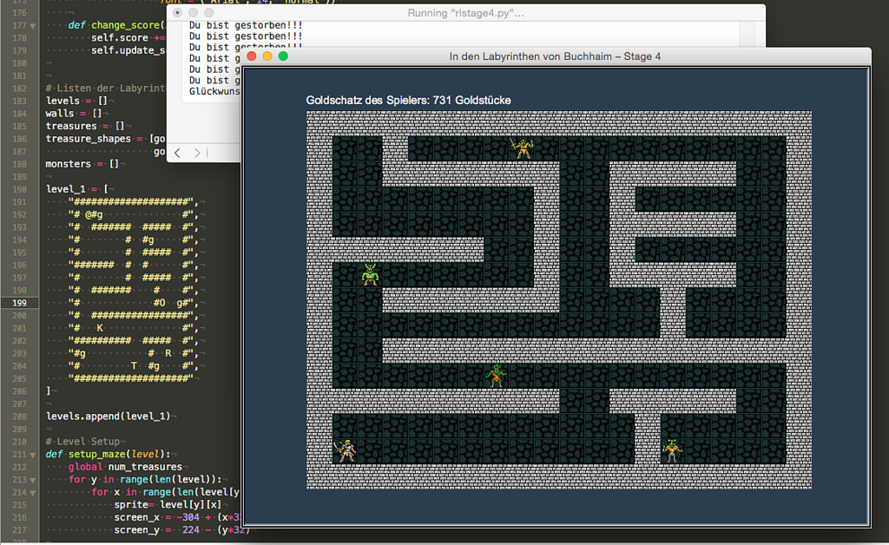

# Ein Rogue-like mit Python und der Turtle (Last Stage)

In diesem letzten Teil meiner kleinen Tutorial-Reihe, wie man mit dem Turtle-Modul von Python ein kleines Rogue-like programmieren kann, habe ich einerseits das Spiel noch ein wenig aufgehübscht und zum anderen den Monstern ein wenig Intelligenz zugestanden, damit sie dem *Rogue* das Leben zur Hölle machen können. Nun ist es nicht mehr so einfach, an die Goldschätze zu gelangen ohne einem der Monster in die Hände zu fallen, was ja unweigerlich zum Tod der Spielfigur führt.

Also erst einmal die Verschönerungen: Ich habe das Spielefenster größer gewählt (800 x 600 Pixel) und ihm eine andere Hintergrundfarbe spendiert (wie auch der Screenshot zeigt).

~~~python
wn.setup(800, 600)
wn.bgcolor("#2b3e50")
wn.bgpic(os.path.join(os.getcwd(), "sources/turtle/roguelike/images/bground.gif"))
~~~

Das eigentlich Labyrinth bekam ein 640 x 480 Pixel großes Hintergrundbild spendiert, dessen Kacheln ich -- wie alle anderen in diesem Tutorial verwendeten Bildchen -- bei der freien ([CC BY 3.0](https://creativecommons.org/licenses/by/3.0/)) [TomeTik Tiles Library](http://pousse.rapiere.free.fr/tome/) ausgeliehen habe. Die Lizenz schreibt vor, daß der Schöpfer der Bilder genannt wird -- es ist *David E. Gervais*. Damit habe ich die Lizenzbedingungen erfüllt.

Da ich die Kacheln nicht einzeln laden wollte habe ich sie mit Hilfe des freien (GPL) Programms [Tiled](http://cognitiones.kantel-chaos-team.de/multimedia/spieleprogrammierung/tiled.html) zu einem einzigen, großen Hintergrundbild zusammengefügt. Dabei stellte sich dann heraus, daß ich mit meiner Berechnung der linken, oberen Ecke bei `-304` doch richtig lag. Das seltsame Abschneiden der Mauern in den vorherigen Versionen des Spiels lag wohl daran, daß die Fenstergröße inklusive des Fensterrandes ermittelt wird und so ein paar Pixel verloren gingen. Ist aber das Fenster größer als das Labyrinth, dann ist alles schick.

Links oberhalb des Labyrinths wird die Anzahl der vom Spieler eingesammelten Goldstücke angezeigt. Solch eine Anzeige nennt man im Spieler-Jargon HUD (für Head-Up-Display) und daher habe ich die Klasse auch so genannt:

~~~python
class HeadUpDisplay(t.Turtle):
    
    def __init__(self):
        t.Turtle.__init__(self)
        self.penup()
        self.hideturtle()
        self.speed(0)
        self.color("white")
        self.goto(-WIDTH/2, HEIGHT/2 + 5)
        self.score = 0
    
    def update_score(self):
        self.clear()
        self.write("Goldschatz des Spielers: {} Goldstücke".format(rogue.gold), False, align = "left",
                    font = ("Arial", 14, "normal"))
~~~

Das HUD ist ebenfalls eine Turtle, die bei der Initialisierung nach links oben geschickt wird, um dann dort zu bleiben, weil es ihre einzige Aufgabe ist, als Ankerpunkt für den Text zu dienen und ihn bei Bedarf mit neuen Werten herauszuschreiben.

Das waren im Großen und Ganzen die Änderungen, die ich zur Verschönerung des Spieles implementiert hatte. Daher komme ich jetzt zu den Änderungen, die den Monstern den Anschein einer Intelligenz geben. Dazu habe ich in der Klasse `Sprite` eine zweite Abstandsfunktion eingefügt,

~~~python
    def is_close_to(self, other):
        a = self.xcor() - other.xcor()
        b = self.ycor() - other.ycor()
        distance = math.sqrt(a**2 + b**2)
        if distance < 96:
            return True
        else:
            return False
~~~

die bis auf den eigentlichen Abstand mit der Methode `collides_with` identisch ist. Die Idee dahinter ist die, daß das Monster ab einem Abstand von drei Kacheln (das entspricht 96 Pixeln) erkennen kann, ob der *Rogue* in der Nähe ist. Sieht oder riecht das Monster den *Rogue*, verfolgt es ihn, bis er wieder einen weiteren Abstand als drei Kacheln erreicht hat oder gestorben ist. Dann bewegt sich das Monster wieder zufällig im Labyrinth. Um das zu realisieren, habe ich in der Methode `move()` in der Klasse `Monster` diese Zeilen eingefügt:

~~~python
        if self.is_close_to(rogue):
            if rogue.xcor() < self.xcor():
                self.dir = "left"
            elif rogue.xcor() > self.xcor():
                self.dir = "right"
            elif rogue.ycor() < self.ycor():
                self.dir = "down"
            elif rogue.ycor() > self.ycor():
                self.dir = "up"
~~~

Das ist eigentlich schon alles. In der Hauptschleife mußte nur noch der Befehl

~~~python
    hud.update_score()
~~~

in die letzte Zeile vor dem `update()` eingefügt werden, damit das HUD mitbekommt, wann ein Update fällig ist.

Zum Schluß wie gewohnt das vollständige Programm für die, die gerne Quellcode lesen und für die, die das Spiel nachprogrammieren wollen:

~~~python
import turtle as t
import random as r
import os
import math

WIDTH = 640
HEIGHT = 480

wn = t.Screen()
wn.bgcolor("black")
wn.title("In den Labyrinthen von Buchhaim – Stage 4")
wn.setup(800, 600)
wn.bgcolor("#2b3e50")
wn.bgpic(os.path.join(os.getcwd(), "sources/turtle/roguelike/images/bground.gif"))

wall_shape = os.path.join(os.getcwd(), "sources/turtle/roguelike/images/wall.gif")
player_shape = os.path.join(os.getcwd(), "sources/turtle/roguelike/images/player.gif")
gold1_shape = os.path.join(os.getcwd(), "sources/turtle/roguelike/images/gold1.gif")
gold2_shape = os.path.join(os.getcwd(), "sources/turtle/roguelike/images/gold2.gif")
gold3_shape = os.path.join(os.getcwd(), "sources/turtle/roguelike/images/gold3.gif")
gold4_shape = os.path.join(os.getcwd(), "sources/turtle/roguelike/images/gold4.gif")
gold5_shape = os.path.join(os.getcwd(), "sources/turtle/roguelike/images/gold5.gif")
gold6_shape = os.path.join(os.getcwd(), "sources/turtle/roguelike/images/gold6.gif")
orc_shape = os.path.join(os.getcwd(), "sources/turtle/roguelike/images/orc.gif")
painkiller_shape = os.path.join(os.getcwd(), "sources/turtle/roguelike/images/painkiller.gif")
reptileman_shape = os.path.join(os.getcwd(), "sources/turtle/roguelike/images/reptileman.gif")
troll_shape = os.path.join(os.getcwd(), "sources/turtle/roguelike/images/troll.gif")

shapes = [wall_shape, player_shape, gold1_shape, gold2_shape, gold3_shape,
          gold4_shape, gold5_shape, gold6_shape,
          orc_shape, painkiller_shape, reptileman_shape, troll_shape]

for shape in shapes:
    wn.register_shape(shape)

# Die Oberklasse Sprite, zugleich die Klasse für die Mauern des Labyrinths
class Sprite(t.Turtle):
    
    def __init__(self, shape):
        t.Turtle.__init__(self)
        self.shape(shape)
        self.penup()
        self.speed(0)
    
    def go_left(self):
        go_to_x = self.xcor() - 32
        go_to_y = self.ycor()
        if (go_to_x, go_to_y) not in walls:
            self.goto(go_to_x, go_to_y)
        
    def go_right(self):
        go_to_x = self.xcor() + 32
        go_to_y = self.ycor()
        if (go_to_x, go_to_y) not in walls:
            self.goto(go_to_x, go_to_y)

    def go_up(self):
        go_to_x = self.xcor()
        go_to_y = self.ycor() + 32
        if (go_to_x, go_to_y) not in walls:
            self.goto(go_to_x, go_to_y)
        
    def go_down(self):
        go_to_x = self.xcor()
        go_to_y = self.ycor() - 32
        if (go_to_x, go_to_y) not in walls:
            self.goto(go_to_x, go_to_y)
    
    def collides_with(self, other):
        a = self.xcor() - other.xcor()
        b = self.ycor() - other.ycor()
        distance = math.sqrt(a**2 + b**2)
        if distance < 5:
            return True
        else:
            return False
    
    def is_close_to(self, other):
        a = self.xcor() - other.xcor()
        b = self.ycor() - other.ycor()
        distance = math.sqrt(a**2 + b**2)
        if distance < 96:
            return True
        else:
            return False

    def destroy(self):
        self.goto(5000, 5000)
        self.hideturtle()

# Der Spieler
class Player(Sprite):
    
    def __init__(self, shape):
        Sprite.__init__(self, shape)
        self.gold = 0
        self.start_x = 0
        self.start_y = 0
    
    def goto_start_pos(self):
        self.goto(self.start_x, self.start_y)

# Die Schätze
class Treasure(Sprite):
    
    def __init__(self, shape, x, y, amount):
        Sprite.__init__(self, shape)
        self.x = x
        self.y = y
        self.gold = amount
        self.goto(self.x, self.y)
        
# Die Monster
class Monster(Sprite):

    def __init__(self, shape, x, y):
        Sprite.__init__(self, shape)
        self.x = x
        self.y = y
        self.goto(self.x, self.y)
        self.dir = r.choice(["up", "down", "left", "right"])
    
    def move(self):
        if self.dir == "up":
            dx = 0
            dy = 32
        elif self.dir == "down":
            dx = 0
            dy = -32
        elif self.dir == "left":
            dx = -32
            dy = 0
        elif self.dir == "right":
            dx = 32
            dy = 0
        else:
            dx = 0
            dy = 0
            
        if self.is_close_to(rogue):
            if rogue.xcor() < self.xcor():
                self.dir = "left"
            elif rogue.xcor() > self.xcor():
                self.dir = "right"
            elif rogue.ycor() < self.ycor():
                self.dir = "down"
            elif rogue.ycor() > self.ycor():
                self.dir = "up"
        
        move_to_x = self.xcor() + dx
        move_to_y = self.ycor() + dy
        
        if (move_to_x, move_to_y) not in walls:
            self.goto(move_to_x, move_to_y)
        else:
            self.dir = r.choice(["up", "down", "left", "right"])
            
        # Set Timer
        t.ontimer(self.move, r.randint(100, 300))

class HeadUpDisplay(t.Turtle):
    
    def __init__(self):
        t.Turtle.__init__(self)
        self.penup()
        self.hideturtle()
        self.speed(0)
        self.color("white")
        self.goto(-WIDTH/2, HEIGHT/2 + 5)
        self.score = 0
    
    def update_score(self):
        self.clear()
        self.write("Goldschatz des Spielers: {} Goldstücke".format(rogue.gold), False, align = "left",
                    font = ("Arial", 14, "normal"))

# Listen der Labyrinthe, der Mauern und der Schätze
levels = []
walls = []
treasures = []
treasure_shapes = [gold1_shape, gold2_shape, gold3_shape,
                   gold4_shape, gold5_shape, gold6_shape]
monsters = []

level_1 = [
    "####################",
    "# @#g              #",
    "#  #######  #####  #",
    "#        #  #g     #",
    "#        #  #####  #",
    "#######  #  #      #",
    "#        #  #####  #",
    "#  #######    #    #",
    "#             #O  g#",
    "#  #################",
    "#   K              #",
    "##########  #####  #",
    "#g           #  R  #",
    "#         T  #g    #",
    "####################"
]

levels.append(level_1)

# Level Setup
def setup_maze(level):
    global num_treasures
    for y in range(len(level)):
        for x in range(len(level[y])):
            sprite= level[y][x]
            screen_x = -304 + (x*32)
            screen_y =  224 - (y*32)

            if sprite == "#":
                wall.goto(screen_x, screen_y)
                walls.append((screen_x, screen_y))
                wall.stamp()
            elif sprite == "@":
                rogue.start_x = screen_x
                rogue.start_y = screen_y
                rogue.goto(screen_x, screen_y)
                rogue.stamp
            elif sprite == "O":
                orc = Monster(orc_shape, screen_x, screen_y)
                monsters.append(orc)
            elif sprite == "K":
                painkiller = Monster(painkiller_shape, screen_x, screen_y)
                monsters.append(painkiller)
            elif sprite == "R":
                reptileman = Monster(reptileman_shape, screen_x, screen_y)
                monsters.append(reptileman)
            elif sprite == "T":
                troll = Monster(troll_shape, screen_x, screen_y)
                monsters.append(troll)
            elif sprite == "g":
                treasures.append(Treasure(r.choice(treasure_shapes), screen_x, screen_y, r.randint(25, 250)))
                num_treasures += 1

def exitGame():
    global keepGoing
    keepGoing = False

wall = Sprite(wall_shape)
rogue = Player(player_shape)
hud = HeadUpDisplay()

# Auf Tastaturereignisse lauschen
t.listen()
t.onkey(rogue.go_left, "Left")
t.onkey(rogue.go_right, "Right")
t.onkey(rogue.go_up, "Up")
t.onkey(rogue.go_down, "Down")
t.onkey(exitGame, "Escape") # Escape beendet das Spiel

wn.tracer(0)
num_treasures = 0
setup_maze(levels[0])

# Timer für die Monster initialisieren
for monster in monsters:
    t.ontimer(monster.move, 250)

keepGoing = True
while keepGoing:
    for treasure in treasures:
        if rogue.collides_with(treasure):
            rogue.gold += treasure.gold
            treasure.destroy()
            num_treasures -= 1
            if num_treasures == 0:
                print("Glückwunsch, Du hast diesen Level überlebt!")
    
    for monster in monsters:
        if rogue.collides_with(monster):
            print("Du bist gestorben!!!")
            # Für Testzwecke, muß in einem realen Spiel durch die
            # unten auskommentierte Zeile ersetzt werden.
            rogue.goto_start_pos()
            # rogue.destroy()
    hud.update_score()
    
    wn.update()
~~~

Der Quellcode ist nun ziemlich umfangreich und das Spiel ist auch nicht mehr einfach zu spielen. Bei meinen Testspielen habe ich es bisher erst einmal geschafft, ohne einen qualvollen Tod des *Rogues* alle Goldschätze einzusammeln. Man muß teilweise taktisch vorgehen und die Monster in eine Ecke locken, damit man den Teil des Labyrinths, den man erkunden will, monsterfrei bekommt.

Außerdem habe ich als zusätzliche Erschwernis die rechte, untere Kammer wieder so geändert, daß der Troll daraus nur freikommt, wenn ihn der *Rogue* herauslockt. Und da dort ein Goldschatz versteckt ist, muß er ihn herauslocken.

Damit ist diese kleine Tutorial-Reihe beendet. Ihr könnt das Spiel natürlich weiter ausbauen, indem Ihr weitere Level implementiert oder Ausgänge und Fallen einbaut, es mit Zaubersprüchen verseht oder zusätzliche Schätze versteckt. Ich selber lasse es erst einmal als Blaupause so stehen und falls es mich überkommt, neue Algorithmen zum Beispiel zur prozeduralen Generierung von Leveln oder zur Erhöhung der »Intelligenz« der Monster und anderer NPC zu implementieren, habe ich immer eine Vorlage, auf die ich zurückgreifen kann.

Ein Ergebnis hat diese kleine Tutorial-Reihe jedenfalls schon gezeigt: Es ist durchaus möglich, ein *Rogue-like* oder ein anderes *RPG* mit dem Turtle-Modul der Standard-Bibliothek zu bauen. Habt Spaß damit, egal ob beim Spielen oder beim Weiterentwickeln.
