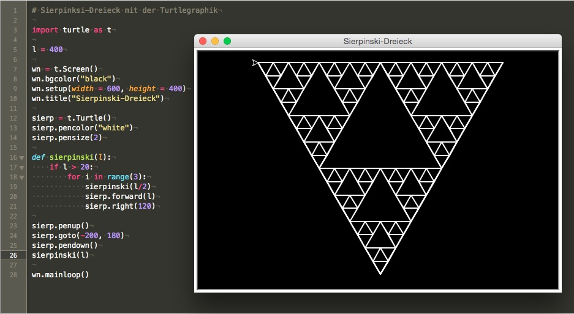

# Turtle-Graphik (3): Das Sierpinski-Dreieck

Das [Sierpinski-Dreieck](https://de.wikipedia.org/wiki/Sierpinski-Dreieck), ein 1915 vom polnischen Mathematiker [Wacław Sierpiński](https://de.wikipedia.org/wiki/Wac%C5%82aw_Sierpi%C5%84ski) beschriebenes Fraktal, zählt zu den Ikonen der Chaos-Theorie. Es ist die selbstähnliche Teilmenge eines (meist, aber nicht notwendigerweise gleichseitig dargestellten) Dreiecks. Teilt man das Dreieck in vier zueinander kongruente und zum Ausgangsdreieck ähnliche Dreiecke, deren Eckpunkte die Seitenmittelpunkte des Ausgangsdreiecks sind, dann sind die Teilmengen des Fraktals in den drei äußeren Dreiecken skalierte Kopien des gesamten Fraktals, während das mittlere Teildreieck nicht zum Fraktal gehört.

Das Sierpinski-Dreieck im streng mathematischen Sinn ist das Grenzobjekt, das nach unendlich vielen Iterationsschritten übrigbleibt. Es besteht aus unendlich vielen »Eckpunkten«. Zur Darstellung, die meist mit rekursiven Computerprogrammen realisiert wird, reicht meist schon eine Iterations- oder Rekursionstiefe von höchstens zehn. Bedingt durch die Auflösung des darstellenden Mediums und des menschlichen Auges sind diese Gebilde vom Grenzobjekt nicht mehr zu unterscheiden. In klassischer planimetrischer Flächenmessung geht die Fläche mit zunehmender Iterationstiefe gegen Null. Somit ist das Sierpinski-Dreieck eng verwandt mit der [Cantor-Menge](https://de.wikipedia.org/wiki/Cantor-Menge).

Angestachelt durch meine frisch erwachte Begeisterung über das Turtle-Modul in Python, beschloß ich, das Sierpinski-Dreieck mit der Schildkröte zeichnen zu lassen. Das Programm war schnell geschrieben, wobei ich einem Turbo-Pascal-Programm von *Dietmar Hermann* aus seinem wunderbaren Buch »Algorithmen für Chaos und Fraktale« folgte:

~~~python
import turtle as t

l = 400

wn = t.Screen()
wn.bgcolor("black")
wn.setup(width = 600, height = 400)
wn.title("Sierpinski-Dreieck")

sierp = t.Turtle()
sierp.pencolor("white")
sierp.pensize(2)

def sierpinski(l):
    if l > 20:
        for i in range(3):
            sierpinski(l/2)
            sierp.forward(l)
            sierp.right(120)

sierp.penup()
sierp.goto(-200, 180)
sierp.pendown()
sierpinski(l)

wn.mainloop()
~~~

Die einzigen neuen Turtle-Befehle in diesem Skript sind die Befehle `turtle.penup()`, `turtle.goto()` und `turtle.pendown()`. Mit dem ersten wird die Turtle angewiesen, den Stift anzuheben, das heißt, nicht mehr zu zeichnen. Mit dem zweiten Kommando schickt man die Turtle direkt zu einer Koordinate, ohne das vorherige `turtle.penup` hätte die Schildkröte eine Linie von der Mitte des Canvas’ (ihrem Startpunkt) bis zum Startpunkt des Dreiecks links oben gezogen. Und der letzte Befehl (`turtle.pendown()`) sagt der Schildkröte, daß sie ab nun wieder zeichen soll.

Ich habe das Programm mit normaler Geschwindigkeit ablaufen lassen, weil man sehr schön verfolgen kann, wie in diesem Fall die Rekursion funktioniert und das Dreieck Schritt für Schritt aus kleineren Dreiecken aufgebaut wird [^t3fn01].

[^t3fn01]: Allerdings wird damit die eigentliche Abbildungsvorschrift des Sierpinski-Dreiecks verschleiert, aber man kann nicht alles haben, eine Visualisierung der Rekursion und gleichzeitig eine Visualisierung der Abbildungsvorschrift.

Es ist erstaunlich, wo das Sierpinski-Dreieck überall auftaucht, in der Mehrfach-Verkleinerungs-Kopiermaschine (MVKM) [^t3fn02] oder im [Pascalschen Dreieck](https://de.wikipedia.org/wiki/Pascalsches_Dreieck). Über die Entstehung des Sierpinski-Dreiecks durch das Chaosspiel hatte ich auch schon einmal [geschrieben](http://blog.schockwellenreiter.de/2017/01/2017012304.html).

[^t3fn02]: Vgl. Peitgen et al., 1992

Und selbst der Bundesgerichtshof hat sich 2016 in einer markenrechtlichen Auseinandersetzung [mit dem Sierpinski-Dreieck befaßt](https://www.jurion.de/document/fullview/1:7874064,0/). Den verlinkten Text verstehen allerdings vermutlich nur Juristen.

## Literatur

- Diese [Seite über das Sierpinski-Dreieck](http://www.oftenpaper.net/sierpinski.htm) von *Antonio Marquez-Raygoza* dürfte keine Fragen mehr zum Thema offenlassen. Doch Vorsicht! Ausgedruckt ergibt sie 107 DIN-A4-Seiten, darum wundert Euch nicht, wenn sie sehr, sehr lange lädt.

- Auch von *Michael Holzapfel* gibt es eine [informative Seite](http://www.michael-holzapfel.de/themen/sierpinski/sierpinski.htm) zum Sierpinski-Dreieck. Außerdem findet Ihr auf seinen [Seiten zu Python](http://www.michael-holzapfel.de/progs/python/python.htm) auch ein paar schöne [Beispiele zur Turtle-Programmierung](http://www.michael-holzapfel.de/progs/python/python_beisp.htm).

- Dietmar Hermann: *[Algorithmen für Chaos und Fraktale][a1]*, Bonn (Addison-Wesley) 1997

- Heinz-Otto Peitgen, Hartmut Jürgens, Dietmar Saupe: *[Bausteine des Chaos, Fraktale][a2]*, Stuttgart (Klett-Cotta/Springer) 1992

[a1]: https://www.amazon.de/Algorithmen-Chaos-Fraktale-Dietmar-Herrmann/dp/3893196331/ref=as_li_ss_tl?ie=UTF8&qid=1510061315&sr=8-1&keywords=Algorithmen+f%C3%BCr+Chaos+und+Fraktale&dpID=41gCmEsqq0L&preST=_SY264_BO1,204,203,200_QL40_&dpSrc=srch&linkCode=ll1&tag=derschockwell-21&linkId=95771b471d448fceb8f33f9d404ff2a0

[a2]: https://www.amazon.de/Bausteine-Chaos-Fraktale-Heinz-Otto-Peitgen/dp/3540557814/ref=as_li_ss_tl?_encoding=UTF8&psc=1&refRID=6K22M4QHHTMZ80HR82XP&linkCode=ll1&tag=derschockwell-21&linkId=b4d8c3190c13a53b406a8a5cc50c4b5c