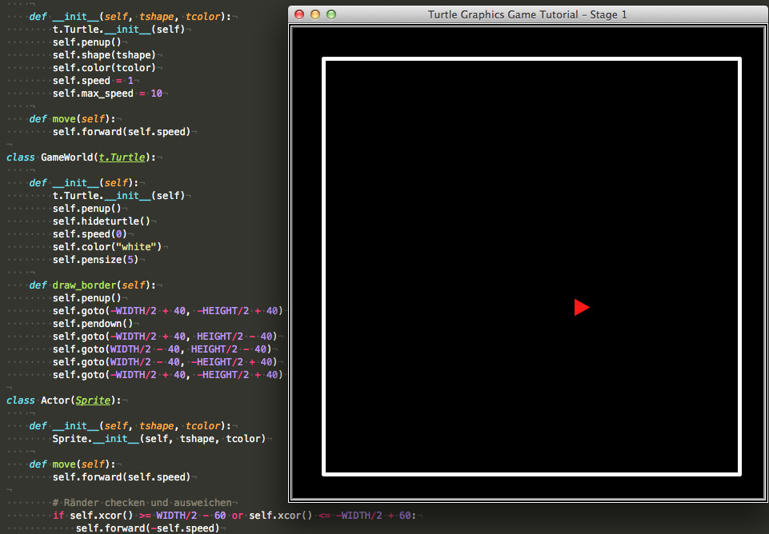

# Spieleprogrammierung mit Pythons Turtle-Modul (Teil 1)

Angeregt durch die Video-Tutorial-Reihe »[Simple Python Game Tutorial Using Classes](https://www.youtube.com/watch?v=sSKXVy3L-HY&list=PLlEgNdBJEO-lwI_F15DAQmgmqh5E7OYt_)« von *[Christian Thompson](http://christianthompson.com/node/5)*, einem in Japan lebenden und lehrenden Amerikaner, wollte ich auch einmal ausprobieren, wie einfach oder wie schwer es ist, mit Pythons [Turtle Bibliothek](https://docs.python.org/3.3/library/turtle.html?highlight=turtle), die Teil der mitgeliederten Standard-Bibliotheken von Pyhon ist, ein Spiel zu programmieren. Ich habe mich dabei weitestgehend an obige Video-Tutorial-Reihe angelehnt, jedoch einiges geändert, was einmal durch unterschiedliche Programmierstile begründet ist, auf der anderen Seite habe ich auch einige Fehlerchen beseitigt und Ungereimtheiten ausgeräumt.

Als erstes habe ich natürlich das Modul `turtle` importiert und dann ein paar Initialisierungen vorgenommen:

~~~python
import turtle as t

WIDTH = 600
HEIGHT = 600

wn = t.Screen()
wn.bgcolor("black")
wn.setup(width = WIDTH, height = HEIGHT)
wn.title("Turtle Graphics Game Tutorial – Stage 1")
~~~

Die Höhe und die Weite des Spielefenster habe ich ganz oben als Konstanten festgeschrieben. Alle späteren Abhängigkeiten wie zum Beispiel der weiße Spielfeldrand oder das Checken der Ränder durch die Spielfigur(en) habe ich von diesen Konstanten abgeleitet. Wenn also die Größe des Spielfeldes geändert werden soll, müssen nur diese beiden Konstanten geändert werden, alle anderen notwendigen Änderungen erledigt dann das Programm automatisch.

Dann gibt es eine Klasse `Sprite`, die die Oberklasse für alle beweglichen Elemente in diesem Spiel ist. Sie erbt von `Turtle` und folgerichtig muß der Konstruktor von `Sprite` auch den Konstruktor von `Turtle`aufrufen. Daneben gibt es noch eine Methode `move()`, die aber nur als Platzhalter dient, zu Testzwecken von mir implementiert wurde und in der Regel von der Unterklasse überschrieben wird:

~~~python
class Sprite(t.Turtle):
    
    def __init__(self, tshape, tcolor):
        t.Turtle.__init__(self)
        self.penup()
        self.shape(tshape)
        self.color(tcolor)
        self.speed = 1
        self.max_speed = 10
    
    def move(self):
        self.forward(self.speed)
~~~

Der Konstruktor von `Sprite`bekommt als Argumente den *Shape*, also die Form des Sprites und die Farbe des Sprites mitgeliefert, die dort initialisiert werden. Die Spielfigur, also die *Turtle* oder der *[Sprite](https://de.wikipedia.org/wiki/Sprite_(Computergrafik))*, soll sich bewegen, ohne eine Spur zu hinterlassen, daher wird der Stift bei der Initialisierung angehoben (`penup`). Eine Default-Startgeschwindigkeit und eine Maximalgeschwindigkeit wird dort ebenfalls noch vereinbart.

Die nächste Klasse, die im Code vereinbart wird, ist `GameWorld`, deren einzige Instanz in diesem Programm nur die Aufgabe hat, die Grenzen des Spielfeldes zu zeichnen. Auch diese Klasse ist natürlich eine Unterklasse von `Turtle`:

~~~python
class GameWorld(t.Turtle):
    
    def __init__(self):
        t.Turtle.__init__(self)
        self.penup()
        self.hideturtle()
        self.speed(0)
        self.color("white")
        self.pensize(5)
    
    def draw_border(self):
        self.penup()
        self.goto(-WIDTH/2 + 40, -HEIGHT/2 + 40)
        self.pendown()
        self.goto(-WIDTH/2 + 40, HEIGHT/2 - 40)
        self.goto(WIDTH/2 - 40, HEIGHT/2 - 40)
        self.goto(WIDTH/2 - 40, -HEIGHT/2 + 40)
        self.goto(-WIDTH/2 + 40, -HEIGHT/2 + 40)
~~~

`GameWorld` bekommt bei der Initialisierung keine Paramter mitgeliefert, also kann und braucht sie auch der Oberklasse keine mitzuteilen. Auch diese Turtle soll zu Beginn -- alle Turtle starten per Default in der Mitte des Fensters -- keine Spur ziehen (das wäre ja sonst eine halbe Diagonale), daher wird auch hier der Stift erst einmal hochgesetzt. Außerdem soll sie auch nicht sichtbar sein, dies wird mit der Methode `hideturtle()`erreicht. Mit `speed(0)` wird für die Turtlewelt die höchstmögliche Animationsgeschwindigkeit vereinbart [^tg0101]. Dies wird im Weiteren nicht ausreichend sein (eine Schildkröte ist schließlich kein Rennpferd), wie man die Ausführungsgeschwindigkeit noch besser beschleunigen und steuern kann, werde ich in einem späteren Tutorial erklären. Aber für diese erste Version reicht dies erst einmal aus.

[^tg0101]: Die Methode `speed(x)` ist nicht mit der Variable `speed = x` zu verwechseln, das sind zwei völlig unabhängige Elemente.

Die Farbe des Randes soll weiß sein und er soll eine Breite von 5 Pixeln haben.

Dann wird die Turtle in der Methode `draw_border()` angewiesen, den Rand zu zeichnen. Sicherheitshalber habe ich den Stift noch einmal angehoben, bevor ich die Schildkröte zum Startpunkt schicke. Von dort zeichnet sie dann in Abhängigkeit von den Konstanten `WIDTH` und `HEIGHT` ein Rechteck und hat dann ihre Aufgabe erledigt.

Nun wieder zu den Sprites: In diesem frühen Stadium des Projekts besitzt `Sprite`nur eine Unterklasse, die ich `Actor` genannt habe.

~~~python
class Actor(Sprite):
    
    def __init__(self, tshape, tcolor):
        Sprite.__init__(self, tshape, tcolor)
    
    def move(self):
        self.forward(self.speed)

        # Ränder checken und ausweichen
        if self.xcor() >= WIDTH/2 - 60 or self.xcor() <= -WIDTH/2 + 60:
            self.forward(-self.speed)
            self.left(75)
        if self.ycor() >= HEIGHT/2 - 60 or self.ycor() <= -HEIGHT/2 + 60:
            self.forward(-self.speed)
            self.left(75)
    
    def turnleft(self):
        self.left(30)
    
    def turnright(self):
        self.right(30)
    
    def move_faster(self):
        self.speed += 1
        # Geschwindigkeitsbegrenzug
        if abs(self.speed) > self.max_speed:
            self.speed = self.max_speed
    
    def move_slower(self):
        # Geschwindigkeitsbegrenzung
        self.speed -= 1
        if abs(self.speed) > self.max_speed:
            self.speed = - self.max_speed
~~~

`Actor` erbt alle Eigenschaften von `Sprite`, daher muß der Konstruktor nur den Konstruktor von `Sprite`aufrufen. Die `move()`-Methode wird ziemlich erweitert, daher mußte sie überschrieben werden.

Der *Actor* bewegt sich erst einmal nach rechts, die Richtungsänderungen erfolgen im Hauptprogramm mithilfe der Pfeiltasten. Der *Actor* soll selbstständig die Grenzen der Spielwelt erkennen und darauf reagieren. Das wurde in den folgenden Zeilen erledigt. Stößt die *Turtle* an die Grenzen (die wieder in Abhängigkeit von den Konstanten `WIDTH` und `HEIGHT` erkannt werden, dann soll sie erst einmal einen Schritt zurückgehen [^tg0102] und dann sich um 75° nach links drehen.

[^tg0102]: Der Schritt zurück ist notwendig, da sich sonst die *Turtle* bei der Wendug nach links wieder in der Grenze verfangen kann. Im Extremfall fängt sie dann an zu tanzen und entkommt entweder der Grenze gar nicht mehr oder fällt sogar aus dem Spielfeld heraus. Es ist wie im wirklichen Leben: Stößt man auf ein Hindernis, erst einen Schritt zurücktreten, dann sich umdrehen und abhauen.😜

Die 75° habe ich willkürlich gewählt, sie lassen die Bewegung des *Actors* über das Spielfeld weniger vorhersehbar erscheinen. Aber der Leser ist aufgefordert, mit anderen Winkeln zu experimentieren.

Die vier letzten Methoden sind die, mit denen über die Tastatur die Instanz des *Actors* in seinen Bewegungen gesteuert werden soll. Die linke und die rechte Pfeiltaste sollen die Figur jeweils um 30° nach links oder rechts bewegen, und mit den Pfeiltasten nach oben und unten soll die Figur beschleunig, respektive verlangsamt werden. Damit die Spielfigur nicht durch die Decke schießt wird in beiden Richtungen eine Maximalgeschwindigkeit festgelegt. Dabei kann es durchaus passieren, daß die Spielfigur sich rückwärts bewegt -- das ist so gewollt.

Da ich wollte, daß das Spiel »ordentlich« beendet und nicht einfach brutal durch das Schließen des Spielefensters abgebrochen wird, habe ich noch eine globale Funktion `exitGame()` geschrieben. Diese Funktion soll aufgerufen werden, wenn der Spieler die `Escape`-Taste drückt:

~~~python
def exitGame():
    global keepGoing
    keepGoing = False
~~~

Jetzt sind alle Vorarbeiten geleistet und das Spiel kann beginnen. Dazu muß erst einmal der Spieler und die Spielwelt initialisiert werden:

~~~python
player = Actor("triangle", "red")
world = GameWorld()
world.draw_border()
~~~

Die Spielfigur `player` wird als eine Instanz der Klasse `Actor` in Form eines roten Dreiecks aufgerufen und die Spielewelt `world` ist eine Instanz der Klasse `GameWorld`. Und dieses Objekt zeichnet auch dann sofort die Grenzen der Spielwelt um sich dann für den Rest der Spieles schlafen zu legen. Sie hat ihre Schuldigkeit getan.

Was noch nicht erledigt ist, ist das »Lauschen« auf die Tastaturereignisse. Das sind direkte Methoden des Turtle-Moduls und sie werden als nächstes aufgerufen:

~~~python
# Auf Tastaturereignisse lauschen
t.listen()
t.onkey(player.turnleft, "Left")
t.onkey(player.turnright, "Right")
t.onkey(player.move_faster, "Up")
t.onkey(player.move_slower, "Down")
t.onkey(exitGame, "Escape") # Escape beendet das Spiel
~~~

Als erstes wird ein Lauscher (engl. *listener*) initialisiert. Und dann werden die diversen *Callbacks* für die Pfeiltasten und die Escape-Taste instantiiert. Dabei verlangt die Methode `onkey()` als ersten Parameter den Namen der Funktion (ohne Klammern und Parameter) und als zweites den Namen der Taste [^tg0103], die diese Funktion aufrufen soll.

[^tg0103]: Die Namen der Tasten habe ich einem Tutorial zur Tkinter-Programmierung entnommen, denn auch das Turtle-Modul ist nur ein Wrapper um die Graphikfunktionen von *Tkinter*.

So, jetzt bleibt nur noch die eigentliche Spielschleife und die ist dank der umfangreichen Vorarbeit extrem kurz:

~~~python
# Spiel-Schleife
keepGoing = True
while keepGoing:
    player.move()
~~~

Zuerst wird die boolsche Variable `keepGoing` auf `True` gesetzt und dadurch mit `while keepGoing` eine Endlosschleife aufgerufen in der mit `player.move()` sich die Spielfigur druch die Welt bewegt. Erst wenn der Spieler die `Escape`-Taste drückt, wird `keepGoing` auf `False` gesetzt und somit die `while`-Schleife verlassen und das Spiel beendet.

Zur besseren Überischt hier noch einmal das komplette Programm:

~~~python
import turtle as t

WIDTH = 600
HEIGHT = 600

wn = t.Screen()
wn.bgcolor("black")
wn.setup(width = WIDTH, height = HEIGHT)
wn.title("Turtle Graphics Game Tutorial – Stage 1")

class Sprite(t.Turtle):
    
    def __init__(self, tshape, tcolor):
        t.Turtle.__init__(self)
        self.penup()
        self.shape(tshape)
        self.color(tcolor)
        self.speed = 1
        self.max_speed = 10
    
    def move(self):
        self.forward(self.speed)

class GameWorld(t.Turtle):
    
    def __init__(self):
        t.Turtle.__init__(self)
        self.penup()
        self.hideturtle()
        self.speed(0)
        self.color("white")
        self.pensize(5)
    
    def draw_border(self):
        self.penup()
        self.goto(-WIDTH/2 + 40, -HEIGHT/2 + 40)
        self.pendown()
        self.goto(-WIDTH/2 + 40, HEIGHT/2 - 40)
        self.goto(WIDTH/2 - 40, HEIGHT/2 - 40)
        self.goto(WIDTH/2 - 40, -HEIGHT/2 + 40)
        self.goto(-WIDTH/2 + 40, -HEIGHT/2 + 40)

class Actor(Sprite):
    
    def __init__(self, tshape, tcolor):
        Sprite.__init__(self, tshape, tcolor)
    
    def move(self):
        self.forward(self.speed)

        # Ränder checken und ausweichen
        if self.xcor() >= WIDTH/2 - 60 or self.xcor() <= -WIDTH/2 + 60:
            self.forward(-self.speed)
            self.left(75)
        if self.ycor() >= HEIGHT/2 - 60 or self.ycor() <= -HEIGHT/2 + 60:
            self.forward(-self.speed)
            self.left(75)
    
    def turnleft(self):
        self.left(30)
    
    def turnright(self):
        self.right(30)
    
    def move_faster(self):
        self.speed += 1
        # Geschwindigkeitsbegrenzug
        if abs(self.speed) > self.max_speed:
            self.speed = self.max_speed
    
    def move_slower(self):
        # Geschwindigkeitsbegrenzung
        self.speed -= 1
        if abs(self.speed) > self.max_speed:
            self.speed = - self.max_speed

player = Actor("triangle", "red")
world = GameWorld()
world.draw_border()

def exitGame():
    global keepGoing
    keepGoing = False

# Auf Tastaturereignisse lauschen
t.listen()
t.onkey(player.turnleft, "Left")
t.onkey(player.turnright, "Right")
t.onkey(player.move_faster, "Up")
t.onkey(player.move_slower, "Down")
t.onkey(exitGame, "Escape") # Escape beendet das Spiel

# Spiel-Schleife
keepGoing = True
while keepGoing:
    player.move()
~~~

Probiert es aus. Das rote Dreieck bewegt sich -- von Euch gesteuert -- über das Spielfeld, ohne je über die Grenzen hinauszuschießen. Dem ist anfangs interessiert zuzuschauen, aber auf Dauer ist es doch etwas langweilig. Daher möchte ich im nächsten Tutorial der Spielfigur ein paar Ziele spendieren, die ihr Punkte einbringen, damit auch der Spieler ein Ziel (möglichst viele Punkte sammeln) bekommt.