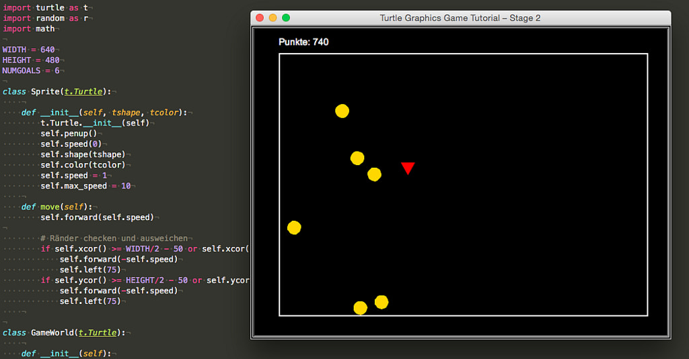

# Spieleprogrammierung mit Pythons Turtle-Modul (Teil 2)

Wie im ersten Teil versprochen, möchte ich nun der Turtle, die sich bisher ja nur einsam durch das Spielfeld quälte, ein Ziel geben. Sie soll nämlich Goldmünzen einsammeln, die sich ebenfalls über das Spielfeld bewegen. Für jede eingesammelte Goldmünze erhält der Spieler 10 Punkte. Die Bewegungen der Goldmünzen sind zufällig und für jede eingesammelte Münze wächst wieder eine andere an einer zufälligen Position im Spielfeld nach.

Um dies zu programmieren, waren natürlich einige Änderungen im Code notwendig. Da die Goldmünzen ebenfalls *Sprites* sind und ebenfalls die Ränder des Spielfeldes nicht überschreiten sollen, habe ich das Checken und Ausweichen der Ränder in die Klasse `Sprites` auslagert, um Doppelungen im Code zu vermeiden. Die Klasse *Sprites* sieht nun so aus:

~~~python
class Sprite(t.Turtle):
    
    def __init__(self, tshape, tcolor):
        t.Turtle.__init__(self)
        self.penup()
        self.speed(0)
        self.shape(tshape)
        self.color(tcolor)
        self.speed = 1
        self.max_speed = 10
    
    def move(self):
        self.forward(self.speed)

        # Ränder checken und ausweichen
        if self.xcor() >= WIDTH/2 - 50 or self.xcor() <= -WIDTH/2 + 50:
            self.forward(-self.speed)
            self.left(75)
        if self.ycor() >= HEIGHT/2 - 50 or self.ycor() <= -HEIGHT/2 + 50:
            self.forward(-self.speed)
            self.left(75)
~~~

Ich habe mit dem Abstand von `50` die Sprites ein wenig näher an die Ränder gelassen, die runden Goldmünzen berührten nämlich sonst die Ränder gar nicht und das sah beim Ausweichen etwas unnatürlich aus. Das nun der dreieckige Spieler gelegentlich bei seinen Drehungen mit einer Ecke leicht über die Begrenzung reicht, habe ich hierfür in Kauf genommen.

Außerdem habe ich im Kopf des Programms mit

~~~python
import turtle as t
import random as r
import math
~~~

neben dem `turtle`-Modul noch zwei weitere Bibliotheken importiert, die später im Programm benötigt werden: Eine Modul `random` für die Generierung von Zufallszahlen und das Mathematikmodul, das für die Berechnung des Euklidischen Abstandes gebraucht wird.

## Goal

Die Klasse für die Goldmünzen, die ich `Goal` genannt habe, ist -- da auch sie von *Sprite* die wichtigsten Attribute und Methoden erbt -- relativ klein geraten:

~~~python
class Goal(Sprite):
    
    def __init__(self, tshape, tcolor):
        Sprite.__init__(self, tshape, tcolor)
        self.speed = 3   # Default-Vorbelegung, wird bei der Initialisierung überschrieben
        self.goto(r.randint(-WIDTH/2 + 60, WIDTH/2 - 60),
                  r.randint(-HEIGHT/2 + 60, HEIGHT/2 - 60))
        self.setheading(r.randint(0, 360))
    
    def jump(self):
        self.goto(r.randint(-WIDTH/2 + 60, WIDTH/2 - 60),
                  r.randint(-HEIGHT/2 + 60, HEIGHT/2 - 60))
        self.setheading(r.randint(0, 360))
~~~

Der Konstruktor holt sich fast alles aus der Oberklasse, lediglich die Geschwindigkeit wird mit einem Default-Wert, der später überschrieben wird, initialisiert und dann wird per Zufall eine Position ausgewürfelt, auf der die Münze im Spielfeld positioniert wird. Außerdem wird eine zufällige Startrichtung zwischen 0° und 360° ermittelt.

Die einzige »eigene« Methode der Klasse *Goal* ist `jump()`. Die Idee dahinter ist folgende: Wird die Münze vom Spieler »eingesammelt«, dann »springt« sie auf eine zufällige Position mit einer zufälligen Startrichtung und nimmt erneut am Spiel teil.

Dafür, daß ich der Klasse `Actor` die Methode `move()` weggenommen habe, habe ich ihr eine neue Methode `collides(self, obj)` spendiert.

~~~python
    def collides(self, obj):
        a = self.xcor() - obj.xcor()
        b = self.ycor() - obj.ycor()
        distance =  math.sqrt((a**2) + (b**2))
        if distance < 20:
            return True
        else:
            return False
~~~

In dieser überprüft der Spieler, ob er mit einem Objekt (in unserem Fall sind das die Goldstücke) kollidiert oder nicht. Es gibt viele Methoden der Kollisionsüberprüfung, hier habe ich die einfachste ausgewählt. Es wird mithilfe des [Satzes des Pythagoras](https://de.wikipedia.org/wiki/Satz_des_Pythagoras) der [euklidische Abstand](https://de.wikipedia.org/wiki/Euklidischer_Abstand) berechnet. Ist dieser kleiner 20, dann wird angenommen, daß der Spieler mit der Münze kollidiert und die Punkte dafür einkassieren darf, in allen anderen Fällen nicht [^tg2fn1].

[^tg2fn1]: Da -- wenn nichts geändert wurde -- die Größe der Turtles etwa 24x24 Pixel beträgt, funktioniert der Wert, der durch Experimente herausgefunden wurde, recht gut.

## Head-up-Display (HUD)

Die Punkte, die der Spieler eingesammelt hat, sollen natürlich angezeigt werden. Solche Anzeigen werden in Computerspielen gerne als [Head-up-Display](https://de.wikipedia.org/wiki/Head-up-Display) (abgekürzt HUD), bezeichnet. Und so habe ich die Klasse, die für das Anzeigen des Spielstandes zuständig ist, `HeadUpDisplay` genannt.

~~~python
class HeadUpDisplay(t.Turtle):
    
    def __init__(self):
        t.Turtle.__init__(self)
        self.penup()
        self.hideturtle()
        self.speed(0)
        self.color("white")
        self.goto(-WIDTH/2 + 40, HEIGHT/2 - 30)
        self.score = 0
    
    def update_score(self):
        self.clear()
        self.write("Punkte: {}".format(self.score), False, align = "left",
                    font = ("Arial", 14, "normal"))
    
    def change_score(self, points):
        self.score += points
        self.update_score()
~~~

Der Konstruktor der Klasse ähnelt in gewisser Weise dem Konstruktor der Klasse `GameWorld`  [^tg2fn2]. Die Turtle wird im Konstruktor versteckt und dann nach links und etwas oberhalb der Randbegrenzung geschickt. Außerdem wird der Score zu Beginn auf `0` gesetzt.

[^tg2fn2]: Aber hier ebenfalls eine Oberklasse mit zwei Unterklassen zu schreiben, hielt ich für ein wenig übertrieben. Abwegig wäre es nicht: Eine Oberklasse `World` mit den Unterklassen `Border` und `HeadUpDisplay` sind durchaus denkbar und im Sinne der reinen Lehre vielleicht sogar der bessere Programmierstil.

Die Methode `update_score()`ist eine interne Methode, die nur von der Methode `change_score()` aufgerufen wird. Sie löscht eine bisher bestehende Punktanzeige und ersetzt sie durch eine neue. Die Methode `write(text, move, align, font)` ist eine [Methode der Turtle](https://docs.python.org/3.3/library/turtle.html?highlight=turtle#turtle.write) und schreibt den Text an die gewünschte Stelle.

Die Methode `change_score()` addiert die neugewonnen Punkte zur bisherigen Punktanzahl hinzu und ruft dann `update_score()` auf.

Das sind die Veränderungen in den Klassen. Der Beginn des Hauptprogramms sieht nun so aus:

~~~python
wn = t.Screen()
wn.bgcolor("black")
wn.setup(width = WIDTH, height = HEIGHT)
wn.title("Turtle Graphics Game Tutorial – Stage 2")

player = Actor("triangle", "red")
world = GameWorld()
hud = HeadUpDisplay()

# Die Grenzen des Spielfeldes zeichnen
world.draw_border()

# Die Zielobjekte erzeugen
goals = []
for i in range(NUMGOALS):
    goals.append(Goal("circle", "gold"))
    goals[i].speed = r.randint(2, 7)
~~~

Die ersten sieben Zeilen sind unverändert, erst in Zeile 8 kommt der *Head-up-Display* hinzu. Die Münzen werden in einer Schleife erzeugt. Dazu habe ich erst einmal die (leere) Liste `goals[]` erstellt und dann in der darauffolgenden Schleife die gewünschte Anzahl der Münzen erzeugt und ihnen eine zufällige Geschwindigkeit zugewiesen.

Im Beispielprogramm habe ich der Konstante `NUMGOALS` zu Beginn den Wert `6` zugewiesen, aber probiert es mal mit nur einer oder nur zwei Münzen. Je weniger Münzen einzusammeln sind, desto schwieriger wird es, überhaupt eine zu treffen.

Die Lauscher und *Callbacks* für die Tastatureingabe sind unverändert geblieben, daher kann ich mich nun der Hauptschleife des Programmes zuwenden:

~~~python
# Bildschirm-Refresh ausschalten
wn.tracer(0)

# Spiel-Schleife
keepGoing = True
while keepGoing:
    wn.update()  # Den gesamten Bildschirm neuzeichnen
    player.move()
    hud.change_score(0)
    
    for goal in goals:
        goal.move()
        if player.collides(goal):
            goal.jump()
            hud.change_score(10)
~~~

Um das Programm zu beschleunigen, habe ich bevor die Schleife durchlaufen wird, mit `tracer(0)` das permanente Neuzeichnen des Bildschirmes ausgeschaltet. Ansonsten würde das Programm nämlich schon ziemlich ruckelig ablaufen. In der Schleife wird mit `update()` nur noch genau einmal bei jedem Schleifendurchlauf neu gezeichnet. Das mag immer noch als viel erscheinen, ist aber selbst bei meinem betagten MacBook Pro kein Problem, das Programm läuft flüssig und ruckelt überhaupt nicht.

Am Anfang wird mit `hud.change_score(0)` der *HUD* initialisiert, da er sonst erst beim Einsammeln der ersten Münze am Bildschirmrand auftauchen würde.

Danach wird in einer weiteren Schleife überprüft, ob der Spieler mit einer der Münzen kollidiert. Wenn ja, soll die Münze wegspringen und der Spieler bekommt 10 Punkte gutgeschrieben.

## Der vollständige Quellcode

Für diejenigen, die das Spiel nachprogrammieren und für die, die die Übersicht behalten wollen, hier der vollständige Quellcode:

~~~python
import turtle as t
import random as r
import math

WIDTH = 640
HEIGHT = 480
NUMGOALS = 6

class Sprite(t.Turtle):
    
    def __init__(self, tshape, tcolor):
        t.Turtle.__init__(self)
        self.penup()
        self.speed(0)
        self.shape(tshape)
        self.color(tcolor)
        self.speed = 1
        self.max_speed = 10
    
    def move(self):
        self.forward(self.speed)

        # Ränder checken und ausweichen
        if self.xcor() >= WIDTH/2 - 50 or self.xcor() <= -WIDTH/2 + 50:
            self.forward(-self.speed)
            self.left(75)
        if self.ycor() >= HEIGHT/2 - 50 or self.ycor() <= -HEIGHT/2 + 50:
            self.forward(-self.speed)
            self.left(75)
    

class GameWorld(t.Turtle):
    
    def __init__(self):
        t.Turtle.__init__(self)
        self.penup()
        self.hideturtle()
        self.speed(0)
        self.color("white")
        self.pensize(2)
    
    def draw_border(self):
        self.penup()
        self.goto(-WIDTH/2 + 40, -HEIGHT/2 + 40)
        self.pendown()
        self.goto(-WIDTH/2 + 40, HEIGHT/2 - 40)
        self.goto(WIDTH/2 - 40, HEIGHT/2 - 40)
        self.goto(WIDTH/2 - 40, -HEIGHT/2 + 40)
        self.goto(-WIDTH/2 + 40, -HEIGHT/2 + 40)

class HeadUpDisplay(t.Turtle):
    
    def __init__(self):
        t.Turtle.__init__(self)
        self.penup()
        self.hideturtle()
        self.speed(0)
        self.color("white")
        self.goto(-WIDTH/2 + 40, HEIGHT/2 - 30)
        self.score = 0
    
    def update_score(self):
        self.clear()
        self.write("Punkte: {}".format(self.score), False, align = "left",
                    font = ("Arial", 14, "normal"))
    
    def change_score(self, points):
        self.score += points
        self.update_score()

class Actor(Sprite):
    
    def __init__(self, tshape, tcolor):
        Sprite.__init__(self, tshape, tcolor)
    
    def turnleft(self):
        self.left(30)
    
    def turnright(self):
        self.right(30)
    
    def move_faster(self):
        self.speed += 1
        # Geschwindigkeitsbegrenzug
        if abs(self.speed) > self.max_speed:
            self.speed = self.max_speed
    
    def move_slower(self):
        # Geschwindigkeitsbegrenzung
        self.speed -= 1
        if abs(self.speed) > self.max_speed:
            self.speed = - self.max_speed
            
    def collides(self, obj):
        a = self.xcor() - obj.xcor()
        b = self.ycor() - obj.ycor()
        distance =  math.sqrt((a**2) + (b**2))
        if distance < 20:
            return True
        else:
            return False

class Goal(Sprite):
    
    def __init__(self, tshape, tcolor):
        Sprite.__init__(self, tshape, tcolor)
        self.speed = 3   # Default-Vorbelegung, wird bei der Initialisierung überschrieben
        self.goto(r.randint(-WIDTH/2 + 60, WIDTH/2 - 60),
                  r.randint(-HEIGHT/2 + 60, HEIGHT/2 - 60))
        self.setheading(r.randint(0, 360))
    
    def jump(self):
        self.goto(r.randint(-WIDTH/2 + 60, WIDTH/2 - 60),
                  r.randint(-HEIGHT/2 + 60, HEIGHT/2 - 60))
        self.setheading(r.randint(0, 360))
        

wn = t.Screen()
wn.bgcolor("black")
wn.setup(width = WIDTH, height = HEIGHT)
wn.title("Turtle Graphics Game Tutorial – Stage 2")

player = Actor("triangle", "red")
world = GameWorld()
hud = HeadUpDisplay()

# Die Grenzen des Spielfeldes zeichnen
world.draw_border()

# Die Zielobjekte erzeugen
goals = []
for i in range(NUMGOALS):
    goals.append(Goal("circle", "gold"))
    goals[i].speed = r.randint(2, 7)

def exitGame():
    global keepGoing
    keepGoing = False

# Auf Tastaturereignisse lauschen
t.listen()
t.onkey(player.turnleft, "Left")
t.onkey(player.turnright, "Right")
t.onkey(player.move_faster, "Up")
t.onkey(player.move_slower, "Down")
t.onkey(exitGame, "Escape") # Escape beendet das Spiel

# Bildschirm-Refresh ausschalten
wn.tracer(0)

# Spiel-Schleife
keepGoing = True
while keepGoing:
    wn.update()  # Den gesamten Bildschirm neuzeichnen
    player.move()
    hud.change_score(0)
    
    for goal in goals:
        goal.move()
        if player.collides(goal):
            goal.jump()
            hud.change_score(10)
~~~

Ich habe, um die Nützlichkeit der Konstanten `WIDTH` und `HEIGHT`zu zeigen, in diesem Beispiel das Spiele-Fenster auf die alte VGA-Größe 640x480 Pixel geändert. Weitere Änderungen im Programm waren nicht nötig, das Spiel lief -- wie der Screenshot zeigt -- ohne weiteres Herumfummeln im Quellcode auch in dieser Auflösung.

Das Spiel ist nun fertig und spielbar. In einem letzten Beitrag möchte ich es nur noch ein wenig aufmotzen und aufhübschen.