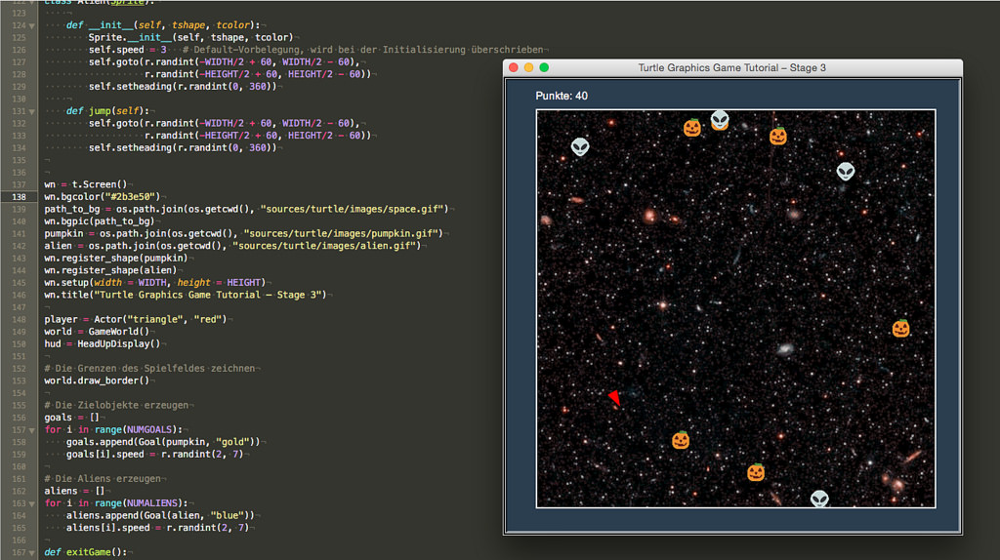

# Spieleprogrammierung mit Pythons Turtle-Modul (Teil 2)

Das ist der letzte Teil meines dreiteiligen Tutorials zur Spieleprogrammierung mit Pythons Turtle-Modul. Während ich in Teil 1 den Spieler und das Spielfeld programmiert hatte, hatte ich im zweiten Teil dem Spieler Ziele in Form von Goldmünzen spendiert und außerdem einen Punktezähler eingerichtet. Nun möchte ich das Spiel einmal noch ein wenig aufhübschen und dem Spiel auch Aliens hinzufügen. Kollidiert der Spieler mit diesen Aliens, dann werden ihm wieder Punkte abgezogen, so daß er das Spiel auch verlieren kann. Das endgültige Produkt sieht dann so aus:

Da man einem gleichseitigen und gleichwinkligen Dreieck nur sehr schwer ansieht, wo vorne und wo hinten sein soll, habe ich als erstes die Figur des Spielers verschlankt, damit sie mehr wie eine Rakete aussieht. Dafür mußte ich im Konstruktur der Klasse *Actor* nur eine Zeile hinzufügen:

~~~python
self.shapesize(stretch_wid = 0.6, stretch_len = 1.1, outline = None)
~~~

Nun kann niemand mehr vorne und hinten verwechseln. Als nächstes habe ich dem Spielfeld einen Sternenhimmel spendiert. Dafür habe ich mir in dem riesigen Areal der NASA mit ihren freien Bildern eines ausgesucht und es auf die passende Größe (520 x 520 Pixel) zurechtgeschnitten [^t3fn1]. Um das Bild als Hintergrundbild in das Fenster zu bekommen und auch die Hintergrundfarbe zu ändern, mußte ich nach der Initialisierung des Fenster (`wn = t.Screen`) folgende drei Zeilen ändern beziehungsweise hinzufügen:

[^t3fn1]: Damit ist nun allerdings die Größe des Spielefenster ein- für allemal auf 600 x 600 Pixel festgeschrieben, sonst paßt das Hintergrundbild nicht mehr in den Rahmen.

~~~python
wn.bgcolor("#2b3e50")
path_to_bg = os.path.join(os.getcwd(), "sources/turtle/images/space.gif")
wn.bgpic(path_to_bg)
~~~

Außerdem mußte zu Beginn des Programmes noch die Bibliothek `os` mit der Zeile

~~~python
import os
~~~

eingebunden werden. Benötigt wird das Modul für die Pfadmanipulation. Denn `Tkinter` (das ist die Bibliothek, auf die das Turtle-Modul aufsetzt) findet die Bilder nur, wenn sie entweder im gleichen Verzeichnis wie das Programm liegen [^t3fn2] oder wenn ein absoluter Pfad darauf verweist. Relative Pfade wie `./images/space.gif` scheint *Tkinter* nicht zu kennen.

[^t3fn2]: Da ich einmal ein Fan davon bin, alle benötigten Assets in einem eigenen Verzeichnis unterzubringen, und zum anderen mein Git-Repositorium auf meinen unterschiedlichen Rechnern in unterschiedlichen Verzeichnissen liegt, muß ich das wohl oder übel so zusammenbauen.

Dann habe ich, einzig und alleine wegen der Optik, das Spiel ein wenig geändert. Statt Goldmünzen soll der Spieler nun Kürbisse einsammeln (ja, ein *meinem* Weltall fliegen Halloween-Kürbisse durch die Gegend, na und?), und dieses Bild der Kürbisse, das ich den [Twemojis](https://emojipedia.org/twitter/twemoji-2.3/), Twitters freier Version der Emojis, entnommen habe, muß bei dem Turtle-Modul als *Shape* registriert werden:

~~~python
pumpkin = os.path.join(os.getcwd(), "sources/turtle/images/pumpkin.gif")
wn.register_shape(pumpkin)
~~~

Diese Zeilen habe ich direkt unter den obigen Zeilen, wo der Bildhintergrund aufgerufen wird, eingefügt. Der Schleife, in der die Zielobjekte erzeugt werden, wird nun einfach statt eines Kreises der Kürbis übergeben:

~~~python
# Die Zielobjekte erzeugen
goals = []
for i in range(NUMGOALS):
    goals.append(Goal(pumpkin, "gold"))
    goals[i].speed = r.randint(2, 7)
~~~

Die Kürbisse habe ich mit dem Bildverarbeitungsprogramm meines Vertrauens auf 24 x 24 Pixel verkleinert und als GIF abgespeichert. Das ist die Default-Größe der Sprites im Turtle-Modul und Tkinter ist ein ziemlich altes Modul, das ohne Klimmzüge plattformübergfreifend nur mit GIF- und PPM-Bildern umgehen kann. Daher hatte ich auch schon das obige Hintergrundbild, das die NASA natürlich als JPEG auslieferte, nach GIF konvertiert.

Das war aber auch schon alles. Da ich von Anfang an die Klasse `Sprite` so aufgebaut habe, daß sie mit unterschiedlichen Shapes unnd unterschiedlichen Farben zurechtkommt, sind keine weiteren Änderungen nötigt -- statt der goldenen Münzen fliegen nun kleine Kürbisse durch die Gegend [^t3fn3].

[^t3fn3]: Die Farbe »gold« wird nun nicht mehr benötigt, aber sie stört auch nicht und ich halte die Klasse so offen für *Shapes*, die Farben benötigen und *Shapes* die keine Farben benötigen. Im letzteren Fall übergebe ich einfach eine *Dummy*-Farbe.

Wenn Ihr das Spiel jetzt startet, sieht es schon recht nett aus. Aber es ist noch kein richtiges Spiel, denn der Spieler kann nur (Punkte hinzu-) gewinnen, aber nicht verlieren. Also habe ich mir noch einen Gegner ausgedacht, Aliens, die, wenn sie die Rakte des Spielers trifft, ihm Punkte abziehen.

Auch das Bild der Aliens stammt von Twitters Twemojis, wurde ebenfalls auf 24 x 24 Pixel verkleinert und nach GIF konvertiert. Dieses Bild wurde genau so wie der Kürbis als Shape registriert:

~~~python
alien = os.path.join(os.getcwd(), "sources/turtle/images/alien.gif")
wn.register_shape(alien)
~~~

Natürlich brauchte ich nun auch eine Klasse `Aliens` und die sieht so aus:

~~~python
class Alien(Sprite):
    
    def __init__(self, tshape, tcolor):
        Sprite.__init__(self, tshape, tcolor)
        self.speed = 3   # Default-Vorbelegung
        self.goto(r.randint(-WIDTH/2 + 60, WIDTH/2 - 60),
                  r.randint(-HEIGHT/2 + 60, HEIGHT/2 - 60))
        self.setheading(r.randint(0, 360))
    
    def jump(self):
        self.goto(r.randint(-WIDTH/2 + 60, WIDTH/2 - 60),
                  r.randint(-HEIGHT/2 + 60, HEIGHT/2 - 60))
        self.setheading(r.randint(0, 360))
~~~

Aufmerksame Leser haben natürlich sofort gemerkt, daß diese Klasse bis auf den Namen eine Eins-zu-Eins-Kopie der Klasse *Goals* ist und sie wird auch fast genauso initialisiert:

~~~python
# Die Aliens erzeugen
aliens = []
for i in range(NUMALIENS):
    aliens.append(Goal(alien, "blue"))
    aliens[i].speed = r.randint(2, 7)
~~~

Die Konstante `NUMALIENS` habe ich zu Beginn des Programms mit vier vorbelegt. Damit ist der Spieler noch im Vorteil und ihr könnt erst einmal üben. Wenn Ihr dann geschickt genug seid, startet das Spiel doch mal mit sechs oder mehr Aliens. Ihr werdet dann ganz schön ins Schwitzen kommen.

Und auch in der Hauptschleife des Programms unterscheiden sich die Behandlung der Kürbisse und die Behandlung der Aliens nur minimal:

~~~python
    for alien in aliens:
        alien.move()
        if player.collides(alien):
            alien.jump()
            hud.change_score(-20)
~~~

Der einzige Unterschied ist, daß, wenn der Player mit einem Alien kollidiert, ihm Punkte abgezogen werden.

Jetzt kann der Spieler also auch verlieren, und das sieht in der Hauptschleife des Programms dann so aus:

~~~python
    if hud.score < 0:
        print("You lost the game!")
        keepGoing = False
~~~

## Der Quellcode

So, und nun der vollständige Quellcode des Programms zum Nachprogrammieren oder Nachschlagen:

~~~python
import turtle as t
import random as r
import math
import os

WIDTH = 600
HEIGHT = 600
NUMGOALS = 6
NUMALIENS = 4

class Sprite(t.Turtle):
    
    def __init__(self, tshape, tcolor):
        t.Turtle.__init__(self)
        self.penup()
        self.speed(0)
        self.shape(tshape)
        self.color(tcolor)
        self.speed = 1
        self.max_speed = 15
    
    def move(self):
        self.forward(self.speed)

        # Ränder checken und ausweichen
        if self.xcor() >= WIDTH/2 - 50 or self.xcor() <= -WIDTH/2 + 50:
            self.forward(-self.speed)
            self.left(75)
        if self.ycor() >= HEIGHT/2 - 50 or self.ycor() <= -HEIGHT/2 + 50:
            self.forward(-self.speed)
            self.left(75)
    

class GameWorld(t.Turtle):
    
    def __init__(self):
        t.Turtle.__init__(self)
        self.penup()
        self.hideturtle()
        self.speed(0)
        self.color("white")
        self.pensize(2)
    
    def draw_border(self):
        self.penup()
        self.goto(-WIDTH/2 + 40, -HEIGHT/2 + 40)
        self.pendown()
        self.goto(-WIDTH/2 + 40, HEIGHT/2 - 40)
        self.goto(WIDTH/2 - 40, HEIGHT/2 - 40)
        self.goto(WIDTH/2 - 40, -HEIGHT/2 + 40)
        self.goto(-WIDTH/2 + 40, -HEIGHT/2 + 40)

class HeadUpDisplay(t.Turtle):
    
    def __init__(self):
        t.Turtle.__init__(self)
        self.penup()
        self.hideturtle()
        self.speed(0)
        self.color("white")
        self.goto(-WIDTH/2 + 40, HEIGHT/2 - 30)
        self.score = 0
    
    def update_score(self):
        self.clear()
        self.write("Punkte: {}".format(self.score), False, align = "left",
                    font = ("Arial", 14, "normal"))
    
    def change_score(self, points):
        self.score += points
        self.update_score()

class Actor(Sprite):
    
    def __init__(self, tshape, tcolor):
        Sprite.__init__(self, tshape, tcolor)
        self.shapesize(stretch_wid = 0.6, stretch_len = 1.1, outline = None)
        self.speed = 5
    
    def turnleft(self):
        self.left(30)
    
    def turnright(self):
        self.right(30)
    
    def move_faster(self):
        self.speed += 1
        # Geschwindigkeitsbegrenzug
        if abs(self.speed) > self.max_speed:
            self.speed = self.max_speed
    
    def move_slower(self):
        # Geschwindigkeitsbegrenzung
        self.speed -= 1
        if abs(self.speed) > self.max_speed:
            self.speed = - self.max_speed
            
    def collides(self, obj):
        a = self.xcor() - obj.xcor()
        b = self.ycor() - obj.ycor()
        distance =  math.sqrt((a**2) + (b**2))
        if distance < 20:
            return True
        else:
            return False

class Goal(Sprite):
    
    def __init__(self, tshape, tcolor):
        Sprite.__init__(self, tshape, tcolor)
        self.speed = 3   # Default-Vorbelegung
        self.goto(r.randint(-WIDTH/2 + 60, WIDTH/2 - 60),
                  r.randint(-HEIGHT/2 + 60, HEIGHT/2 - 60))
        self.setheading(r.randint(0, 360))
    
    def jump(self):
        self.goto(r.randint(-WIDTH/2 + 60, WIDTH/2 - 60),
                  r.randint(-HEIGHT/2 + 60, HEIGHT/2 - 60))
        self.setheading(r.randint(0, 360))
        
class Alien(Sprite):
    
    def __init__(self, tshape, tcolor):
        Sprite.__init__(self, tshape, tcolor)
        self.speed = 3   # Default-Vorbelegung
        self.goto(r.randint(-WIDTH/2 + 60, WIDTH/2 - 60),
                  r.randint(-HEIGHT/2 + 60, HEIGHT/2 - 60))
        self.setheading(r.randint(0, 360))
    
    def jump(self):
        self.goto(r.randint(-WIDTH/2 + 60, WIDTH/2 - 60),
                  r.randint(-HEIGHT/2 + 60, HEIGHT/2 - 60))
        self.setheading(r.randint(0, 360))

wn = t.Screen()
wn.bgcolor("#2b3e50")
path_to_bg = os.path.join(os.getcwd(), "sources/turtle/images/space.gif")
wn.bgpic(path_to_bg)
pumpkin = os.path.join(os.getcwd(), "sources/turtle/images/pumpkin.gif")
alien = os.path.join(os.getcwd(), "sources/turtle/images/alien.gif")
wn.register_shape(pumpkin)
wn.register_shape(alien)
wn.setup(width = WIDTH, height = HEIGHT)
wn.title("Turtle Graphics Game Tutorial – Stage 3")

player = Actor("triangle", "red")
world = GameWorld()
hud = HeadUpDisplay()

# Die Grenzen des Spielfeldes zeichnen
world.draw_border()

# Die Zielobjekte erzeugen
goals = []
for i in range(NUMGOALS):
    goals.append(Goal(pumpkin, "gold"))
    goals[i].speed = r.randint(2, 7)

# Die Aliens erzeugen
aliens = []
for i in range(NUMALIENS):
    aliens.append(Goal(alien, "blue"))
    aliens[i].speed = r.randint(2, 7)

def exitGame():
    global keepGoing
    keepGoing = False

# Auf Tastaturereignisse lauschen
t.listen()
t.onkey(player.turnleft, "Left")
t.onkey(player.turnright, "Right")
t.onkey(player.move_faster, "Up")
t.onkey(player.move_slower, "Down")
t.onkey(exitGame, "Escape") # Escape beendet das Spiel

# Bildschirm-Refresh ausschalten
wn.tracer(0)

# Spiel-Schleife
keepGoing = True
while keepGoing:
    wn.update()  # Den gesamten Bildschirm neuzeichnen
    player.move()
    hud.change_score(0)
    
    for goal in goals:
        goal.move()
        if player.collides(goal):
            goal.jump()
            hud.change_score(10)
    
    for alien in aliens:
        alien.move()
        if player.collides(alien):
            alien.jump()
            hud.change_score(-20)
            
    if hud.score < 0:
        print("You lost the game!")
        keepGoing = False   
~~~

Das war's. Ich hoffe, ich habe Euch gezeigt, daß man mit dem Turtle-Modul von Python schon eine Menge mehr anfangen kann, als nur seltsame Schleifen und Kurven zu zeichnen. Und ich hoffe, Ihr hattet Spaß an diesem dreiteiligen Tutorial. Mir hat es jedenfalls so viel Spaß gemacht, daß ich schon Ideen zu weiteren Abenteuern mit der Schlange und der Schildkröte habe. *Still digging!*
