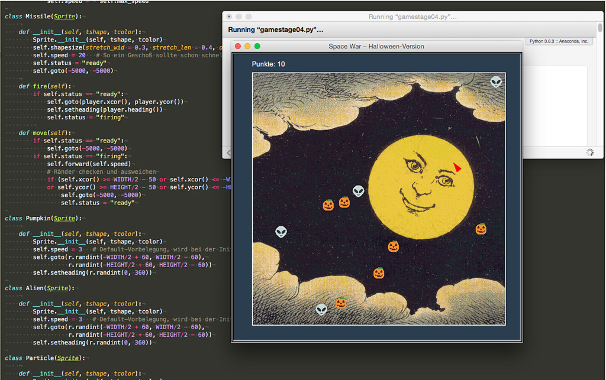

# Ein Ballerspiel mit der Schildkröte

Nachdem ich mein dreiteiliges Tutorial zur Spieleprogrammierung mit Pythons Turtle-Bibliothek abgeschlossen hatte, kam mir die Idee, daß man auf dieser Grundlage ja auch schnell noch ein klassisches »Ballerspiel« wie [Space War](https://de.wikipedia.org/wiki/Spacewar!) oder [Asteroids](https://de.wikipedia.org/wiki/Asteroids) programmieren könnte. Wohlan, hier ist meine Asteroids-Variante (natürlich wieder in einer Halloween-Version):

Die Spielidee ist, daß die kleine rote Rakete durch das All fliegt und dabei die bösen Aliens abschießen muß. Denn kollidiert sie mit einem Alien, verliert sie 20 Energiepunkte, schießt sie dagegen ein Alien ab, erhält sie 20 Energiepunkte gutgeschrieben. Mit den kleinen Kürbissen ist es hingegen genau umgekehrt: Schießt sie versehentlich einen Kürbis ab, werden ihr 10 Energiepunkte abgezogen, kollidiert sie dagegen mit einem Kürbis, sammelt sie seine 10 Energiepunkte ein.

Getroffene Aliens und Kürbisse entstehen an zufällig gewählten Punkten in dem Spielefenster wieder neu, so daß Aliens und Kürbisse immer in gleicher Anzahl das Spiel bevölkern.

Es waren tatsächlich nur wenige Veränderungen gegenüber der letzten Version notwendig. Wenn man einmal davon absieht, daß ich statt des NASA-Sternenhimmels ein anderes Hintergrundbild gewählt, das ich in den Tiefen des Netzes [ausgegraben](https://www.flickr.com/photos/taffeta/6128937880/) und mit der Bildverarbeitung meines Vertrauens in ein entsprechend großes GIF verwandelt hatte, brauchte ich natürlich erst einmal einen Torpedo, mit dem die kleine rote Rakete auf ihre Gegner schießen kann:

~~~python
class Missile(Sprite):
    
    def __init__(self, tshape, tcolor):
        Sprite.__init__(self, tshape, tcolor)
        self.shapesize(stretch_wid = 0.3, stretch_len = 0.4, outline = None)
        self.speed = 20   # So ein Geschoß sollte schon schnell sein :o)
        self.status = "ready"
        self.goto(-5000, -5000)
    
    def fire(self):
        if self.status == "ready":
            self.goto(player.xcor(), player.ycor())
            self.setheading(player.heading())
            self.status = "firing"
        
    def move(self):
        if self.status == "ready":
            self.goto(-5000, -5000)
        if self.status == "firing":
            self.forward(self.speed)
            # Ränder checken und ausweichen
            if (self.xcor() >= WIDTH/2 - 50 or self.xcor() <= -WIDTH/2 + 50
            or self.ycor() >= HEIGHT/2 - 50 or self.ycor() <= -HEIGHT/2 + 50):
                self.goto(-5000, -5000)
                self.status = "ready"
~~~

Den Torpedo möchte ich als kleines Dreieick darstellen, das ich -- ähnlich wie bei der Rakete -- ein wenig verschlankt habe, damit man besser unterscheiden kann, wo bei dem Geschoß vorne oder hinten ist. Außerdem habe ich es verkleinert, es sollte schon deutlich kleiner als die abschießende Rakete sein.

Natürlich erbt auch der Torpedo von der Klasse `Sprite`, so daß neu nur die Methoden `fire()` und `move()` hinzugekommen sind. Wichtig ist, daß der Torpedo zwei Statii besitzt, `ready` und `firing`. Mit ihnen wird einmal sichergestellt, daß nur jeweils ein Geschoß im Raum ist (es kann nur ein neues abgeschossen werden, wenn der Status `ready`ist) und zum anderen, daß der Torpedo das Spielfeld nicht verläßt. Denn wenn er den Spielfeldrand erreicht, ohne daß er ein Ziel getroffen hat, wird sein Status wieder auf `ready` gesetzt und er weit außerhalb des Spielfeldes »zwischengeparkt«.

Das gleiche passiert natürlich auch in der Hauptschleife, wo abgefragt wird, ob ein Ziel getroffen ist, doch dazu weiter unten mehr. Wenn der Torpede ein Ziel getroffen hat oder die Rakete mit einem der anderen Akteure kollidiert, soll das natürlich nicht ohne ein gewissens »Trara« abgehen. Da ich Großraumbüro-geschädigt bin, habe ich eine Aversion gegen akustisches Feedback, daher habe ich ein kleines Partikelsystem entworfen, das eine optische Rückmeldung gibt:

~~~python
class Particle(Sprite):
    
    def __init__(self, tshape, tcolor):
        Sprite.__init__(self, tshape, tcolor)
        stretch = r.uniform(0.1, 0.2)
        self.shapesize(stretch_wid = stretch, stretch_len = stretch, outline = None)
        self.goto(-5000, -5000)
        self.frame = 0
        self.speed = r.randint(10, 20)
    
    def explode(self, x, y):
        self.goto(x, y)
        self.setheading(r.randint(0, 360))
    
    def move(self):
        if self.frame < 20:
            self.forward(self.speed)
            # self.speed -= 1
            self.frame += 1
            # Ränder checken
            if (self.xcor() >= WIDTH/2 - 50 or self.xcor() <= -WIDTH/2 + 50 or
                self.ycor() >= HEIGHT/2 - 50 or self.ycor() <= -HEIGHT/2 + 50):
                self.frame = 0
                self.goto(-5000, -5000)
        else:
            self.frame = 0
            self.goto(-5000, -5000)
~~~

Die Partikel sind kleine bunte Kügelchen, die für 20 Frames in alle Himmelsrichtungen davonstieben. Gibt man allen Partikeln die gleiche Geschwindigkeit, bilden sie so etwas wie einen sich ausdehnenden Kreis. Dies war mir zu regelmäßig, daher bekommt jedes Teilchen seine eigene, zufällig gewählte Geschwindigkeit und schon sieht das ganze doch mehr wie ein Feuerwerk aus.

Die Randüberprüfung läuft ähnlich wie beim Torpedo ab: Auch alle Partikel werden, wenn sie den Rand erreicht haben, weit außerhalb des Spielfeldes zwischengeparkt, aber auch, wenn sie ihre maximale Lebensdauer von 20 Frames erreicht haben.

Diese beiden Klassen sind zusätzlich hinzugekommen, alle anderen Änderungen geschehen im Hauptbereich des Spiels. Zum ersten muß natürlich auch der Torpedo initialisiert

~~~python
missile = Missile("triangle", "yellow")
~~~

und die Partikel müssen erzeugt werden:

~~~python
particles = []
colors = ["red", "green", "violet", "blue", "yellow", "orange", "gold"]
for i in range(NUMPARTICLES):
    particles.append(Particle("circle", r.choice(colors)))
~~~

Damit der Torpedo mit der Leertaste abgeschossen werden kann, muß dies zu den Tastaturevents hinzugefügt werden:

~~~python
t.onkey(missile.fire, "space")
~~~

Die meisten Änderungen waren allerdings in der Hauptschleife nötig, daher habe ich sie hier noch einmal vollständig angegeben:

~~~python
while keepGoing:
    wn.update()  # Den gesamten Bildschirm neuzeichnen
    player.move()
    missile.move()
    hud.change_score(0)
    
    for pumpkin in pumpkins:
        pumpkin.move()
        if missile.collides(pumpkin):
            pumpkin.jump()
            missile.status = "ready"
            hud.change_score(-10)
            for particle in particles:
                particle.explode(missile.xcor(), missile.ycor())
        if player.collides(pumpkin):
            pumpkin.jump()
            hud.change_score(10)
            for particle in particles:
                particle.explode(player.xcor(), player.ycor())
    
    for alien in aliens:
        alien.move()
        if missile.collides(alien):
            alien.jump()
            missile.status = "ready"
            hud.change_score(20)
            for particle in particles:
                particle.explode(missile.xcor(), missile.ycor())
        if player.collides(alien):
            alien.jump()
            hud.change_score(-20)
            for particle in particles:
                particle.explode(player.xcor(), player.ycor())
            
    for particle in particles:
        particle.move()
            
    if hud.score < 0:
        print("You lost the game!")
        # keepGoing = False
~~~

Ich bin kein guter Spieler, ich habe mehr Spaß daran, Spiele zu programmieren als mit ihnen zu spielen. Daher habe ich mir zu Testzwecken erlaubt, den *Player* nicht sterben zu lassen -- in einem »echten« Spiel muß natürlich die letzte Zeile wieder einkommentiert werden.

In jeweils separaten Schleifen wird abgefragt, ob der Spieler oder das Torpedo mit einem Kürbis oder einem Alien kollidiert und dann jeweils die Explosion ausgelöst und die Punkte verteilt.

## Der Quellcode

Wie immer zum Schluß der komplette Quellcode für die, die gerne Quellcode lesen oder das Spiel nachprogrammieren respektive nachvollziehen wollen. Obwohl das Spiel nun doch schon eine beachtliche Komplexität erreicht hat, ist das gesamte Programm mit knapp 300 Zeilen doch noch recht kurz.

~~~python
import turtle as t
import random as r
import math
import os

WIDTH = 600
HEIGHT = 600
NUMGOALS =  6  # Test: 4
NUMALIENS = 4  # Test: 2
NUMPARTICLES = 20

class Sprite(t.Turtle):
    
    def __init__(self, tshape, tcolor):
        t.Turtle.__init__(self)
        self.penup()
        self.speed(0)
        self.shape(tshape)
        self.color(tcolor)
        self.speed = 1
        self.max_speed = 15
    
    def move(self):
        self.forward(self.speed)

        # Ränder checken und ausweichen
        if self.xcor() >= WIDTH/2 - 50 or self.xcor() <= -WIDTH/2 + 50:
            self.forward(-self.speed)
            self.left(r.randint(95, 265))
        if self.ycor() >= HEIGHT/2 - 50 or self.ycor() <= -HEIGHT/2 + 50:
            self.forward(-self.speed)
            self.left(r.randint(95, 265))
    
    def collides(self, obj):
        a = self.xcor() - obj.xcor()
        b = self.ycor() - obj.ycor()
        distance =  math.sqrt((a**2) + (b**2))
        if distance < 20:
            return True
        else:
            return False
    
    def jump(self):
        self.goto(r.randint(-WIDTH/2 + 60, WIDTH/2 - 60),
                  r.randint(-HEIGHT/2 + 60, HEIGHT/2 - 60))
        self.setheading(r.randint(0, 360))
        self.speed = r.randint(2, 7)
 
class GameWorld(t.Turtle):
    
    def __init__(self):
        t.Turtle.__init__(self)
        self.penup()
        self.hideturtle()
        self.speed(0)
        self.color("white")
        self.pensize(2)
    
    def draw_border(self):
        self.penup()
        self.goto(-WIDTH/2 + 40, -HEIGHT/2 + 40)
        self.pendown()
        self.goto(-WIDTH/2 + 40, HEIGHT/2 - 40)
        self.goto(WIDTH/2 - 40, HEIGHT/2 - 40)
        self.goto(WIDTH/2 - 40, -HEIGHT/2 + 40)
        self.goto(-WIDTH/2 + 40, -HEIGHT/2 + 40)

class HeadUpDisplay(t.Turtle):
    
    def __init__(self):
        t.Turtle.__init__(self)
        self.penup()
        self.hideturtle()
        self.speed(0)
        self.color("white")
        self.goto(-WIDTH/2 + 40, HEIGHT/2 - 30)
        self.score = 0
    
    def update_score(self):
        self.clear()
        self.write("Punkte: {}".format(self.score), False, align = "left",
                    font = ("Arial", 14, "normal"))
    
    def change_score(self, points):
        self.score += points
        self.update_score()

class Actor(Sprite):
    
    def __init__(self, tshape, tcolor):
        Sprite.__init__(self, tshape, tcolor)
        self.color = tcolor  # Wird im Programm überschrieben
        self.shapesize(stretch_wid = 0.6, stretch_len = 1.1, outline = None)
        self.speed = 5
    
    def turnleft(self):
        self.left(15)
    
    def turnright(self):
        self.right(15)
    
    def move_faster(self):
        self.speed += 1
        # Geschwindigkeitsbegrenzug
        if abs(self.speed) > self.max_speed:
            self.speed = self.max_speed
    
    def move_slower(self):
        # Geschwindigkeitsbegrenzung
        self.speed -= 1
        if abs(self.speed) > self.max_speed:
            self.speed = - self.max_speed

class Missile(Sprite):
    
    def __init__(self, tshape, tcolor):
        Sprite.__init__(self, tshape, tcolor)
        self.shapesize(stretch_wid = 0.3, stretch_len = 0.4, outline = None)
        self.speed = 20   # So ein Geschoß sollte schon schnell sein :o)
        self.status = "ready"
        self.goto(-5000, -5000)
    
    def fire(self):
        if self.status == "ready":
            self.goto(player.xcor(), player.ycor())
            self.setheading(player.heading())
            self.status = "firing"
        
    def move(self):
        if self.status == "ready":
            self.goto(-5000, -5000)
        if self.status == "firing":
            self.forward(self.speed)
            # Ränder checken und ausweichen
            if (self.xcor() >= WIDTH/2 - 50 or self.xcor() <= -WIDTH/2 + 50
            or self.ycor() >= HEIGHT/2 - 50 or self.ycor() <= -HEIGHT/2 + 50):
                self.goto(-5000, -5000)
                self.status = "ready"

class Pumpkin(Sprite):
    
    def __init__(self, tshape, tcolor):
        Sprite.__init__(self, tshape, tcolor)
        self.speed = 3   # Default-Vorbelegung, wird bei der Initialisierung überschrieben
        self.goto(r.randint(-WIDTH/2 + 60, WIDTH/2 - 60),
                  r.randint(-HEIGHT/2 + 60, HEIGHT/2 - 60))
        self.setheading(r.randint(0, 360))

class Alien(Sprite):
    
    def __init__(self, tshape, tcolor):
        Sprite.__init__(self, tshape, tcolor)
        self.speed = 3   # Default-Vorbelegung, wird bei der Initialisierung überschrieben
        self.goto(r.randint(-WIDTH/2 + 60, WIDTH/2 - 60),
                  r.randint(-HEIGHT/2 + 60, HEIGHT/2 - 60))
        self.setheading(r.randint(0, 360))

class Particle(Sprite):
    
    def __init__(self, tshape, tcolor):
        Sprite.__init__(self, tshape, tcolor)
        stretch = r.uniform(0.1, 0.2)
        self.shapesize(stretch_wid = stretch, stretch_len = stretch, outline = None)
        self.goto(-5000, -5000)
        self.frame = 0
        self.speed = r.randint(10, 20)
    
    def explode(self, x, y):
        self.goto(x, y)
        self.setheading(r.randint(0, 360))
    
    def move(self):
        if self.frame < 20:
            self.forward(self.speed)
            # self.speed -= 1
            self.frame += 1
            # Ränder checken
            if (self.xcor() >= WIDTH/2 - 50 or self.xcor() <= -WIDTH/2 + 50 or
                self.ycor() >= HEIGHT/2 - 50 or self.ycor() <= -HEIGHT/2 + 50):
                self.frame = 0
                self.goto(-5000, -5000)
        else:
            self.frame = 0
            self.goto(-5000, -5000)
         
wn = t.Screen()
wn.bgcolor("#2b3e50")
path_to_bg = os.path.join(os.getcwd(), "sources/images/moon.gif")
wn.bgpic(path_to_bg)
pumpkin = os.path.join(os.getcwd(), "sources/images/pumpkin.gif")
alien = os.path.join(os.getcwd(), "sources/images/alien.gif")
wn.register_shape(pumpkin)
wn.register_shape(alien)
wn.setup(width = WIDTH, height = HEIGHT)
wn.title("Space War – Halloween-Version")

# Bildschirm-Refresh ausschalten
wn.tracer(0)

player = Actor("triangle", "red")
missile = Missile("triangle", "yellow")
world = GameWorld()
hud = HeadUpDisplay()

# Die Grenzen des Spielfeldes zeichnen
world.draw_border()

# Die Zielobjekte erzeugen
pumpkins = []
for i in range(NUMGOALS):
    pumpkins.append(Pumpkin(pumpkin, "gold"))
    pumpkins[i].speed = r.randint(2, 7)

# Die Aliens erzeugen
aliens = []
for i in range(NUMALIENS):
    aliens.append(Alien(alien, "blue"))
    aliens[i].speed = r.randint(2, 7)
    
# Die Partikel erzeugen
particles = []
colors = ["red", "green", "violet", "blue", "yellow", "orange", "gold"]
for i in range(NUMPARTICLES):
    particles.append(Particle("circle", r.choice(colors)))

def exitGame():
    global keepGoing
    keepGoing = False

# Auf Tastaturereignisse lauschen
t.listen()
t.onkey(player.turnleft, "Left")
t.onkey(player.turnright, "Right")
t.onkey(player.move_faster, "Up")
t.onkey(player.move_slower, "Down")
t.onkey(missile.fire, "space")
t.onkey(exitGame, "Escape") # Escape beendet das Spiel

# Spiel-Schleife
keepGoing = True
while keepGoing:
    wn.update()  # Den gesamten Bildschirm neuzeichnen
    player.move()
    missile.move()
    hud.change_score(0)
    
    for pumpkin in pumpkins:
        pumpkin.move()
        if missile.collides(pumpkin):
            pumpkin.jump()
            missile.status = "ready"
            hud.change_score(-10)
            for particle in particles:
                particle.explode(missile.xcor(), missile.ycor())
        if player.collides(pumpkin):
            pumpkin.jump()
            hud.change_score(10)
            for particle in particles:
                particle.explode(player.xcor(), player.ycor())
    
    for alien in aliens:
        alien.move()
        if missile.collides(alien):
            alien.jump()
            missile.status = "ready"
            hud.change_score(20)
            for particle in particles:
                particle.explode(missile.xcor(), missile.ycor())
        if player.collides(alien):
            alien.jump()
            hud.change_score(-20)
            for particle in particles:
                particle.explode(player.xcor(), player.ycor())
            
    for particle in particles:
        particle.move()
            
    if hud.score < 0:
        print("You lost the game!")
        # keepGoing = False
~~~

Meine Erfahrung ist übrigens die, daß man beim Abschreiben von Quellcode tatsächlich viel lernt, da man sich (oder zumindest ich mir) Gedanken darüber macht, was man da und warum überhaupt in die Tasten haut. Demgegenüber ist das reine *Copy & Paste* eine so öde Angelegenheit, daß die Gehirnzellen gar nicht erst in Bewegung gesetzt werden. Daher empfehle ich natürlich im Zweifelsfalle das Abtippen, verbunden mit eigenen Änderungen, Erweiterungen und Ideen.

Dieses Spiel bildet vermutlich die Grenze dessen, was man dem Turtle-Modul zumuten darf. Auf meinem betagten MacBook Pro gerät es schon gelegentlich ins Stottern, auf meinem Desktop-Rechner läuft es dagegen noch flüssig. Für viel komplexere Spiele, die noch mehr Graphikleistung erfordern, ist die dem Turtle-Modul zugrundeliegende Tkinter-Bibliothek schnell überfordert und nicht das geeignete Werkzeug. Hier sollte man daher schon darauf spzialisierte Pakete wie [PyGame](http://cognitiones.kantel-chaos-team.de/multimedia/spieleprogrammierung/pygame.html), [Cocos2d (Python)](http://cognitiones.kantel-chaos-team.de/multimedia/spieleprogrammierung/cocos2d.html) oder [Processing.py](http://cognitiones.kantel-chaos-team.de/programmierung/creativecoding/processing/processingpy.html) einsetzen. Ich plane daher, meine Tutorial-Reihe zur Spieleprogrammierung mit Python in nächster Zukunft mit diesen Paketen (oder einigen dieser Pakete) fortzusetzen. *Still digging!*

