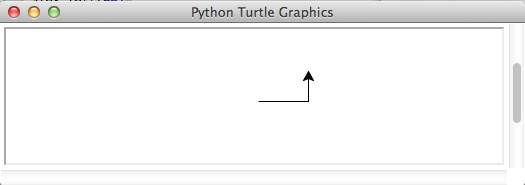
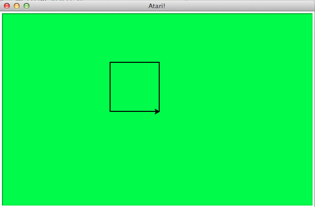
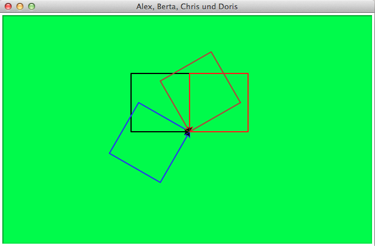

# Spaß mit Pythons Turtle-Graphik

Irgendwie wußte ich zwar, daß es existiert, aber eigentlich hatte ich es nie wirklich ernst genommen: Pythons Turtle-Graphik-Modul Bis ich es vor einigen Tagen neugierig doch einmal ausprobierte und da wußte ich, daß meine bisherige Arroganz ein Fehler war. Denn ich hatte wirklich viel Spaß mit diesem Modul.

Die Graphik mit der Schildkröte ist aus Logo bekannt und war eigentlich am MIT entwickelt worden, um Kindern den Einstieg in die Welt des Programmierens zu erleichtern. Doch dann wurde diese Art der Graphikprogrammierung schnell populär, selbst *Turbo Pascal* hatte ein Turtle-Paket.

Worum geht es da eigentlich? Es geht um eine (virtuelle) Schildkröte, die sich auf einem (ebenfalls virtuellen) Blatt Papier bewegt und einen Stift hält (ob in der Hand oder in der Schnauze, das ist nicht bekannt). Diese Schildkröte kann nun mit einfachen Befehlen wie »rechts«, »links«, »vorwärts« oder »rückwärts« gesteuert werden und zeichnet dabei ihren Weg auf diesem Blatt Papier. In Python sieht das so aus:

~~~python
import turtle

wn = turtle.Screen()
alex = turtle.Turtle()

alex.forward(50)
alex.left(90)
alex.forward(30)

wn.mainloop()
~~~

Zuerst muß das Turtle-Paket importiert werden. Dann wird der Bildschirm (das virtuelle Papierblatt) initialisiert und dann die Schildkröte (die ich in Anlehnung an *Allen B. Downey* (siehe Literaturverzeichnis), dem Initiator des Turtle-Moduls, »Alex« genannt habe). Und schon kann man der Schildkröte (also *Alex*) Befehle geben, die sie ausführt.

Die letzte Zeile dient dazu, das Blatt Papier in einer Schleife auch weiterhin auf dem Bildschirm anzuzeigen, damit man das Ergebnis seiner Programmierkunst auch bewundern kann:

Wichtig ist dabei, daß der Koordinatenursprung -- der Punkt `(0, 0)` --nicht, wie es sonst in der Computergraphik üblich ist, in der linken oberen Ecke des Graphikfensters (das ich ab sofort der Einfachheit halber *Canvas* nennen werde), sondern in der Mitte des Canvas’ liegt und von dort die positive X-Koordinate nach rechts und die positive Y-Koordinate nach oben zeigt. Der Canvas ist also ein karthesisches Koordinatensystem mit vier Quadranten, wie es viele aus dem Schullunterricht noch kennen werden. Das heißt, links von der Mitte ist `x` negativ und unterhalb der Mitte ist `y` negativ. Daran muß man sich erst einmal gewöhnen. 😜

Nun zu den Befehlen: Mit `alex.forward(50)` haben wir die Schildkröte angewisen, 50 Schritte (Pixel) in Blickrichtung vorwärts zu gehen. Da dies der erste Befehl im Programm war, steht die Turtle in der Mitte des Fensters (auf `(0, 0)`) mit der Blickrichtung nach rechts. Mit `alex.left(90)` drehten wir sie um 90° nach rechts (per Default nimmt die Schildkröte Richtungsbefehle in Grad und nicht in Radiant an). In die neue Richtung haben wir sie dann mit `alex.forward(30)`noch einmal um 30 Schritte in die neue Blickrichtung (nach oben) geschickt.

## Ein erstes Beispiel

Das ist doch ziemlich einleuchtend, oder? Da kann ich ja gleich mit einem weiteren Beispiel fortfahren:

~~~python
import turtle as t

wn = t.Screen()
wn.bgcolor("green")
wn.setup(width = 640, height = 400)
wn.title("Atari!")
alex = t.Turtle()
alex.pencolor("black")
alex.pensize(2)

for i in range(4):
    alex.left(90)
    alex.forward(100)

print("Schildkröte Alex sagt: »I did it, Babe!« 🐢")

wn.mainloop()
~~~

Nun solltet Ihr Euch ziemlich sicher sein, daß Ihr Python 3 verwendet. Denn sonst bekommt Ihr große Schwierigkeiten mit den Umlauten und dem Emoji.

Die erste Änderung gegenüber dem vorherigen Programm ist, daß ich mit

~~~python
import turtle as t
~~~

statt `turtle.` nun die Kurzform `t.` verwenden kann. Dann habe ich mit `wn.bgcolor("green")` dem Fenster eine lindgrüne Hintergrundfarbe verpaßt, die mich an meinen Atari ST erinnert. Darum habe ich auch mit `wn.title("Atari!")` dem Graphikfenster den Titel »Atari!« verpaßt[^t01fn1].

[^t01fn1]: Das ist reine Nostalgie und hat sonst gar nichts zu bedeuten. 😎

In der Zeile davor habe ich dann noch mit

~~~python
wn.setup(width = 640, height = 400)
~~~

dem Ausgabefenster eine Größe von 640x400 Pixeln spendiert. Das ist nicht ganz zufällig die (Maximal-) Auflösung des Atari ST[^t01fn2].

[^t01fn2]: Auch das ist natürlich nur reine Nostalgie und ohne weitere Bedeutung.

Die nächsten beiden neuen Befehle

~~~python
alex.pencolor("black")
alex.pensize(2)
~~~

sagen der Turtle einmal, das ihre Schreibfarbe schwarz ist (das ist der Default und muß eigentlich nicht extra programmiert werden, aber irgendwo muß ich ja das Kommando `pencolor()` einführen und daß die Schreibdicke 2 Pixel weit ist (Default ist 1 Pixel).

Naja, um dann ein Quadrat mit der Seitenlänge 100 Pixel zu zeichnen, schicke ich in der `for`-Schleife die Schildkröte einfach vier mal los, lasse sie sich jeweils um 90 Grad drehen und dann 100 Pixel weiterlaufen. Der Screenshot zeigt, wie das Endergebnis dann aussieht.

## Eine Schildkrötenherde

Schildkröten sind sehr gesellige Tiere (zumindest die virtuellen in unseren Computern. Daher wundert es vermutlich niemanden, daß sie auch in Herden auftreten können. Eine solche Herde -- genauer ein Quartett -- möchte ich zum Abschluß des ersten Teils meiner kleinen Turtle-Tutorial-Reihe programmieren:

~~~python
import turtle as t

wn = t.Screen()
wn.bgcolor("green")
wn.setup(width = 640, height = 400)
wn.title("Alex, Berta, Chris und Doris")

alex = t.Turtle()
alex.pencolor("black")
alex.pensize(2)

berta = t.Turtle()
berta.pencolor("red")
berta.pensize(2)
berta.left(-90)

chris = t.Turtle()
chris.pencolor("blue")
chris.pensize(2)
chris.left(120)

doris = t.Turtle()
doris.pencolor("brown")
doris.pensize(2)
doris.left(-60)

# i = 0
for i in range(4):
    alex.left(90)
    alex.forward(100)
    berta.left(90)
    berta.forward(100)
    chris.left(90)
    chris.forward(100)
    doris.left(90)
    doris.forward(100)

print("Die Schildkröten sagen: »We did it, Babe!« 🐢")

wn.mainloop()
~~~

In diesem Beispielskript kommen keine neuen Befehle vor. Neu ist nur, daß statt einer vier Schildkröten definiert und auf die Reise geschickt werden. Und da es langweilig wäre, wenn alle das gleiche zeichnen, werden sie zu Beginn des Programms alle in eine andere Richtung geschickt.

*Alex* blickt weiterhin stur nach Osten (das ist der Default, daher braucht er dafür keinen Extra-Befehl) und startet dann nach der ersten Drehung um 90° nach Norden. *Berta* schaut nach Süden, startet daher nach der ersten Drehung nach Osten. Die Startrichtung von *Chris* ist (in etwa) Nordost, nach der ersten Drehung rennt er in nordwestlicher Richtung los.*Doris* dagegen schaut nach Südosten, um nach der ersten Drehung Richtung Nordost durchzustarten.

## Caveat

Das Turtle-Modul setzt auf Tkinter auf und ist daher nicht besonders schnell. Auch wenn es einige Tricks gibt, die Ausführung zu beschleunigen, mehrere tausend Schildkröten auf die Reise zu schicken, wie es zum Beispiel in *Mitchel Resnicks* StarLogo möglich ist, würde ich tunlichst unterlassen. Das Modul ist in erster Linie dafür gedacht, Anfängern den Einstieg in die Programmierung zu erleichtern, nicht um massiv-parallele Simulationen durchzuführen. Dennoch macht die Programmierung mit Pythons Turtle-Modul Spaß und daher werde ich diese kleine Tutorial-Reihe auch fortsetzen.

## Literatur

Folgende Bücher und Webseiten haben mir beim Einstieg in die Schildkrötenwelt geholfen:

- *[How to Think Like a Computer Scientist](http://openbookproject.net/thinkcs/python/english3e/index.html). Learning with Python 3* (2012) von *Peter Wentworth*, *Jeffrey Elkner*, *Allen B. Downey* und *Chris Meyers*. *Allen B. Downey* ist der Initiator des Turtle-Moduls und daher war insbesondere das dritte Kapitel »[Hello, little turtles!](http://openbookproject.net/thinkcs/python/english3e/hello_little_turtles.html)« besonders hilfreich.

- *[Algorithmic Problem Solving with Python](http://www.eecs.wsu.edu/~schneidj/swan/index.php)* (2015) von *John B. Schneider*, *Shira Lynn Broschat* und *Jess Dahmen*, hier besonders das 13. Kapitel »[Turtle Graphics](http://www.eecs.wsu.edu/~schneidj/PyBook/chap13.pdf)«.

- Und natürlich die »[offizielle Dokumentation](https://docs.python.org/3/library/turtle.html)« zur Turtle-Graphik in Python 3.

- Mitchel Resnick: *[Turtles, Termites, and Traffic Jam](https://www.amazon.de/Turtles-Termites-Traffic-Jams-Explorations/dp/0262680939/ref=as_li_ss_tl?ie=UTF8&qid=1509985968&sr=8-1&keywords=Turtles+Termites+traffic+jam&linkCode=ll1&tag=derschockwell-21&linkId=fa5582ac4e8d5841581ddd46dde8bf64)*, Cambrigde, MA (MIT Press) 1994 (Paperback 1997) ist **das** Buch zu StarLogo, Turtles, autonomen Agenten, massiv-parallele Simulationen und Dezentralisierung.

